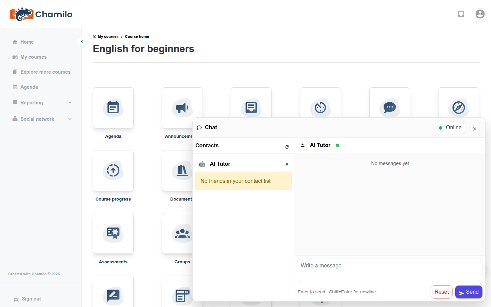

# Chatbot Tuteur IA

Si votre plateforme et votre cours l’ont tous deux activé, vous avez accès à un **Tuteur IA** — un assistant de discussion auquel vous pouvez poser des questions et obtenir des réponses instantanées, adaptées au contexte, sans attendre la réponse de votre enseignant.

## Accès ou non

Le Tuteur IA dépend d’une configuration à deux niveaux, tous deux hors de votre contrôle :

* **Niveau plateforme** — Votre administrateur doit activer les assistants IA et configurer un fournisseur d’IA.
* **Niveau cours** — Votre enseignant doit activer le Tuteur IA pour ce cours précis.

Consultez [Tuteur IA](../../teacher-guide/ai-tools/ai-tutor.md) dans le Guide de l’enseignant pour savoir comment cela se configure côté enseignant. Si vous ne voyez nulle part l’option décrite ci-dessous, elle n’a pas été activée pour vous — soit pas du tout, soit pas pour le cours dans lequel vous vous trouvez actuellement.

Certaines plateformes activent aussi le Tuteur IA **en dehors de tout cours** — le cas échéant, il change alors de focus : au lieu de répondre à propos d’un cours précis, il aide pour des questions génériques d’utilisation de la plateforme, par exemple comment trouver ou utiliser une fonctionnalité. Ce mode à l’échelle de la plateforme est un interrupteur distinct de celui par cours, de sorte que l’un peut être activé sans l’autre.

## Ouvrir la discussion

Cherchez le bouton de discussion (une icône flottante en bulle de parole) en bas de l’écran. L’ouvrir affiche vos contacts ainsi que, s’il est activé, une entrée dédiée **Tuteur IA** avec une icône de robot et un point « en ligne » — cliquez dessus pour démarrer ou poursuivre votre conversation avec l’IA.

Saisissez votre question et appuyez sur **Entrée** pour l’envoyer (**Maj+Entrée** insère un saut de ligne au lieu d’envoyer). Le Tuteur IA met en forme ses réponses avec des titres, des listes, du texte en gras et des blocs de code lorsque c’est utile, afin que les explications plus longues restent lisibles.

## Poser une question sur ce que vous lisez

Pendant que vous consultez un document, un message de forum, une page wiki, une entrée de portfolio ou une étape de parcours d’apprentissage, vous pouvez sélectionner un passage de texte sur la page avant de poser votre question. Une petite pastille « Sélection » apparaît au-dessus de la zone de message — envoyez votre message et ce texte sélectionné est inclus comme contexte, afin que le Tuteur IA puisse répondre spécifiquement au passage que vous avez mis en évidence. Cliquez sur le **×** de la pastille pour abandonner la sélection si vous ne souhaitez pas l’inclure.

## Recommencer

Si une conversation s’égare, utilisez l’option **Réinitialiser** dans le champ de saisie du chat pour l’effacer et repartir de zéro. Cela n’efface que votre conversation avec le Tuteur IA — cela n’affecte pas vos messages habituels avec votre enseignant ou vos camarades.

## Quand il n’est pas disponible

Le Tuteur IA est désactivé automatiquement pendant que vous passez un test ou travaillez sur un devoir, afin qu’il ne puisse pas servir à obtenir des réponses pendant une évaluation. Il n’apparaîtra pas non plus si le fournisseur d’IA sous-jacent est temporairement indisponible — Chamilo tente de basculer automatiquement vers un autre fournisseur configuré, mais si aucun n’est joignable, le Tuteur IA peut être brièvement indisponible.

## Conseils

* **Utilisez-le pour des éclaircissements rapides** — il est particulièrement utile pour les questions auxquelles vous attendriez autrement une réponse.
* **Vérifiez tout de même les informations importantes** — comme tout système d’IA, il peut se tromper. Recoupez tout élément critique avec le matériel de votre cours ou votre enseignant.
* **C’est un complément, pas un substitut** — pour tout ce qui exige un véritable jugement de votre enseignant (contestations de notes, prolongations, circonstances personnelles), contactez-le directement.