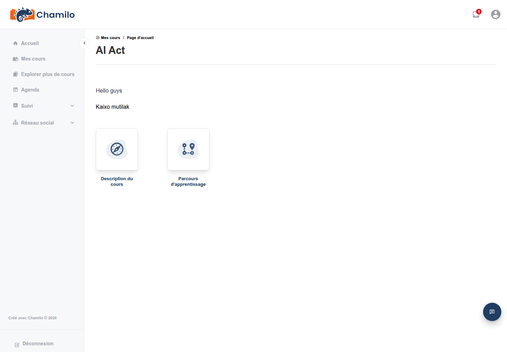
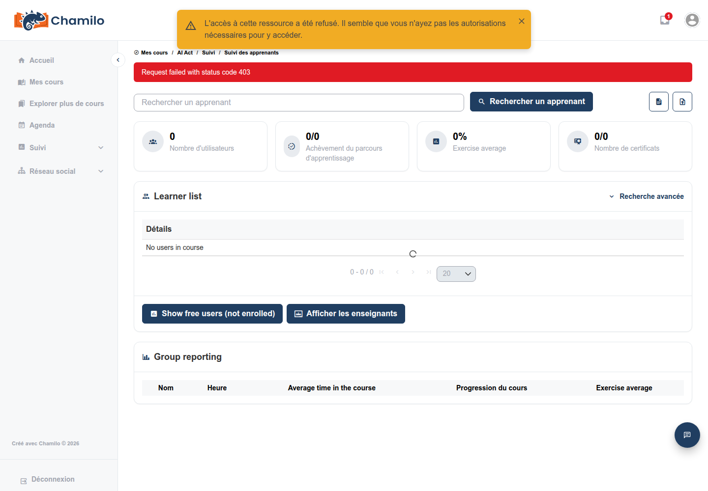

# Se repérer dans un cours

Une fois un cours ouvert, vous voyez sa page d’accueil avec une grille d’icônes d’outils. Cette page explique ce que chaque outil signifie pour vous en tant qu’apprenant, et renvoie vers l’endroit où la fonctionnalité sous-jacente est décrite plus en détail.

Seuls les outils que votre enseignant a rendus visibles aux apprenants apparaissent dans votre grille — votre enseignant peut voir des outils supplémentaires, masqués, qui ne vous sont pas montrés. Si un outil que vous attendez n’est pas là, il peut simplement être masqué, ou désactivé pour l’ensemble du cours ; demandez à votre enseignant.

## La grille d’outils

| Outil | Icône | Ce que cela signifie pour vous | En savoir plus |
|------|------|------------------------|------------|
| Documents |  | Lire et télécharger les fichiers que votre enseignant a déposés | [Documents](../../teacher-guide/adding-content/documents.md) |
| Parcours |  | Suivre une séquence guidée d’activités dans l’ordre, en suivant votre propre progression | [Parcours](../../teacher-guide/adding-content/learning-paths.md) |
| Liens |  | Ouvrir les ressources externes sélectionnées par votre enseignant | [Liens](../../teacher-guide/adding-content/links.md) |
| Tests (Exercices) |  | Passer des quiz et des examens ; certains sont notés automatiquement, d’autres par votre enseignant | [Exercices](../../teacher-guide/assessing-learners/exercises.md) |
| Annonces |  | Lire les mises à jour importantes publiées par votre enseignant | [Annonces](../../teacher-guide/adding-content/announcements.md) |
| Évaluations (Carnet de notes) |  | Consulter vos propres scores pour les activités notées du cours, ainsi que tout certificat obtenu | [Carnet de notes](../../teacher-guide/assessing-learners/gradebook.md) |
| Glossaire |  | Consulter les termes clés définis pour le cours | [Glossaire](../../teacher-guide/adding-content/glossary.md) |
| Présences |  | Consulter vos présences enregistrées, si votre enseignant les suit | [Présences](../../teacher-guide/assessing-learners/attendance.md) |
| Progression du cours |  | Consulter un résumé de votre avancement dans le cours | [Progression du cours](../../teacher-guide/additional-tools/course-progress.md) |
| Agenda |  | Consulter les événements et échéances propres au cours | — |
| Forum |  | Lire et publier dans des discussions hiérarchisées avec votre enseignant et vos camarades | [Forums](../../teacher-guide/collaboration-and-communication/forums.md) |
| Dropbox |  | Échanger des fichiers en privé avec votre enseignant ou vos camarades | [Dropbox](../../teacher-guide/additional-tools/dropbox.md) |
| Utilisateurs |  | Voir qui d’autre est inscrit au cours | — |
| Groupes |  | Travailler au sein d’un groupe plus restreint constitué par votre enseignant, avec ses propres outils partagés | [Groupes](../../teacher-guide/collaboration-and-communication/groups.md) |
| Chat |  | Envoyer des messages en temps réel à votre enseignant ou à vos camarades | [Chat](../../teacher-guide/collaboration-and-communication/chat.md) |
| Travaux |  | Déposer des fichiers ou du texte pour que votre enseignant les examine et les note | [Travaux](../../teacher-guide/assessing-learners/assignments.md) |
| Enquêtes |  | Répondre à des questionnaires, parfois de façon anonyme | [Enquêtes](../../teacher-guide/assessing-learners/surveys.md) |
| Wiki |  | Rédiger et modifier collectivement des pages partagées | [Wiki](../../teacher-guide/collaboration-and-communication/wiki.md) |
| Carnet |  | Tenir vos propres notes privées au sein du cours | [Carnet](../../teacher-guide/additional-tools/notebook.md) |
| Portfolio |  | Constituer une collection personnelle de travaux à présenter ou à déposer | [Portfolio](../../teacher-guide/additional-tools/portfolio.md) |
| Rapports |  | Rien, pour vous — voir ci-dessous | — |

## Outils que vous ne verrez pas — et un qui ne fonctionnera pas

Quelques éléments n’existent que pour que les enseignants et les administrateurs de cours configurent le cours lui-même — les paramètres du cours, la maintenance du cours (sauvegarde/importation/exportation), l’éditeur de la page d’accueil du cours, et (sur la plupart des plateformes) l’outil Blog se trouvent dans un menu « Plus d’actions » qui n’apparaît qu’aux personnes disposant de droits d’édition sur le cours. En tant qu’apprenant, vous ne verrez pas ce menu du tout.

La tuile **Reporting** est un cas particulier : elle apparaît bien dans votre grille, mais elle ouvre la vue de suivi de toute la classe destinée aux enseignants, si bien qu’un clic produit un message d’accès refusé plutôt que quelque chose d’utile :

Ne vous inquiétez pas — votre propre progression est disponible ailleurs : depuis **My Progress** dans la barre latérale principale (voir [Comprendre l’interface](../getting-started/understanding-the-interface.md) et [My Progress](../my-progress.md)), ainsi que depuis les outils **Course progress** et **Assessments** ci-dessus, qui affichent tous deux vos propres données.

Si les fonctionnalités d’IA sont activées dans votre cours, vous remarquerez peut-être aussi qu’une option « AI analyzer » destinée à l’enseignant (utilisée pour pré-entraîner l’AI Tutor sur le contenu du cours) est différente du chat **AI Tutor** destiné à l’apprenant — voir [Chatbot AI Tutor](ai-tutor.md).

## Conseils

* **Un outil manque ?** Demandez à votre enseignant — il est très probablement masqué ou désactivé plutôt que défectueux.
* **La description du cours et les annonces** peuvent être entièrement désactivées par votre enseignant ; le cas échéant, elles n’apparaîtront pour personne, enseignant compris.
* **Tout ici peut varier d’un cours à l’autre** — votre enseignant décide quels outils sont actifs et visibles pour chaque cours individuellement.