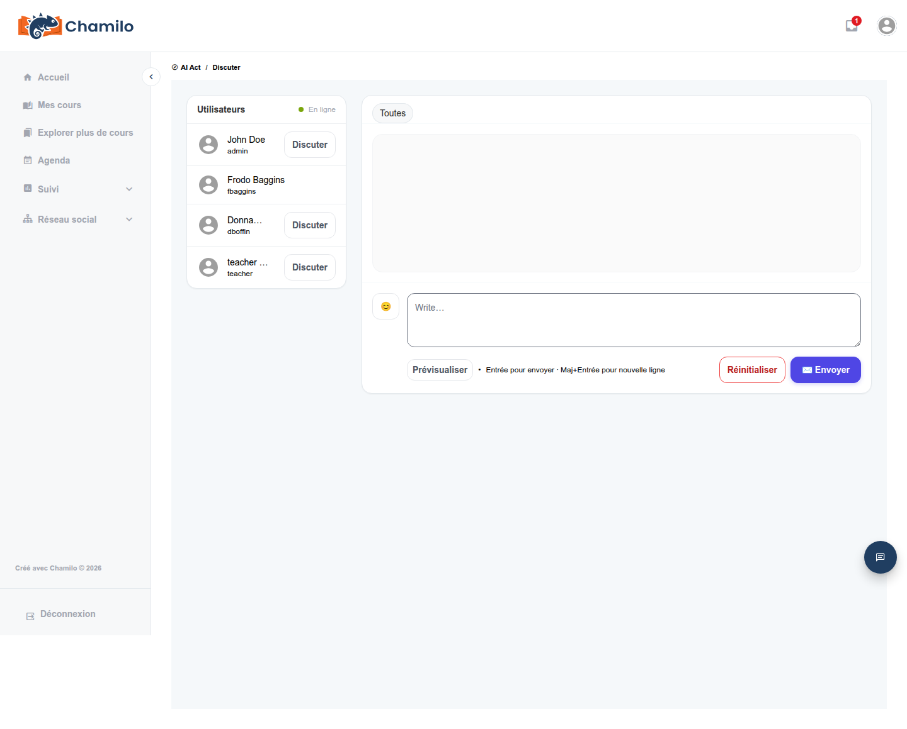

# Utiliser l'outil Chat

Certains cours incluent un outil **Chat** — une messagerie textuelle en temps réel liée à ce cours spécifique, utile pour des échanges rapides ou des questions-réponses en direct lorsque un enseignant est présent.

## Envoyer des messages

Ouvrez l'outil **Chat**  depuis la page d'accueil du cours. Vous verrez une liste **Utilisateurs** de toutes les personnes actuellement en ligne dans le cours, chacune avec son propre bouton **Chat**, ainsi qu'un onglet **Tous** pour l'ensemble du groupe :

Choisissez une personne (ou **Tous**) et saisissez votre message dans la zone en bas. Appuyez sur **Enter** pour l'envoyer, ou **Shift+Enter** pour commencer une nouvelle ligne sans envoyer. Une option **Aperçu** vous permet de vérifier la mise en forme avant l'envoi, et **Réinitialiser** efface ce que vous avez saisi.

## Si le Chat est réservé aux tuteurs

Votre administrateur peut restreindre le chat du cours de sorte que seul votre enseignant (ou d'autres tuteurs du cours) puisse publier — dans ce cas, tous les autres peuvent lire mais ne pas participer directement. Si vous constatez que vous ne pouvez pas envoyer de message dans le chat d'un cours, ce paramètre en est la raison la plus probable, et non un bogue.

## À ne pas confondre avec

Chamilo propose trois fonctionnalités distinctes qui impliquent toutes de la messagerie, et il est facile de les confondre :

* **Cet outil Chat du cours** — en temps réel, lié à un cours spécifique, accessible uniquement depuis la page d'accueil de ce cours.
* **[Boîte de réception](../inbox.md)** — messages privés, asynchrones, avec n'importe qui sur la plateforme, sans lien avec un cours particulier.
* **Le panneau de chat flottant** (en bas de l'écran, disponible presque partout) — utilisé pour la messagerie directe et pour l'[AI Tutor](ai-tutor.md), indépendamment de cet outil de cours.

Si vous recherchez l'une des deux autres, consultez leurs pages respectives.

## Conseils

* **Utilisez-le pour des échanges en direct, dans l'instant** — pour tout ce que vous voudrez retrouver plus tard, utilisez plutôt le [Forum](using-the-forum.md).
* **Vérifiez si une session de chat en direct est prévue** — les enseignants annoncent parfois des horaires précis auxquels ils seront disponibles dans le chat du cours, souvent via l'Agenda.
* **Si votre cours dispose d'une visioconférence**, votre enseignant peut préférer celle-ci pour les sessions en direct plutôt que le chat textuel.