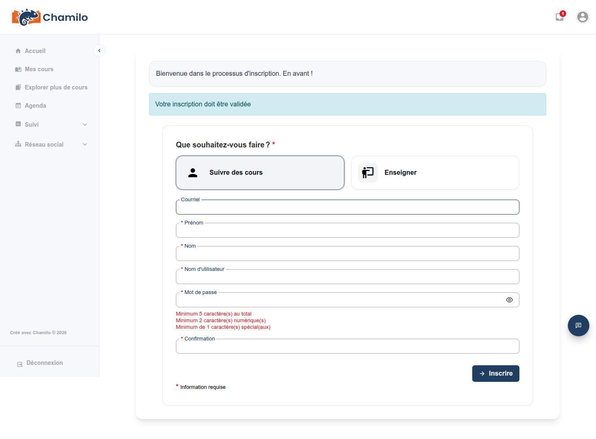

# Création d’un compte

La possibilité de créer vous-même votre compte dépend de la configuration de votre plateforme. Cette page décrit ce à quoi s’attendre du formulaire d’auto-inscription, et ce qui se passe s’il n’est pas disponible.

## Si l’auto-inscription n’est pas disponible

Toutes les plateformes Chamilo ne permettent pas aux visiteurs de s’inscrire eux-mêmes — une école ou une entreprise préférera souvent créer les comptes de ses membres directement, ou limiter l’inscription aux personnes ayant reçu une invitation spécifique. Si vous ne voyez pas de lien **S’inscrire** (ou **Register**) sur la page de connexion, c’est pour cette raison. Dans ce cas :

* Demandez à votre établissement ou à l’administrateur de la plateforme de créer un compte pour vous, ou
* Demandez à votre enseignant une **invitation au cours** — un lien à usage unique envoyé à votre adresse e-mail qui vous permet de vous inscrire directement, même sur une plateforme où l’inscription générale est fermée, et vous inscrit immédiatement au cours de cet enseignant une fois l’opération terminée. Voir [Ce que voit la personne invitée](../../teacher-guide/assessing-learners/subscribing-users.md#what-the-invited-person-sees) pour l’apparence de cette procédure de votre côté.

## Remplir le formulaire d’inscription

Si l’auto-inscription est activée, cliquez sur **S’inscrire** sur la page de connexion. Le formulaire demande une combinaison des éléments suivants, selon ce que votre administrateur a configuré :

* Adresse e-mail et/ou nom d’utilisateur
* Prénom et nom
* Mot de passe (avec un indicateur de force au fur et à mesure de la saisie)
* Numéro de téléphone, langue, code officiel ou date de naissance
* Champs de profil supplémentaires propres à votre plateforme

Ne vous inquiétez pas si votre formulaire diffère de cette liste — les administrateurs peuvent afficher, masquer ou rendre obligatoires des champs individuels.

## Ce formulaire ne crée que des comptes apprenant

Par défaut, le formulaire d’inscription public n’offre aucune option pour s’inscrire en tant qu’enseignant — chaque compte créé par ce biais est un compte apprenant. Il n’y a ni liste déroulante, ni case à cocher, ni option désactivée indiquant un rôle enseignant ; ce choix ne fait simplement pas partie du formulaire.

Certaines plateformes activent une étape **« Que souhaitez-vous faire ? »** avec deux cartes — **Suivre des cours** et **Enseigner des cours** — mais celle-ci n’apparaît que si votre administrateur a spécifiquement activé l’inscription en tant qu’enseignant. Même dans ce cas, le choix d’enseigner peut exiger que votre compte soit approuvé avant que vous n’obteniez les droits d’enseignant.

Si vous avez besoin d’un compte enseignant et que vous ne voyez pas cette option, demandez à l’administrateur de votre plateforme d’en créer un pour vous ou de mettre à niveau votre compte existant.

## Conditions générales et CAPTCHA

Selon la configuration de votre plateforme, le formulaire peut également inclure :

* Une case **Conditions générales** près du bas du formulaire (« J’ai lu et j’accepte les conditions générales »), le texte intégral étant affiché dans une zone défilante au-dessus.
* Un défi **CAPTCHA** à la fin du formulaire, vous demandant de saisir les lettres affichées dans une image. Voir [CAPTCHA](../account-and-security/captcha.md) pour en comprendre la raison.

Sur certaines plateformes, l’envoi du formulaire affiche une étape de confirmation (« Vous confirmez que vous souhaitez réellement vous inscrire à cette plateforme. ») avant que votre compte ne soit réellement créé — il s’agit d’une protection contre les envois accidentels, et non d’une étape d’approbation supplémentaire.

## Ce qui se passe après l’envoi

Selon la configuration de l’inscription par votre administrateur, l’une des trois situations suivantes se produit :

* **Vous êtes connecté immédiatement** — la configuration la plus courante, en particulier pour les plateformes ouvertes.
* **Votre compte nécessite une approbation** — votre compte est créé mais désactivé jusqu’à ce qu’un administrateur l’approuve manuellement. Vous serez notifié une fois que ce sera fait.
* **Vous devez confirmer votre adresse e-mail** — vous recevrez un lien de confirmation par e-mail ; votre compte est désactivé jusqu’à ce que vous cliquiez dessus.

Si vous n’êtes pas sûr de ce qui s’applique à vous et que rien ne semble se passer après l’inscription, vérifiez votre boîte de réception (y compris les indésirables) pour un message de la plateforme, ou contactez votre administrateur.

## Conseils

* **Utilisez une adresse e-mail que vous consultez régulièrement** — c’est par ce moyen que vous recevrez les réinitialisations de mot de passe, les invitations aux cours et les confirmations de compte.
* **Choisissez un mot de passe fort** — l’indicateur de force du formulaire vous donne un retour en temps réel au fur et à mesure de la saisie.
* **Impossible de s’inscrire ?** Contactez la personne qui gère votre plateforme — la fermeture de l’auto-inscription est un choix délibéré sur de nombreuses plateformes institutionnelles et d’entreprise.