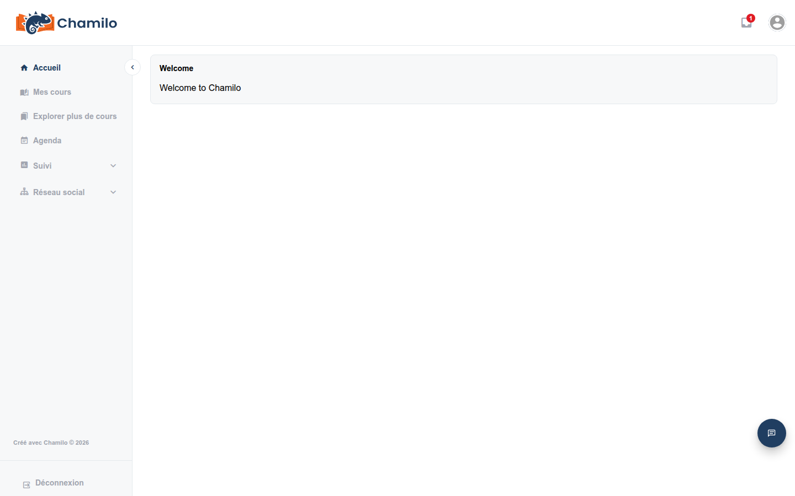

# Comprendre l’interface

Chamilo 3.0 propose une interface claire et moderne, conçue pour une navigation simple. Cette page décrit chaque partie de l’interface du point de vue de l’apprenant.

## La barre supérieure

La barre supérieure est toujours visible en haut de chaque page. Elle contient :

* **Logo de la plateforme** — Cliquez dessus pour revenir à la page d’accueil à tout moment.
* **Icône de messagerie**  — Affiche vos messages. Un badge rouge indique des messages non lus. Cliquez pour ouvrir votre [Boîte de réception](../inbox.md).
* **Icône de ticket de support**  — Si elle est activée par votre administrateur, elle vous donne accès au système de tickets de support. Toutes les plateformes ne l’activent pas : vous ne verrez alors que l’icône de messagerie et votre avatar.
* **Votre avatar** — Une image circulaire dans le coin supérieur droit. Cliquez dessus pour ouvrir un menu déroulant :

* **Mon profil** — Modifier vos informations personnelles, changer votre mot de passe et (si l’option est activée) configurer l’authentification à deux facteurs
* **Mes certificats** — Tous les certificats que vous avez obtenus, dans l’ensemble de vos cours
* **Mes compétences** — Badges de compétence qui vous ont été attribués
* **Se déconnecter**

## La barre latérale

La barre latérale à gauche constitue votre navigation principale. Elle peut être repliée pour laisser plus d’espace à la zone de contenu. Cliquez sur la flèche de bascule sur son bord droit pour l’étendre ou la replier. Chamilo mémorise votre préférence.

La barre latérale contient les liens suivants (certains peuvent être masqués selon la configuration de votre plateforme) :

| Élément de menu | Icône | Description |
|-----------|------|-------------|
| **Accueil** |  | Retour au tableau de bord principal |
| **Mes cours** |  | Liste de tous les cours auxquels vous êtes inscrit |
| **Mes sessions** |  | Liste de vos sessions de formation (en cours, passées, à venir) |
| **Explorer plus de cours** |  | Parcourir le catalogue de cours pour trouver de nouveaux cours et s’y inscrire soi-même |
| **Agenda** |  | Votre calendrier personnel et de cours |
| **Rapports** |  | S’étend vers **Progression** — votre propre aperçu [Ma progression](../my-progress.md) |
| **Réseau social** |  | S’étend vers le [Réseau social](../social-network.md) et les liens associés, s’ils sont activés |
| **Visioconférence** |  | Accès aux sessions vidéo en direct (si configuré) |

**Rapports** et **Réseau social** ne sont pas de simples liens : un clic les déplie et affiche une petite liste de sous-éléments directement dans la barre latérale :

* Sous **Rapports** : uniquement **Progression**, qui mène à [Ma progression](../my-progress.md).
* Sous **Réseau social** : **Accueil** (le mur social), **Messages** (un raccourci vers votre [Boîte de réception](../inbox.md)), **Mes amis**, **Groupes sociaux** — et, de façon un peu inattendue regroupés ici aussi, **Mes fichiers** (votre stockage de fichiers personnel) et **Données personnelles** (un export des données personnelles que la plateforme détient à votre sujet). Ces deux derniers éléments ne sont pas vraiment des fonctionnalités « sociales » ; ils se trouvent simplement dans cette partie de la barre latérale.

Si votre compte a des rôles supplémentaires (par exemple, vous enseignez aussi un cours), vous pouvez voir des éléments de barre latérale supplémentaires — comme **Administration** — qu’un compte uniquement apprenant ne voit jamais.

Tout en bas de la barre latérale, vous trouverez une option **Se déconnecter** pour vous déconnecter rapidement lorsque vous avez terminé. Cette option est également disponible depuis le menu déroulant de l’icône de votre avatar, dans le coin supérieur droit.
Si la plateforme est gérée via des méthodes d’authentification externes, ces options de déconnexion peuvent ne pas être disponibles.

## La zone de contenu principale

La zone centrale de l’écran affiche le contenu de la page courante. En haut, vous verrez souvent un **fil d’Ariane** indiquant votre emplacement actuel dans la plateforme (par exemple : Accueil > Rock music > Documents). Utilisez le fil d’Ariane pour revenir à une page parente.

## La page d'accueil du cours

Lorsque vous entrez dans un cours, vous voyez la **page d'accueil du cours** :

* **Titre du cours** — Affiché de manière proéminente en haut
* **Introduction du cours** — Une description facultative en texte enrichi rédigée par votre enseignant
* **Grille d'outils** — Une grille d'icônes représentant les outils disponibles dans ce cours (Documents, Exercices, Forums, etc.)

Seuls les outils que votre enseignant a rendus visibles apparaissent dans cette grille — voir [Se repérer dans un cours](../courses/course-tools-overview.md) pour le rôle de chacun. Les commandes permettant de modifier le cours lui-même (aperçu en tant qu'étudiant, affichage/masquage des outils, réorganisation) n'apparaissent qu'aux enseignants et aux administrateurs de cours — vous ne les verrez pas dans un cours auquel vous êtes inscrit en tant qu'apprenant.

## Couleurs des icônes

Ceci est encore expérimental et n'est pas entièrement abouti dans Chamilo 3.0, mais nous essayons d'appliquer les règles suivantes à tous les boutons et icônes d'action de l'interface :

* **Vert** pour les actions de création. Cela inclut l'ajout, la création, l'importation, l'enregistrement et la copie de contenu.
* **Bleu** pour les actions de consultation. Cela inclut l'exportation, la visualisation, l'aperçu dans les listes ou les vues détaillées, la recherche et le téléchargement.
* **Orange** pour les actions de modification. Cela inclut l'édition, le déplacement, la configuration, l'activation/désactivation, le masquage et l'affichage.
* **Rouge** pour les actions de suppression/retrait. Cela inclut la suppression, le retrait, la désinscription.
* **Gris** pour les actions d'annulation. Il s'agit simplement de laisser les choses en l'état.

## Conception responsive

Chamilo 3.0 s'adapte aux différentes tailles d'écran. Sur un appareil mobile ou dans une fenêtre de navigateur étroite :

* La barre latérale est masquée par défaut et peut être ouverte en appuyant sur l'icône de menu
* Les cartes de cours s'affichent en une seule colonne au lieu d'une grille
* Les tableaux deviennent défilables horizontalement

Cela signifie que vous pouvez accéder à vos cours depuis un téléphone, une tablette ou un ordinateur, même si l'interface peut paraître légèrement différente selon l'appareil.