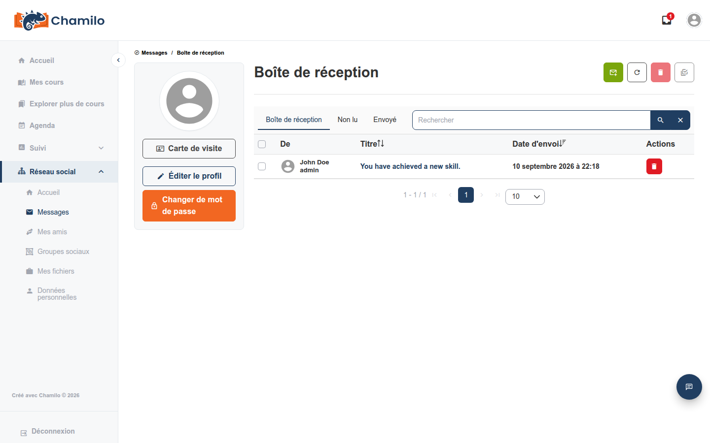

# Boîte de réception

La **Boîte de réception** est le système de messagerie privée de Chamilo — des messages asynchrones, de type courriel, entre vous et d’autres utilisateurs de la plateforme, indépendants de tout cours particulier.

## Accéder à votre boîte de réception

Cliquez sur l’icône **Boîte de réception**  dans la barre supérieure. Un badge rouge indique le nombre de messages non lus. Si cette icône n’apparaît pas du tout, votre administrateur a désactivé la messagerie de la plateforme.

## Lire et répondre

Votre boîte de réception liste les messages reçus et indique lesquels sont non lus. Ouvrez-en un pour le lire, puis utilisez **Répondre** pour y répondre — vous pouvez inclure plusieurs destinataires dans une même réponse, ce qui est utile pour tenir un petit groupe informé sans créer un cours formel ni un groupe social.

## Rédiger un nouveau message

Cliquez sur le bouton **nouveau message** , choisissez un ou plusieurs destinataires, rédigez un objet et un corps, puis envoyez. Comme pour une réponse, un nouveau message peut être adressé à plusieurs personnes à la fois.

## Onglets et actions

Outre votre **Boîte de réception**, un onglet affiche uniquement vos messages **Non lus**, et un autre affiche les **Envoyés** — ce que vous avez envoyé, pour votre propre référence. Un champ de recherche vous permet de trouver un message par mot-clé. Les boutons au-dessus de la liste permettent de rédiger un nouveau message, d’actualiser, de supprimer les messages sélectionnés et de marquer les messages sélectionnés comme lus.

## Étiquettes de messages

Si votre plateforme utilise des étiquettes de messages, vous verrez dans votre boîte de réception une liste d’étiquettes sur lesquelles cliquer pour filtrer les messages par étiquette — pratique pour retrouver facilement les conversations liées à mesure que votre boîte de réception s’agrandit.

## Lien avec les autres fonctionnalités de messagerie

La boîte de réception est indépendante de l’outil [Chat](courses/using-the-chat-tool.md) du cours et du panneau de discussion flottant utilisé pour la messagerie directe et le [Tuteur IA](courses/ai-tutor.md) — chacune est une fonctionnalité réellement distincte, même si toutes impliquent l’échange de messages. Le [Réseau social](social-network.md), s’il est activé, utilise cette même boîte de réception pour la messagerie privée plutôt que d’en avoir une propre.

## Conseils

* **Surveillez le badge de l’icône Boîte de réception** — c’est le moyen le plus rapide de remarquer de nouveaux messages sans ouvrir la page.
* **Utilisez la boîte de réception pour tout ce qui n’est pas lié à un seul cours** — les discussions propres à un cours relèvent généralement du Forum ou du Chat de ce cours.
* **Le lien « Messages » du Réseau social mène à cette même boîte de réception** — vous ne manquez pas une boîte aux lettres distincte si vous y accédez depuis là plutôt que depuis la barre supérieure.