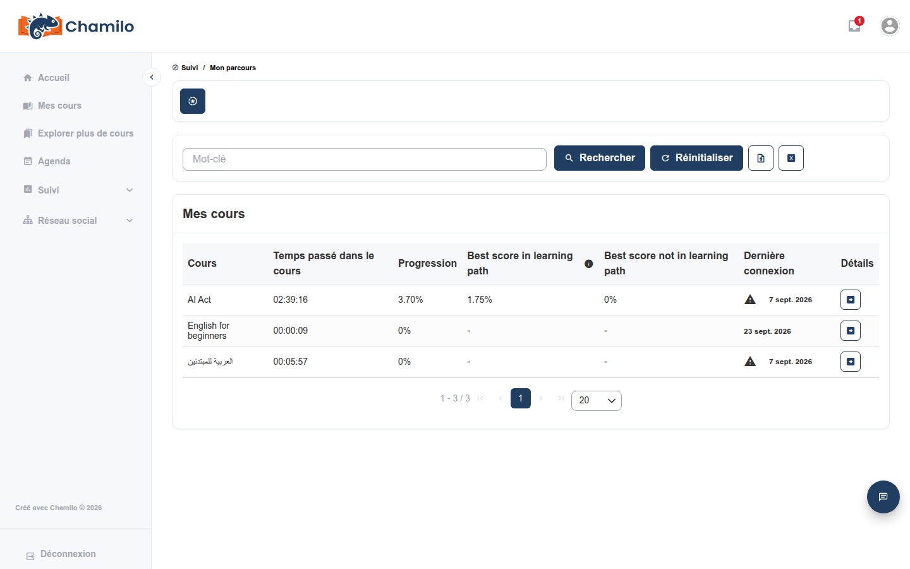
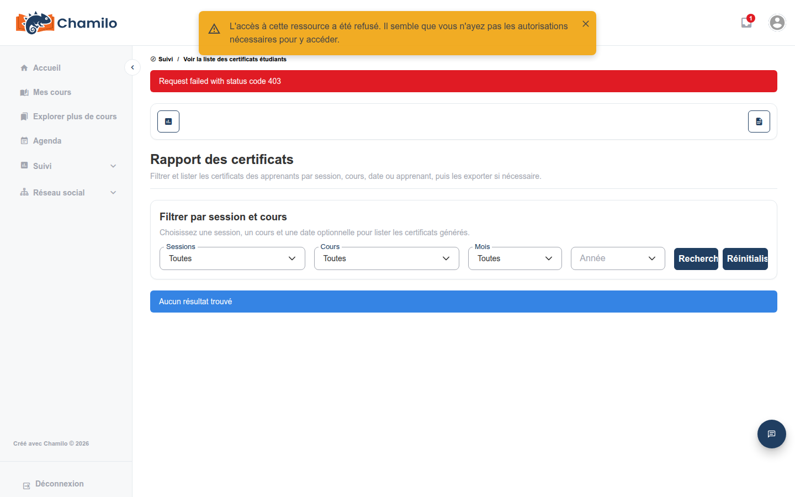

# Ma progression

**Ma progression** vous offre une vue d’ensemble unique et rapide de votre activité et de vos résultats dans tous les cours auxquels vous êtes inscrit — sans avoir à ouvrir chaque cours séparément pour savoir où vous en êtes.

## Y accéder

Cliquez sur **Rapports**  dans la barre latérale pour la développer, puis cliquez sur **Progression**. Il s’agit de votre vue personnelle — elle n’affiche jamais que vos propres données, pas celles de vos camarades.

## Ce que vous voyez

Un tableau listant chaque cours auquel vous participez, avec :

* **Temps passé dans le cours**
* **Progression** — votre pourcentage d’achèvement des parcours d’apprentissage
* **Meilleur score dans un parcours d’apprentissage** et **meilleur score hors parcours d’apprentissage** — vos meilleurs résultats, selon qu’ils proviennent d’un test intégré à un parcours d’apprentissage ou d’un test autonome
* **Dernière connexion** — la dernière fois que vous avez accédé à ce cours

Cliquez sur le bouton **Détails** à côté de n’importe quel cours pour développer trois sous-tableaux sans quitter la page :

* **Tests** — vos tentatives, votre meilleur score et votre classement parmi vos camarades (si votre enseignant affiche les classements)
* **Parcours d’apprentissage** — temps passé, progression et score pour chacun d’eux
* **Compétences acquises** — les badges de compétence que vous avez obtenus dans ce cours

## Vos certificats

Les certificats ne font pas partie de cette page — retrouvez-les sous **Mes certificats**, dans le menu de votre avatar en haut à droite de l’écran. Il liste chaque cours et chaque session pour lesquels vous avez obtenu un certificat, avec le score, la date, et des boutons pour **voir** ou **télécharger** celui-ci.

Le menu de votre avatar comporte également un lien **Mes compétences**, listant les badges de compétence qui vous ont été attribués — distinct des deux pages ci-dessus.

## Ailleurs dans un cours

Quelques indicateurs connexes se trouvent dans le cours lui-même plutôt qu’ici :

* L’outil **Évaluations** (carnet de notes) affiche votre propre score pour ce cours, et parfois votre classement, le meilleur score et la moyenne de la classe, si votre enseignant a activé ce niveau de détail.
* À partir de vos résultats du carnet de notes, vous pouvez également trouver une option **Exporter les badges** pour les compétences que vous avez obtenues.

## Conseils

* **Consultez « Ma progression » avant un rendez-vous avec un enseignant** — c’est le moyen le plus rapide de voir votre situation dans tous vos cours à la fois.
* **Le temps passé et la progression ne sont pas la même chose** — vous pouvez passer beaucoup de temps sans beaucoup progresser, ou l’inverse ; utilisez les deux ensemble pour juger de votre avancement.
* **Les certificats se trouvent dans un autre menu** — pensez à consulter le lien « Mes certificats » de votre avatar, et non cette page, lorsque vous cherchez un certificat.