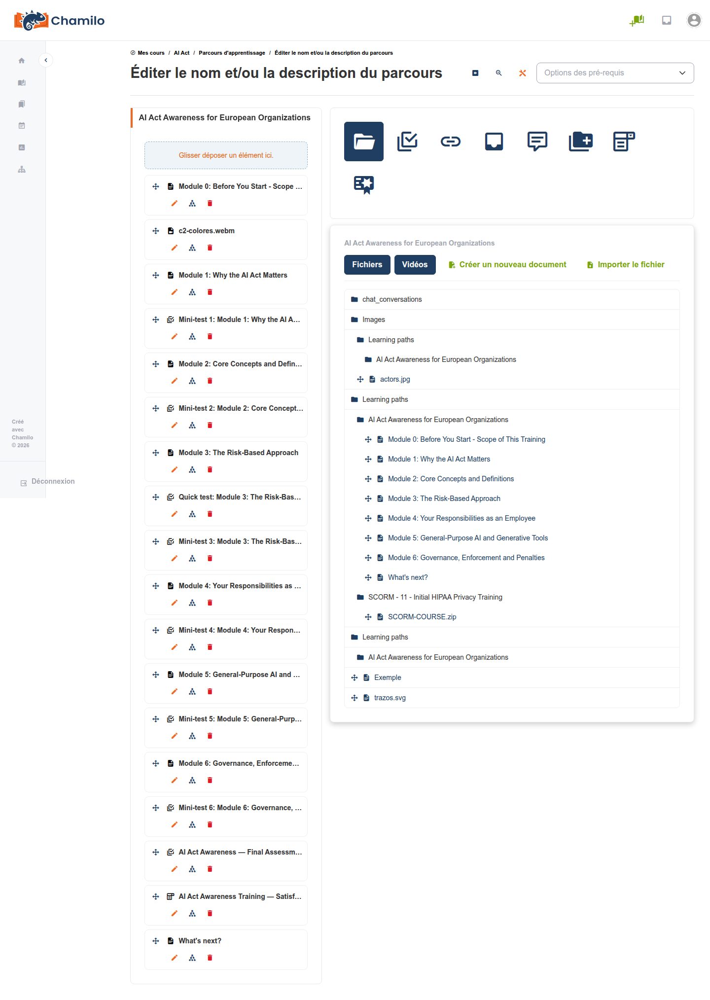
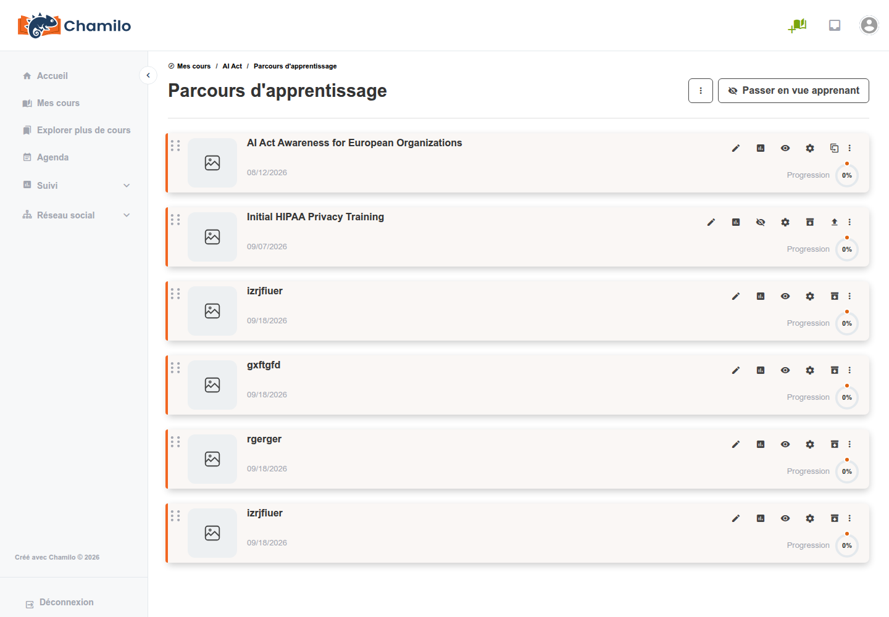
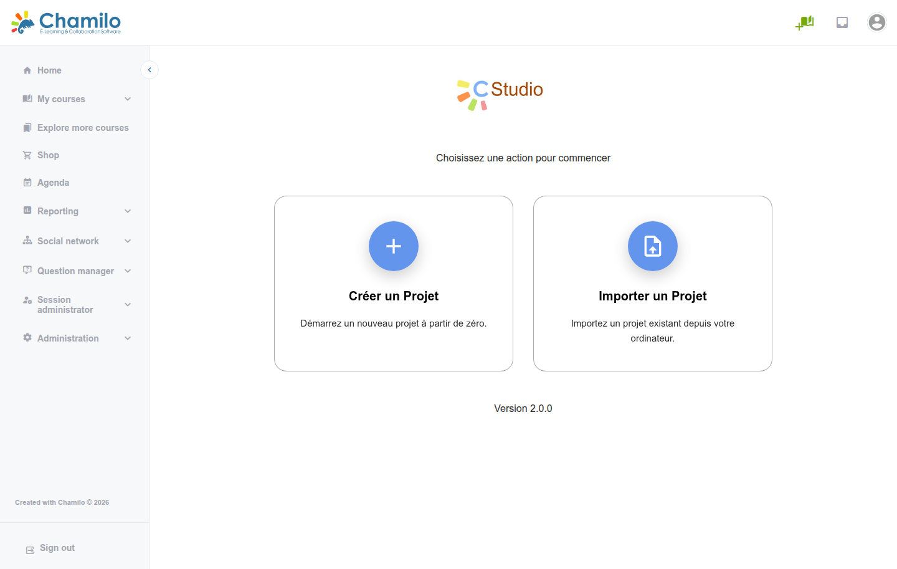

# Parcours d'apprentissage

Les parcours d'apprentissage vous permettent de créer des séquences structurées d'activités d'apprentissage. Un parcours guide vos apprenants à travers un ordre précis de documents, d'exercices, de liens et d'autres ressources, avec des prérequis optionnels et un suivi de la progression.

Cet outil est sans doute l'outil de cours le plus utilisé, car il agit comme un compositeur pour de nombreux autres outils et peut très bien être le ***seul*** outil auquel les apprenants sont confrontés.

## Pourquoi utiliser les parcours d'apprentissage ?

Les parcours d'apprentissage sont utiles lorsque vous souhaitez :

* **Contrôler l'ordre** de consultation du contenu — garantir que les apprenants terminent le matériel de base avant d'avancer
* **Suivre la progression** — voir exactement où se trouve chaque apprenant dans la séquence
* **Définir des prérequis** — exiger que les apprenants réussissent un exercice avant d'accéder à la section suivante
* **Attribuer une achèvement** — lier l'achèvement du parcours au carnet de notes et aux certificats
* **Conditionner le contenu** — créer des modules d'apprentissage autonomes que les apprenants peuvent parcourir à leur rythme

## Créer un parcours d'apprentissage

1. Ouvrez l'outil **Parcours d'apprentissage**  depuis la page d'accueil du cours
2. Cliquez sur **Créer un parcours d'apprentissage**
3. Saisissez un **titre** et une description facultative
4. Enregistrez — vous serez dirigé vers l'éditeur de parcours d'apprentissage

## L'éditeur de parcours d'apprentissage

L'éditeur comporte deux zones principales :

* **Panneau de gauche** — La liste des éléments (étapes) du parcours d'apprentissage, présentée sous forme d'arborescence
* **Panneau de droite** — Le contenu de l'élément sélectionné

### Ajouter des éléments

Cliquez sur **Ajouter un élément** et choisissez ce que vous souhaitez ajouter :

| Type d'élément | Description |
|-----------|-------------|
| **Section** | Un titre qui regroupe des éléments liés (comme un titre de chapitre). Les sections ne contiennent pas de contenu elles-mêmes. |
| **Document** | Un fichier ou une page web provenant de l'outil Documents de votre cours |
| **Exercice** | Un quiz ou un test provenant de l'outil Exercices |
| **Lien** | Une URL externe |
| **Travail** | Une publication d'étudiant provenant de l'outil Travaux |
| **Forum** | Un lien vers un forum du cours |
| **Enquête** | Un lien vers une enquête |
| **Certificat** | Une page spéciale pour déclencher la génération d'un certificat d'achèvement ou l'attribution de compétences |

### Organiser les éléments

* **Glissez-déposez** les éléments pour les réordonner
* **Imbriquez les éléments** sous des sections en les faisant glisser vers la droite
* **Supprimez** les éléments dont vous n'avez plus besoin

### Définir des prérequis

Les prérequis garantissent que les apprenants terminent certaines étapes avant d'accéder à d'autres :

1. Sélectionnez un élément dans le parcours d'apprentissage
2. Ouvrez ses paramètres de **prérequis**
3. Choisissez le ou les éléments précédents qui doivent d'abord être terminés
4. Pour les exercices, vous pouvez exiger un **score minimum** (par ex. « Doit obtenir au moins 70 % au Quiz 1 avant d'accéder au Module 2 »)

## Expérience de l'apprenant

Lorsqu'un apprenant ouvre un parcours d'apprentissage :

* Il voit la liste des éléments dans le panneau de gauche
* Les éléments terminés sont marqués d'une coche
* Les éléments dont les prérequis ne sont pas remplis sont verrouillés
* La progression est suivie automatiquement — si un apprenant quitte puis revient, il reprend là où il s'était arrêté
* Une barre de progression indique le pourcentage d'achèvement global

## Contenu SCORM

L'outil de parcours d'apprentissage de Chamilo peut importer des paquets **SCORM 1.2** — le standard e-learning le plus largement utilisé. Téléversez un fichier ZIP SCORM et Chamilo créera un parcours d'apprentissage à partir de celui-ci, en suivant la progression et les scores conformément à la spécification SCORM.

Pour importer un paquet SCORM :

1. Dans l'outil Parcours d'apprentissage, ouvrez le menu d'actions et cliquez sur **Téléverser**
2. Téléversez le fichier ZIP
3. Chamilo décompresse et crée le parcours d'apprentissage automatiquement

### Paquets CMI5 / xAPI

Les paquets CMI5 (le successeur moderne de SCORM basé sur xAPI) sont pris en charge via le plugin **XApi**. Une fois le plugin activé par votre administrateur, vous pouvez importer un paquet CMI5 et les apprenants peuvent le lancer depuis le cours ; leurs statements sont transmis au Learning Record Store configuré.

## Création de contenu avec C-Studio

*Disponible si votre administrateur a activé le plugin C-Studio.*

C-Studio ajoute un éditeur visuel intégré, par glisser-déposer, pour créer du contenu interactif directement dans un parcours d'apprentissage — une alternative à l'importation d'un paquet SCORM lorsque vous n'avez pas (ou ne souhaitez pas apprendre) un outil-auteur distinct comme Articulate ou iSpring. Vous construisez le contenu page par page directement dans Chamilo, et il est stocké et suivi comme n'importe quel autre élément de parcours d'apprentissage.

### Démarrer un projet C-Studio

Lorsque le plugin est actif, la liste des parcours d’apprentissage affiche un bouton supplémentaire à côté du menu d’actions habituel, marqué d’un « + » et d’une infobulle « Studio Tools » :

Cliquez dessus pour commencer. Il vous sera demandé de créer un nouveau projet à partir de zéro ou d’importer un projet existant :

Cet écran particulier n’est actuellement disponible qu’en français, quelle que soit la langue de votre plateforme ou de votre cours — une limitation connue de la version du plugin utilisée. Donnez un titre à votre projet : il s’ouvre directement dans l’éditeur.

### L’éditeur

L’éditeur est un constructeur visuel page par page :

* **Panneau de gauche** — les pages de votre projet, avec un « + » pour en ajouter, et une section **Tools** en bas (Clean data, Preview, Colors, Options, Quit)
* **Canevas central** — la page que vous construisez ; cliquez sur n’importe quel élément pour le modifier sur place
* **Panneau de droite** — la palette de composants, à faire glisser sur le canevas

La palette couvre les blocs de construction de base (colonnes, images, audio, titres, texte, boutons, cartes) ainsi que plusieurs types d’exercices interactifs : **Drag Drop**, **Fill text**, **Hotspot Img**, **Mark Words**, **Find Words** et **Sort paragraphs**, plus un bloc **iframe** pour intégrer du contenu externe et un bloc **Quiz**.

### Langue

L’interface propre de C-Studio peut s’afficher par défaut en français la première fois que vous l’ouvrez, indépendamment de la langue de l’interface Chamilo ou de la langue du cours. Le cas échéant, allez dans **File > UI language** et choisissez votre langue — l’éditeur se recharge immédiatement et mémorise ensuite votre choix.

### Enregistrement et exportation

Utilisez **File > Save** au fur et à mesure. **File > Export...** empaquette votre projet sous forme de fichier SCORM que vous pouvez télécharger, sauvegarder ou réutiliser ailleurs via **Import...**. **File > Quit** vous ramène à la liste des parcours d’apprentissage, où votre projet C-Studio apparaît désormais comme un élément ordinaire.

## Paramètres du parcours d’apprentissage

Configurez le comportement du parcours d’apprentissage :

| Paramètre | Description |
|---------|-------------|
| **Visibility** | Masquer ou afficher le parcours d’apprentissage aux apprenants |
| **Prerequisites** | Exiger l’achèvement d’autres parcours d’apprentissage avant celui-ci |
| **Auto-launch** | Ouvrir automatiquement ce parcours d’apprentissage lorsque les apprenants entrent dans le cours |
| **Accumulated SCORM time** | Indique s’il faut cumuler le temps sur plusieurs sessions |

## Liaison au carnet de notes

Vous pouvez inclure l’achèvement du parcours d’apprentissage comme activité notée dans le carnet de notes. Cela permet à la progression du parcours de contribuer à la note globale de l’apprenant et à l’éligibilité au certificat.

## Utilisation de l’IA

Si l’administrateur a activé la génération de parcours d’apprentissage assistée par l’IA, vous trouverez une option de générateur IA dans le menu déroulant des actions. Donnez à l’IA un contexte aussi précis que vous le souhaitez pour votre parcours, demandez un nombre de pages et un nombre approximatif de mots par page, puis indiquez si vous voulez le peupler de tests et lancez. Quelques minutes plus tard, vous avez sous les yeux un parcours d’apprentissage complet, basé sur du texte.

Modifiez les documents pour générer des illustrations avec davantage d’IA : il ne vous reste plus qu’une relecture avant de le partager avec vos apprenants.

## Conseils

* **Commencez par un plan** — Planifiez vos sections et vos éléments avant de construire le parcours
* **Utilisez les sections comme chapitres** — Regroupez les éléments liés sous des titres de section pour plus de clarté
* **Définissez des prérequis pour les évaluations** — Exigez que les apprenants étudient le contenu avant de passer un quiz
* **Mélangez les types de contenu** — Combinez supports de lecture, vidéos, exercices interactifs et ressources externes pour une expérience d’apprentissage engageante
* **Vérifiez la vue apprenant** — Utilisez la fonctionnalité Vue étudiant pour parcourir le parcours comme le ferait un apprenant
* **Utilisez SCORM pour l’interactivité** — Si vous avez accès à des outils d’auteur SCORM (comme Articulate, iSpring ou similaires), créez du contenu interactif riche et importez-le dans Chamilo. Si votre administrateur a activé le plugin C-Studio, vous pouvez construire un contenu interactif similaire directement dans Chamilo — voir [Création de contenu avec C-Studio](#content-authoring-with-c-studio) ci-dessus