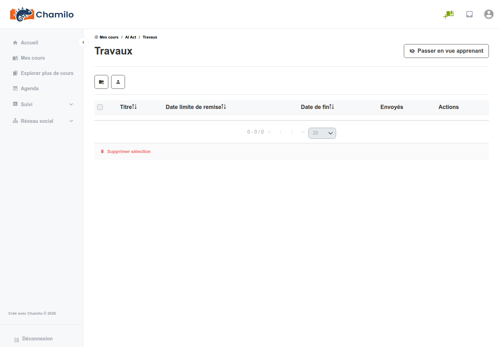
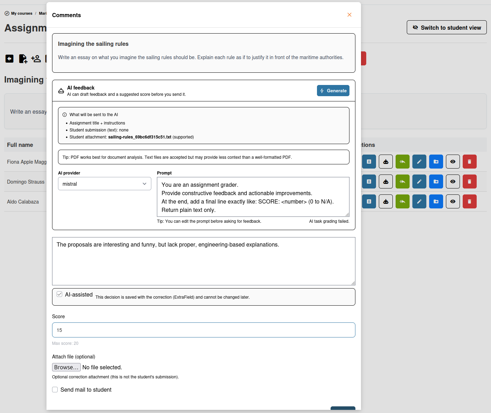

# Travaux

L'outil Travaux (également appelé « publications des apprenants ») vous permet de collecter le travail des apprenants — dissertations, projets, rapports ou tout dépôt sous forme de fichier — et de le noter.

## Créer un travail

1. Ouvrez l'outil **Travaux**  depuis la page d'accueil du cours
2. Cliquez sur **Créer un travail**
3. Renseignez les informations :
   * **Nom du travail** — Le nom du travail (par ex. « Rapport de projet final »)
   * **Description** — Consignes destinées aux apprenants, y compris ce qu'il faut déposer et comment le travail sera évalué (texte enrichi pris en charge)
   * **Note maximale** — Sur quel total le travail sera noté
   * **Ajouter au carnet de notes** — Ajouter comme élément évalué dans l'outil d'évaluation (carnet de notes), afin qu'il puisse contribuer à l'atteinte des objectifs du cours
   * **Date limite** — La date et l'heure officielles (publiées) après lesquelles les dépôts sont signalés comme en retard (les envois restent acceptés)
   * **Se termine le (complètement fermé)** — La date et l'heure de coupure définitive après lesquelles aucun envoi n'est possible
   * **Ajouter au calendrier** — Créer un événement pour indiquer la date de dépôt de ce travail
   * **Type de dépôt** — Choisissez entre **Autoriser uniquement le texte**, **Autoriser uniquement les fichiers**, ou **Autoriser les fichiers ou le texte en ligne**
4. Enregistrez

Une fois le travail créé, vous pouvez également :
* Téléverser des documents modèles depuis la page de détail du travail
* Attribuer le travail à des utilisateurs spécifiques (plutôt qu'à tous les utilisateurs du cours)

Et une fois que les apprenants ont déposé leurs travaux, vous pouvez :
* Exporter une liste PDF des dépôts
* Afficher une liste des seuls apprenants qui n'ont pas déposé leur travail
* Télécharger tous les travaux dans une grande archive ZIP
* Téléverser toutes les corrections dans une grande archive ZIP
* Supprimer toutes les corrections que vous avez envoyées (cela ne supprime pas les dépôts des apprenants)

## Comment les apprenants déposent

Les apprenants ouvrent le travail et :

1. Cliquent sur **Téléverser un fichier** ou sur le bouton de dépôt
2. Sélectionnent un fichier depuis leur ordinateur (ou rédigent du texte directement, selon la configuration)
3. Ajoutent un commentaire facultatif
4. Envoient

Les apprenants peuvent voir s'ils ont déjà déposé et, si cela est autorisé, mettre à jour leur dépôt.

## Examiner les dépôts

En tant qu'enseignant, ouvrez un travail pour voir la liste de tous les dépôts :

* **Nom de l'étudiant** — Qui a déposé
* **Date de dépôt** — Quand le travail a été déposé
* **Fichier** — Télécharger le fichier déposé
* **Statut** — Si le dépôt a été noté
* **Commentaires** — Tout commentaire laissé par l'apprenant ou par vous

### Noter un dépôt

1. Cliquez sur un dépôt pour l'ouvrir
2. Examinez le fichier déposé
3. Saisissez une **note**
4. Rédigez des **commentaires de rétroaction** pour l'apprenant
5. Téléversez éventuellement un **fichier corrigé** en pièce jointe
6. Enregistrez

### Notation assistée par IA

Si des outils d'IA sont configurés sur votre plateforme, vous pouvez voir une option **Notation IA** lors de l'examen des dépôts. Celle-ci utilise un modèle d'IA pour proposer une note et une rétroaction pour les travaux ouverts. Voir [Notation IA](../ai-tools/ai-grading.md) pour plus de détails.

## Gérer les dépôts

Actions de groupe :
* **Télécharger le paquet de travaux** — Télécharger tous les dépôts dans un seul fichier ZIP pour un examen hors ligne
* **Téléverser le paquet de corrections** — Si vous avez téléchargé tous les dépôts dans un seul fichier ZIP, modifié les fichiers sur place sur votre ordinateur puis les avez de nouveau compressés, vous pouvez envoyer le zip comme paquet de corrections. Ne changez pas les noms de fichiers, sinon cela ne fonctionnera pas.
* **Dépôts en retard** — Les dépôts après la date limite sont signalés mais peuvent encore être acceptés selon vos paramètres

Actions sur un dépôt individuel :
* **Téléverser une correction** — Téléverser une correction pour un apprenant 
* **Télécharger** — Télécharger le dépôt d'un apprenant
* **Corriger et noter** — Ajouter une correction et une note au dépôt de l'apprenant 
* **Modifier** — Modifier le titre du document ou la rétroaction précédente sur le dépôt
* **Déplacer** — Transférer un dépôt entre dossiers de travaux (par ex. si l'étudiant a déposé dans le mauvais travail)
* **Visibilité** — Contrôler si les apprenants peuvent voir les dépôts des autres

## Lien avec le carnet de notes

Les notes des travaux peuvent être incluses dans le carnet de notes du cours (outil « Évaluations »). Cela permet aux notes des travaux de contribuer à la note globale de l'apprenant et à l'éligibilité au certificat. Voir [Carnet de notes](gradebook.md) pour plus de détails.

## Conseils

* **Soyez précis dans les consignes** — Décrivez clairement ce que les apprenants doivent remettre, le format attendu et les critères d’évaluation
* **Fixez des échéances réalistes** — Utilisez l’outil Agenda pour rendre les échéances visibles dans le calendrier du cours
* **Utilisez la fonctionnalité de fichier corrigé** — Déposez des versions annotées des travaux des étudiants afin qu’ils puissent voir vos corrections précises
* **Activez la visibilité entre pairs avec prudence** — Permettre aux apprenants de voir les travaux des autres peut favoriser l’apprentissage, mais cela n’est pas forcément adapté à tous les devoirs