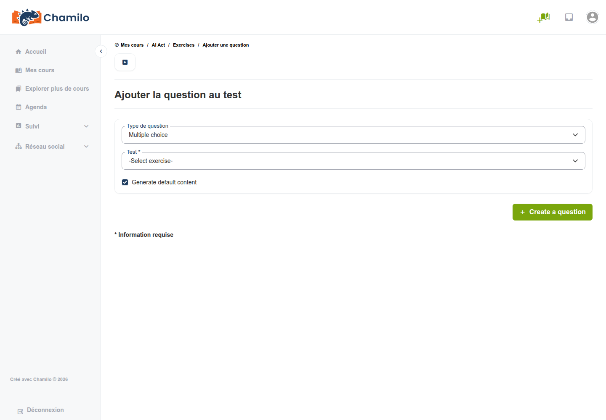

# Exercices

L’outil Exercices (également appelé « tests ») permet de créer des quiz et des examens avec notation automatique. Chamilo prend en charge une grande variété de types de questions, du simple choix multiple aux questions interactives de type hotspot.

## Créer un exercice

1. Ouvrez l’outil **Exercices**  depuis la page d’accueil du cours
2. Cliquez sur **Nouvel exercice**
3. Saisissez un **titre** et, éventuellement, une **description**
4. Configurez les paramètres de l’exercice (voir ci-dessous)
5. Enregistrez, puis ajoutez des questions

## Paramètres de l’exercice

### Affichage et navigation

| Paramètre | Options | Description |
|---------|---------|-------------|
| **Disposition des questions** | Toutes sur une page / Une par page | Afficher toutes les questions à la fois ou une à la fois |
| **Masquer les titres des questions** | Oui / Non | Indique si les titres des questions sont affichés aux apprenants |
| **Afficher le bouton précédent** | Oui / Non | Autoriser les apprenants à revenir aux questions précédentes |
| **Empêcher la navigation vers l’arrière** | Oui / Non | Obliger les apprenants à répondre dans l’ordre sans revenir en arrière |

### Temps et disponibilité

| Paramètre | Description |
|---------|-------------|
| **Limite de temps** | Temps maximal (en minutes) pour terminer l’exercice. Un compte à rebours est affiché à l’apprenant |
| **Date de début** | Moment à partir duquel l’exercice devient disponible pour les apprenants |
| **Date de fin** | Moment à partir duquel l’exercice n’est plus disponible |

### Tentatives et notation

| Paramètre | Description |
|---------|-------------|
| **Nombre maximal de tentatives** | Nombre de fois qu’un apprenant peut passer l’exercice (0 = illimité) |
| **Pourcentage de réussite** | Score minimal pour réussir (par ex. 70 %). Les apprenants qui n’atteignent pas ce seuil voient un message d’échec |
| **Propager la notation négative** | Indique si les points négatifs sur des questions individuelles peuvent faire descendre le score total en dessous de zéro |

### Rétroaction

| Paramètre | Options |
|---------|---------|
| **À la fin** | Afficher les résultats et les réponses correctes après la soumission par l’apprenant |
| **Immédiate** | Afficher la rétroaction après chaque question (utile pour les exercices d’apprentissage) |
| **Mode examen** | N’afficher aucune rétroaction ni aucun résultat |

### Affichage des résultats

Contrôlez ce que les apprenants voient après avoir terminé l’exercice :

* Afficher le score et les réponses attendues
* Afficher uniquement le score
* Afficher le score avec la répartition par catégorie
* Afficher le classement parmi les autres apprenants
* Afficher uniquement à la dernière tentative
* Afficher une visualisation en diagramme radar

### Messages de fin

* **Message de réussite** — Texte personnalisé affiché lorsque l’apprenant réussit
* **Message d’échec** — Texte personnalisé affiché lorsque l’apprenant n’atteint pas le pourcentage de réussite

### Randomisation des questions

| Paramètre | Description |
|---------|-------------|
| **Ordre aléatoire des questions** | Mélanger l’ordre des questions à chaque tentative |
| **Réponses aléatoires** | Mélanger les options de réponse au sein de chaque question |
| **Aléatoire par catégorie** | Sélectionner des questions aléatoires dans chaque catégorie de questions |

Vous pouvez également configurer des stratégies de sélection avancées combinant catégories et randomisation.

## Types de questions

Chamilo propose un ensemble riche de types de questions organisés en plusieurs catégories :

### Choix unique

* **Choix multiple (réponse unique)** — L’apprenant sélectionne une seule réponse correcte dans une liste d’options
* **Réponse unique avec images** — Identique au précédent, mais les options de réponse sont affichées sous forme d’images

### Choix multiple

* **Réponses multiples** — L’apprenant sélectionne une ou plusieurs réponses correctes
* **Réponses multiples (liste déroulante)** — Les options de réponse sont présentées sous forme de menus déroulants
* **Vrai/Faux** — Une série d’affirmations que l’apprenant marque comme vraies ou fausses
* **Vrai/Faux avec degré de certitude** — Vrai/faux avec un niveau de confiance supplémentaire, permettant une notation plus nuancée

### Texte à trous

* **Texte à trous** — L’apprenant complète les mots manquants dans un texte. Vous définissez les blancs et les réponses acceptées lors de la création de la question.

### Appariement

* **Appariement** — L’apprenant relie des éléments de deux colonnes
* **Appariement (glisser-déposer)** — Même principe, mais avec une interface de glisser-déposer
* **Glisser-déposer** — Faire glisser des éléments vers les positions correctes

### Questions ouvertes

* **Réponse libre (dissertation)** — L’apprenant rédige une réponse textuelle. Nécessite une notation manuelle (ou une notation assistée par IA si elle est configurée)
* **Expression orale** — L’apprenant enregistre une réponse audio à l’aide de son microphone
* **Réponse par téléversement** — L’apprenant téléverse un fichier comme réponse

### Hotspot

* **Hotspot** — L’apprenant clique sur des zones précises d’une image pour répondre
* **Délimitation hotspot** — L’apprenant dessine des contours autour de zones sur une image

### Calculée

* **Réponse calculée** — Questions numériques avec une formule et une plage de tolérance. Utile pour les cours de mathématiques et de sciences.

### Spécial

* **Compréhension écrite** — Tests fondés sur la lecture d’un passage
* **Annotation** — L’enseignant téléverse une image et l’apprenant l’annote
* **Réponse dans un document Office** — Lorsque le plugin OnlyOffice est activé, l’apprenant répond à la question en éditant un document Office intégré (Word, Excel, PowerPoint). Sa réponse est enregistrée sous forme de fichier distinct rattaché à l’exercice, afin de pouvoir être examinée avec le reste de sa tentative.

## Ajouter des questions à un exercice

1. Ouvrez l’exercice et cliquez sur **Ajouter une question**
2. Sélectionnez le type de question
3. Saisissez le **texte de la question** (prend en charge le texte enrichi avec images et mise en forme)
4. Définissez les **réponses** et leur notation :
   * Pour chaque option de réponse, indiquez si elle est correcte et le nombre de points qu’elle vaut
   * Vous pouvez attribuer des points négatifs aux mauvaises réponses afin de décourager les réponses au hasard
5. Ajoutez éventuellement un **feedback** — explications affichées à l’apprenant après sa réponse
6. Définissez le **niveau de difficulté** et la **catégorie** (utile pour la sélection aléatoire et les rapports)
7. Enregistrez

## Catégories de questions

Vous pouvez organiser les questions en catégories (par ex. « Module 1 », « Vocabulaire », « Avancé »). Les catégories sont utiles pour :

* Organiser de grandes banques de questions
* Activer la sélection aléatoire par catégorie (par ex. « 5 questions du Module 1, 3 du Module 2 »)
* Consulter les scores détaillés par catégorie dans les rapports

## Réutilisation des questions

Les questions peuvent être réutilisées d’un exercice à l’autre au sein du même cours. Lors de l’ajout d’une question, vous pouvez choisir d’en créer une nouvelle ou de sélectionner une question existante dans la banque de questions.

## Importer des exercices

Chamilo prend en charge l’importation d’exercices depuis des formats externes :

* **IMS QTI / Common Cartridge** — Le format standard de quiz e-learning
* **Format Moodle** — Importer des quiz à partir d’exports Moodle

Pour importer, recherchez l’option **Importer** dans l’outil exercices et téléversez votre fichier.

## Conseils

* **Mélangez les types de questions** — Combinez questions à choix multiples, textes à trous et questions ouvertes pour une évaluation complète
* **Utilisez les catégories** — Organisez les questions par thème afin d’activer une sélection aléatoire ciblée
* **Définissez un pourcentage de réussite** — Donnez aux apprenants un objectif clair et reliez-le à la génération de certificats via le carnet de notes
* **Utilisez le feedback immédiat pour l’entraînement** — Créez des exercices d’entraînement non notés avec feedback immédiat pour aider les apprenants à apprendre de leurs erreurs
* **Randomisez pour l’intégrité** — Activez l’ordre aléatoire des questions et des réponses afin de réduire les risques de copie