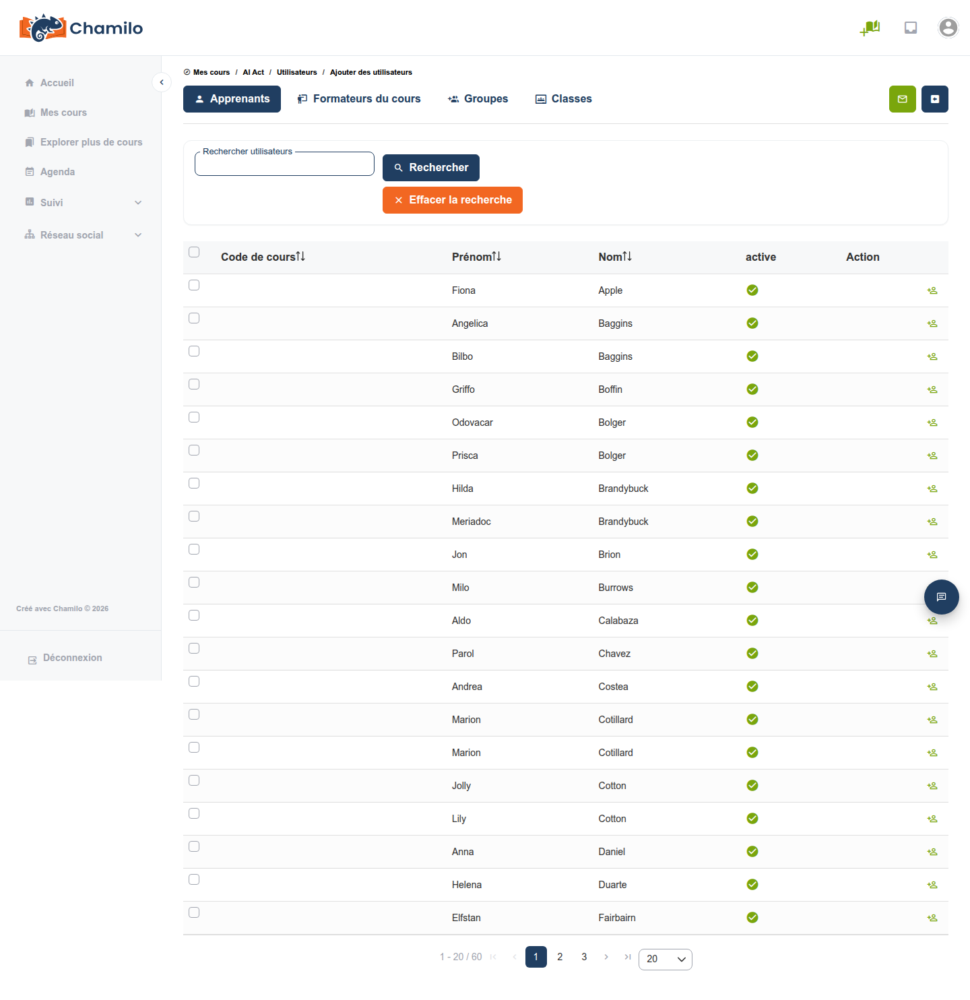
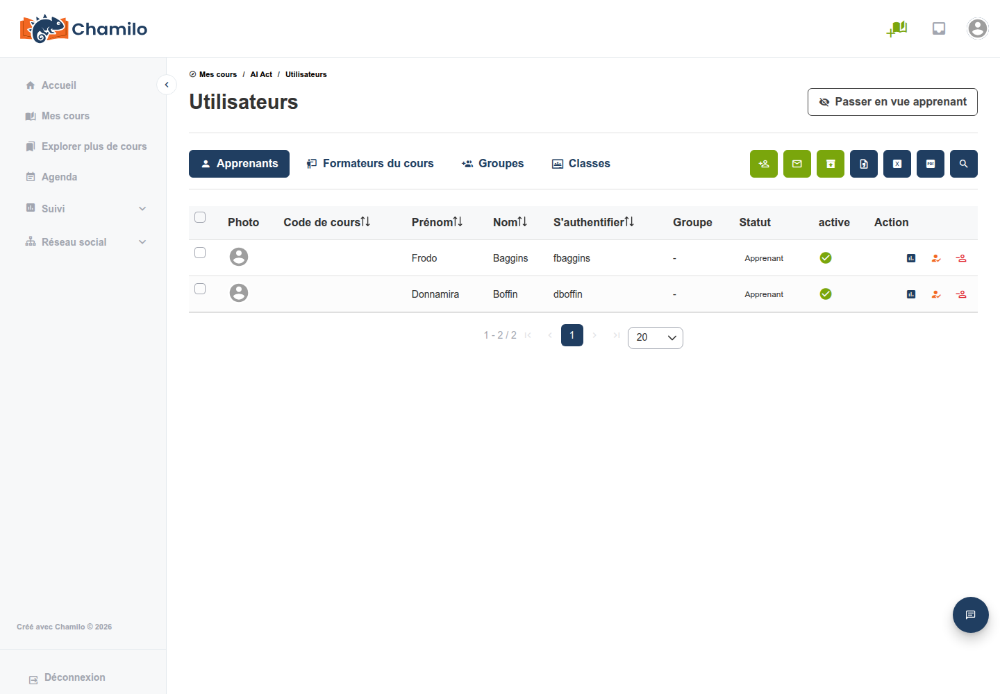
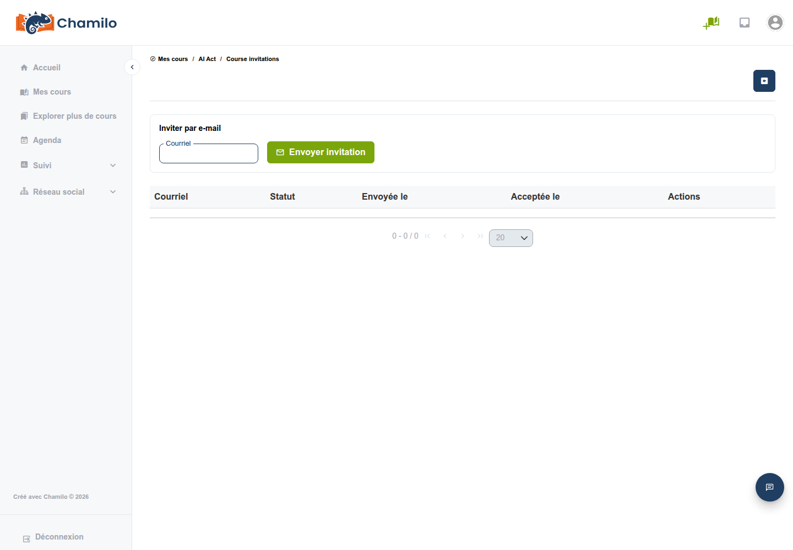

# Inscrire des utilisateurs

Avant de pouvoir évaluer un apprenant, celui-ci doit être inscrit à votre cours. Chamilo propose quatre façons d’y parvenir, selon la personne qui effectue l’inscription et selon que l’intéressé dispose déjà d’un compte sur la plateforme.

| Méthode | Qui l’effectue | Compte existant requis ? |
|--------|-------------|------------------------------|
| [Inscription par l’administrateur](#administrator-enrollment) | Administrateur de la plateforme | Oui |
| [Auto-inscription via le catalogue de cours](#self-enrollment-via-the-course-catalog) | L’apprenant lui-même | Oui |
| [Inscription manuelle via l’outil Utilisateurs](#manual-enrollment-via-the-users-tool) | Enseignant (ou administrateur du cours) | Oui |
| [Invitation d’utilisateurs par e-mail](#inviting-users-by-email) | Enseignant (ou administrateur du cours) | **Non** |

## Inscription par l’administrateur

Un administrateur de la plateforme peut inscrire n’importe quel utilisateur existant à n’importe quel cours directement depuis le panneau d’administration — utile pour l’intégration en masse (par exemple l’importation d’une liste de classe) ou lorsqu’un enseignant n’a pas les droits pour gérer lui-même les inscriptions. Consultez la section [Cours](../../admin-guide/courses/README.md) du Guide d’administration.

## Auto-inscription via le catalogue de cours

Si la [visibilité](../creating-your-course/course-settings.md#course-visibility) de votre cours le permet, les apprenants disposant d’un compte sur la plateforme peuvent s’inscrire eux-mêmes en trouvant votre cours dans **Explorer plus de cours** et en cliquant pour le rejoindre — aucune action n’est requise de votre part. La disponibilité de cette option, et le fait qu’un mot de passe soit exigé ou non, sont contrôlés par les **Paramètres d’inscription** dans [Paramètres du cours](../creating-your-course/course-settings.md#enrollment-settings).

## Inscription manuelle via l’outil Utilisateurs

Pour inscrire une personne qui possède déjà un compte sur la plateforme mais ne s’est pas inscrite d’elle-même, ouvrez l’outil **Utilisateurs** de votre cours et cliquez sur l’icône **Ajouter des utilisateurs** .

1. Recherchez la personne par nom, identifiant, e-mail ou code officiel
2. Cliquez sur **Inscrire** sur sa ligne, ou sélectionnez plusieurs personnes à l’aide des cases à cocher et utilisez le menu **Action** pour les inscrire toutes en une fois

Seuls les utilisateurs qui ne sont pas déjà inscrits au cours apparaissent dans les résultats.

> Cette icône est disponible par défaut pour les enseignants. Un administrateur de la plateforme peut la réserver aux seuls administrateurs via le paramètre **Autoriser l’inscription d’utilisateurs au cours par l’administrateur du cours** (`allow_user_course_subscription_by_course_admin`) — si vous ne voyez pas l’icône **Ajouter des utilisateurs**, demandez à votre administrateur.

## Invitation d’utilisateurs par e-mail

Les trois méthodes ci-dessus supposent toutes que la personne possède déjà un compte sur la plateforme. Les **invitations de cours** couvrent le cas où ce n’est pas le cas : vous envoyez une invitation à une adresse e-mail, et Chamilo envoie à cette personne un lien à usage unique. L’ouverture du lien lui permet de créer un compte, et dès qu’elle a terminé son inscription, elle est automatiquement inscrite à votre cours — aucune étape d’inscription distincte n’est nécessaire.

### Accéder à l’outil

Ouvrez l’outil **Utilisateurs** de votre cours, puis cliquez sur l’icône **Inviter par e-mail**  dans la barre d’outils, à côté de **Ajouter des utilisateurs** :

Cela ouvre la page **Invitations de cours**.

### Qui peut envoyer des invitations

* Les administrateurs de la plateforme, toujours.
* Dans un cours simple (non ouvert dans une session) : les enseignants et les autres utilisateurs disposant de droits d’édition sur le cours.
* Dans une session : le coach général de la session, ou un administrateur de session — pas l’ensemble plus large des coachs de cours, car l’envoi d’une invitation ici inscrit à la *session entière*, et non seulement à ce cours.

### Envoi d’une invitation

1. Saisissez l’adresse e-mail du destinataire dans le formulaire **Inviter par e-mail**
2. Cliquez sur **Envoyer l’invitation**

Toutes les invitations que vous avez envoyées pour ce cours apparaissent sous le formulaire, avec leur statut :

| Statut | Signification |
|--------|---------|
| **En attente** | Envoyée, pas encore utilisée. Toujours dans sa période de validité. |
| **Acceptée** | Le destinataire s’est inscrit et a été abonné. |
| **Révoquée** | Vous l’avez annulée avant qu’elle ne soit utilisée. |

Pour une invitation encore en attente, la colonne **Actions** propose :

* **Copier**  — copie le lien d’invitation, au cas où vous préféreriez le partager vous-même (messagerie, en personne) plutôt que de compter sur l’e-mail.
* **Révoquer**  — annule l’invitation immédiatement ; le lien cesse de fonctionner. Une invitation déjà acceptée ne peut pas être révoquée.

> **L’adresse e-mail invitée ne doit pas déjà posséder de compte sur cette plateforme.** Si c’est le cas, l’envoi de l’invitation échoue avec un message vous demandant d’inscrire directement cet utilisateur existant — via [Inscription manuelle via l’outil Utilisateurs](#manual-enrollment-via-the-users-tool) ci-dessus.

### Invitations dans une session

Si vous ouvrez l’outil Utilisateurs depuis un cours qui s’exécute à l’intérieur d’une session, la page affiche un rappel indiquant que l’invitation s’applique à toute la session, et pas seulement à ce cours :

> *Ce cours est ouvert dans une session. L’envoi d’une invitation ici abonnera le destinataire à l’ensemble de la session, et pas seulement à ce cours.*

Cela reflète le fonctionnement de l’inscription ailleurs dans Chamilo : vous abonnez quelqu’un à une session dans son ensemble, ou à un cours autonome, mais jamais à « ce seul cours à l’intérieur de cette session » comme action distincte.

### Ce que voit la personne invitée

L’e-mail contient un lien vers la page d’inscription. En l’ouvrant :

* Le champ e-mail est prérempli et verrouillé sur l’adresse que vous avez invitée — ils ne peuvent pas s’inscrire sous une autre adresse avec ce lien.
* Ils peuvent terminer l’inscription **même si l’auto-inscription est actuellement désactivée à l’échelle de la plateforme** — à condition que votre administrateur ait activé le paramètre **Autoriser l’inscription via les liens d’invitation au cours** (voir ci-dessous). Sans cela, un lien d’invitation n’aide que si l’auto-inscription est par ailleurs ouverte.
* Ils sont immédiatement abonnés à votre cours (ou à la session) une fois le formulaire soumis, et connectés.

Le lien est à usage unique et expire au bout de 7 jours. S’il expire ou si l’invitation cible est révoquée, l’ouvrir se comporte comme si le lien n’avait jamais existé.

> Le paramètre **Autoriser l’inscription via les liens d’invitation au cours** à l’échelle de la plateforme (`registration.allow_invitation_registration`) détermine si votre lien d’invitation peut ouvrir l’inscription lorsque l’auto-inscription générale est désactivée. Demandez à votre administrateur si les invitations ne semblent pas fonctionner sur une plateforme par ailleurs fermée.

## Conseils

* **Adaptez la méthode à la situation** — administrateur ou auto-inscription pour les personnes qui utilisent déjà la plateforme, inscription manuelle pour un utilisateur existant connu, invitations pour les invités externes, les relecteurs, ou quiconque n’a pas encore de compte.
* **Révoquez les invitations dont vous n’avez plus besoin** — une ancienne invitation en attente reste un lien valide et inutilisé ; révoquez-la si le destinataire prévu n’a plus besoin d’accès, ou si vous n’êtes pas sûr qu’elle lui soit parvenue.
* **Vérifiez auprès de votre administrateur si une méthode semble indisponible** — plusieurs de ces flux (inscription manuelle, invitations, auto-inscription) peuvent être restreints ou désactivés à l’échelle de la plateforme.