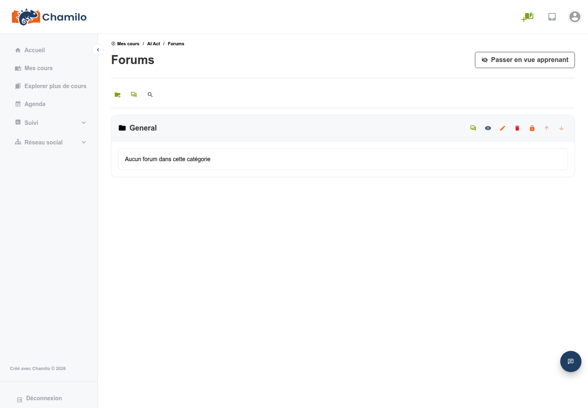

# Forums

L'outil forum vous permet d'héberger des discussions structurées au sein de votre cours. Les apprenants peuvent publier des messages, se répondre mutuellement et participer à des conversations en fils de discussion.

## Structure des forums

Les forums dans Chamilo sont organisés en trois niveaux :

1. **Catégories de forums** — Regroupements de premier niveau (par ex. « Discussions générales », « Questions du module 1 »)
2. **Forums** — Espaces de discussion individuels au sein d'une catégorie
3. **Sujets (fils de discussion)** — Sujets de discussion individuels au sein d'un forum, chacun avec une chaîne de réponses

## Créer une catégorie de forum

1. Ouvrez l'outil **Forums**  depuis la page d'accueil de votre cours
2. Cliquez sur **Ajouter une catégorie de forum**
3. Saisissez un **Nom de catégorie** et une description facultative
4. Enregistrez

## Créer un forum

Vous ne pouvez ajouter un forum qu'une fois qu'au moins une catégorie existe.

1. Dans une catégorie, cliquez sur **Ajouter un forum**
2. Renseignez les informations de base :
   * **Titre** — Le nom de cet espace de discussion
   * **Description** — Une description facultative de l'objet du forum
   * **Créer dans la catégorie** — La catégorie à laquelle ce forum appartient
3. Ouvrez **Paramètres avancés** pour configurer :
   * **Date de publication** / **Date de clôture** — Fenêtre temporelle facultative pendant laquelle le forum est ouvert
   * **Forum modéré** — Exiger que les nouveaux messages soient approuvés par un enseignant avant de devenir visibles
   * **Les apprenants peuvent-ils modifier leurs propres messages ?** — Autoriser ou empêcher les apprenants de modifier les messages après envoi
   * **Autoriser les utilisateurs à démarrer de nouveaux fils** — Lorsque défini sur Non, les apprenants ne peuvent que répondre aux fils existants
   * **Type d'affichage par défaut** — Choisissez comment les messages sont affichés : **Plat**, **En fils** ou **Imbriqué**
   * **Pour le groupe** — Associer ce forum à un groupe de cours
   * **Accès public / Accès privé** — Pour les forums de groupe, décider si tout membre du cours peut le lire ou uniquement les membres du groupe
4. Enregistrez

Si la visibilité du cours est définie sur « Ouvert au monde », le formulaire affiche également une option **Autoriser les messages anonymes ?**. Cette option est masquée dans les cours à visibilité restreinte.

## Gérer les sujets

Les apprenants (et vous) peuvent créer de nouveaux sujets au sein d'un forum. En tant qu'enseignant, vous pouvez :

* **Épingler un sujet (message collant)** — Marquer un fil comme collant lors de sa création ou de sa modification afin qu'il apparaisse toujours en haut
* **Verrouiller un sujet** — Empêcher toute nouvelle réponse
* **Modifier ou supprimer des messages** — Modérer la discussion
* **Déplacer un sujet** — Transférer un sujet vers un autre forum

## Notation des forums

Lors de la création d'un nouveau fil en tant qu'enseignant, vous pouvez activer **Noter ce fil** sous Paramètres avancés. Vous définissez alors une note maximale, un en-tête de colonne pour le carnet de notes et un poids dans le rapport. Vous pouvez également activer **Fil noté par les pairs**, ce qui exige que chaque apprenant évalue au moins deux autres apprenants avant que sa propre note ne soit prise en compte.

## Notifications

Chaque forum et chaque fil dispose d'un bascule **Me notifier** que vous et vos apprenants pouvez utiliser pour vous abonner aux notifications par e-mail concernant les nouveaux messages. Les notifications sont un abonnement par utilisateur et ne se configurent pas lors de la création du forum.