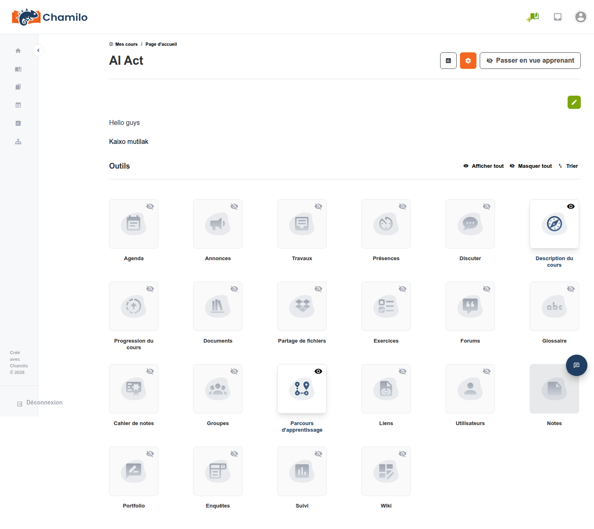
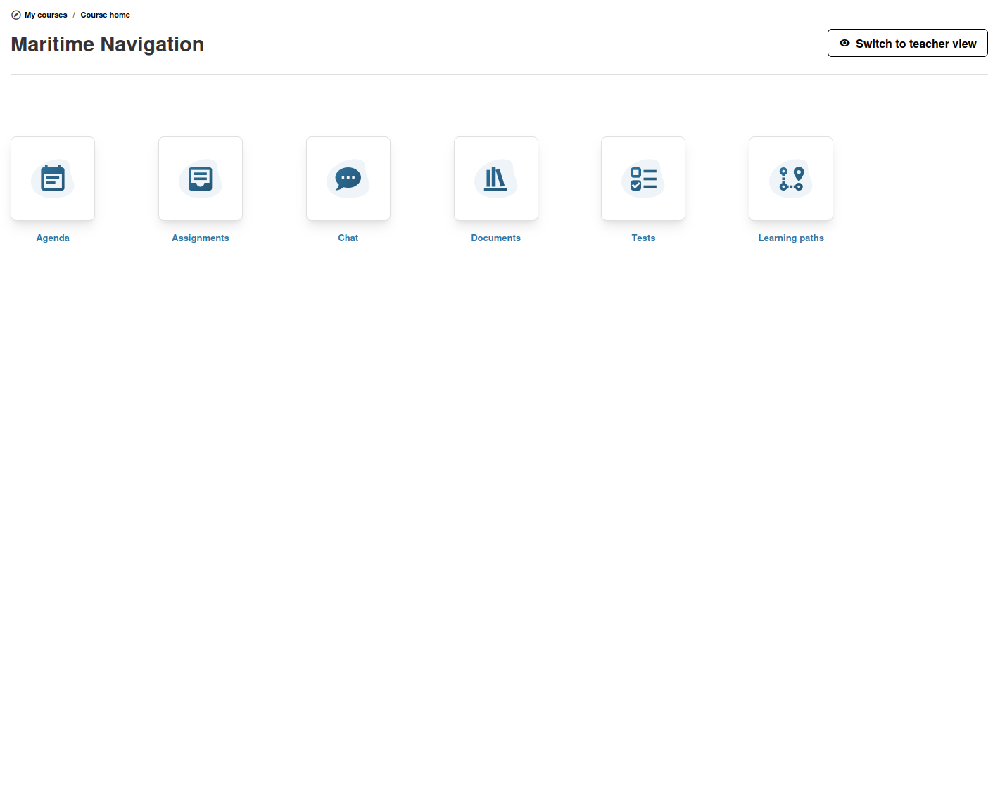

# Page d'accueil du cours

La page d'accueil du cours est la première page que vos apprenants voient lorsqu'ils entrent dans un cours. Cette page décrit comment la personnaliser afin de créer un point d'entrée engageant.

## Introduction du cours

L'introduction du cours est une zone de texte enrichi affichée en haut de la page d'accueil, au-dessus de la grille d'outils. Utilisez-la pour :

* Accueillir vos apprenants
* Décrire les objectifs du cours
* Fournir des consignes pour commencer
* Intégrer des images, des vidéos ou des liens

Pour modifier l'introduction :

1. Cliquez sur le bouton **Modifier l'introduction** 
2. Utilisez l'éditeur de texte enrichi pour rédiger votre contenu
3. Enregistrez vos modifications

Si aucune introduction n'a encore été créée, vous verrez un bouton **Créer une introduction**.

## Grille d'outils

Sous l'introduction, les outils du cours s'affichent sous forme de grille. Chaque outil apparaît sous forme de carte avec :

* Une icône représentant l'outil
* Le nom de l'outil

Les outils disponibles dans votre cours peuvent inclure :

| Outil | Icône | Objectif |
|------|------|---------|
| Agenda |  | Planifier des événements et des échéances |
| Annonces |  | Envoyer des messages aux apprenants inscrits |
| Travaux |  | Collecter et noter le travail des étudiants |
| Documents |  | Téléverser et organiser des fichiers et du contenu |
| Tests |  | Créer des quiz et des tests |
| Forum |  | Animer des discussions |
| Glossaire |  | Définir les termes clés |
| Évaluations |  | Gérer les notes et les certificats |
| Parcours |  | Construire des séquences d'apprentissage structurées |
| Liens |  | Partager des URL utiles |
| Utilisateurs |  | Consulter et gérer les utilisateurs inscrits |
| Enquêtes |  | Créer et diffuser des enquêtes |

> Certains outils peuvent ne pas apparaître si votre administrateur les a désactivés au niveau de la plateforme ou si vous les avez masqués.

Un changement notable par rapport à Chamilo 1.* est que nous ne répartissons plus les outils en 3 sections distinctes. Cela donne aux enseignants un contrôle total sur les outils à afficher et dans quel ordre.

De plus, les outils **Suivi** et **Maintenance** ont été déplacés en haut de la page, sous les icônes de statistiques et de rouage, afin de retirer de la liste les outils qui ne sont jamais montrés aux apprenants.

## Organisation des outils

### Réorganisation

1. Cliquez sur le bouton **Trier** en haut de la grille d'outils
2. Faites glisser-déposer les outils pour modifier leur ordre
3. Le nouvel ordre est enregistré automatiquement

### Masquage et affichage

* Cliquez sur l'**icône de visibilité** de n'importe quel outil pour basculer entre visible et masqué pour les apprenants
* Utilisez **Tout afficher** ou **Tout masquer** pour des modifications groupées
* Les outils masqués restent accessibles pour vous en tant qu'enseignant — ils sont uniquement masqués pour les apprenants

## Fonctionnalités de lancement automatique

Vous pouvez configurer certains outils pour qu'ils se lancent automatiquement lorsqu'un apprenant entre dans le cours. Si cette option est activée, une notification s'affiche en haut de la page d'accueil du cours indiquant quel lancement automatique est actif :

* Lancement automatique de document — Ouvre automatiquement un document spécifique
* Lancement automatique d'exercice — Lance immédiatement un test
* Lancement automatique de parcours — Démarre un parcours à l'entrée dans le cours
* Lancement automatique de forum — Ouvre directement le forum