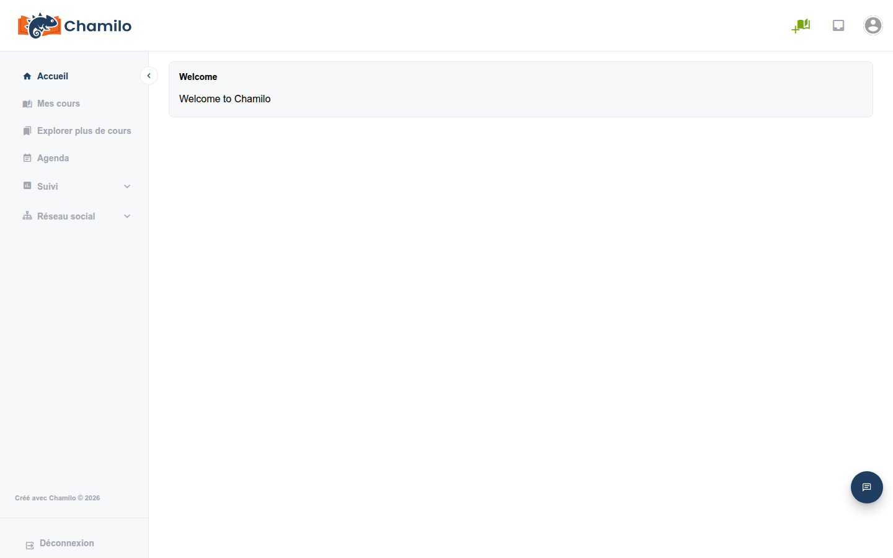

# Comprendre l’interface

Chamilo 3.0 propose une interface claire et moderne, conçue pour simplifier la navigation. Cette page décrit en détail chaque partie de l’interface.

## La barre supérieure

La barre supérieure est toujours visible en haut de chaque page. Elle contient :

* **Logo de la plateforme** — Cliquez dessus pour revenir à la page d’accueil à tout moment.
* **Icône de boîte de réception**  — Affiche vos messages. Un badge rouge indique des messages non lus. Cliquez pour ouvrir votre boîte de réception.
* **Icône de ticket de support**  — Si elle est activée par votre administrateur, elle vous donne accès au système de tickets de support.
* **Votre avatar** — Une image circulaire dans le coin supérieur droit. Cliquez dessus pour ouvrir un menu déroulant avec des liens vers votre profil, les paramètres du compte et la déconnexion.

## La barre latérale

La barre latérale à gauche constitue votre navigation principale. Elle peut être repliée pour laisser plus d’espace à la zone de contenu. Cliquez sur la flèche de bascule sur son bord droit pour l’étendre ou la replier. Chamilo mémorise votre préférence.

La barre latérale contient les liens suivants (certains peuvent être masqués selon la configuration de votre plateforme) :

| Élément de menu | Icône | Description |
|-----------|------|-------------|
| **Accueil** |  | Retourne au tableau de bord principal |
| **Mes cours** |  | Liste tous les cours auxquels vous êtes inscrit |
| **Mes sessions** |  | Liste vos sessions de formation (en cours, passées, à venir) |
| **Explorer plus de cours** |  | Parcourir le catalogue de cours pour trouver de nouveaux cours |
| **Agenda** |  | Votre calendrier personnel et de cours |
| **Rapports** |  | Accéder au suivi des apprenants et aux rapports de cours |
| **Réseau social** |  | Entrer en contact avec d’autres utilisateurs, envoyer des messages, rejoindre des groupes |
| **Visioconférence** |  | Accéder aux sessions vidéo en direct (si configuré) |
| **Administration** |  | Administration de la plateforme (visible uniquement pour les administrateurs) |

Tout en bas de la barre latérale, vous trouverez une option **Déconnexion** pour vous déconnecter rapidement lorsque vous avez terminé. Cette option est également disponible depuis le menu déroulant de l’icône de votre avatar, dans le coin supérieur droit.
Si la plateforme est gérée via des méthodes d’authentification externes, ces options de déconnexion peuvent ne pas être disponibles.

## La zone de contenu principale

La zone centrale de l’écran affiche le contenu de la page en cours. En haut, vous verrez souvent un **fil d’Ariane** indiquant votre emplacement actuel dans la plateforme (par exemple : Accueil > Rock music > Documents). Utilisez le fil d’Ariane pour revenir à une page parente.

## La page d’accueil du cours

Lorsque vous entrez dans un cours, vous voyez la **page d’accueil du cours**. Celle-ci est décrite en détail dans la section [Créer votre cours](../creating-your-course/), mais voici un aperçu rapide :

* **Titre du cours** — Affiché de manière proéminente en haut
* **Introduction du cours** — Une description facultative en texte enrichi que vous pouvez modifier
* **Grille d’outils** — Une grille d’icônes représentant les outils du cours (Documents, Exercices, Forums, etc.)

En tant qu’enseignant, vous verrez des commandes supplémentaires :

* **Vue apprenant**  — Activez cette option pour voir le cours tel qu’un apprenant le verrait
* **Modifier l’introduction**  — Modifier le texte d’introduction du cours
* **Tout afficher / Tout masquer** — Modifier rapidement la visibilité de tous les outils pour les apprenants
* **Trier** — Activer le glisser-déposer pour réordonner les outils sur la page d’accueil

## Couleurs des icônes

Ceci reste expérimental et n’est pas entièrement abouti dans Chamilo 3.0, mais nous essayons d’appliquer les règles suivantes à tous les boutons et icônes d’action de l’interface :

* **Vert** pour les actions de création. Cela comprend l’ajout, la création, l’importation, la notation, l’enregistrement et la copie de contenu.
* **Bleu** pour les actions de consultation. Cela comprend l’exportation, la visualisation, l’aperçu dans les listes ou les vues détaillées, la recherche et le téléchargement.
* **Orange** pour les actions de modification. Cela comprend l’édition, le déplacement, la configuration, l’activation/désactivation, le masquage et l’affichage.
* **Rouge** pour les actions de suppression/retrait. Cela comprend la suppression, le retrait, la désinscription.
* **Gris** pour les actions d’annulation. Il s’agit simplement de laisser les choses en l’état.

## Conception responsive

Chamilo 3.0 s’adapte aux différentes tailles d’écran. Sur un appareil mobile ou dans une fenêtre de navigateur étroite :

* La barre latérale est masquée par défaut et peut être ouverte en appuyant sur l’icône de menu
* Les cartes de cours s’affichent en une seule colonne au lieu d’une grille
* Les tableaux deviennent défilables horizontalement

Cela signifie que vous et vos apprenants pouvez accéder à la plateforme depuis un téléphone, une tablette ou un ordinateur, mais vous pourriez percevoir l’interface de manière légèrement différente.