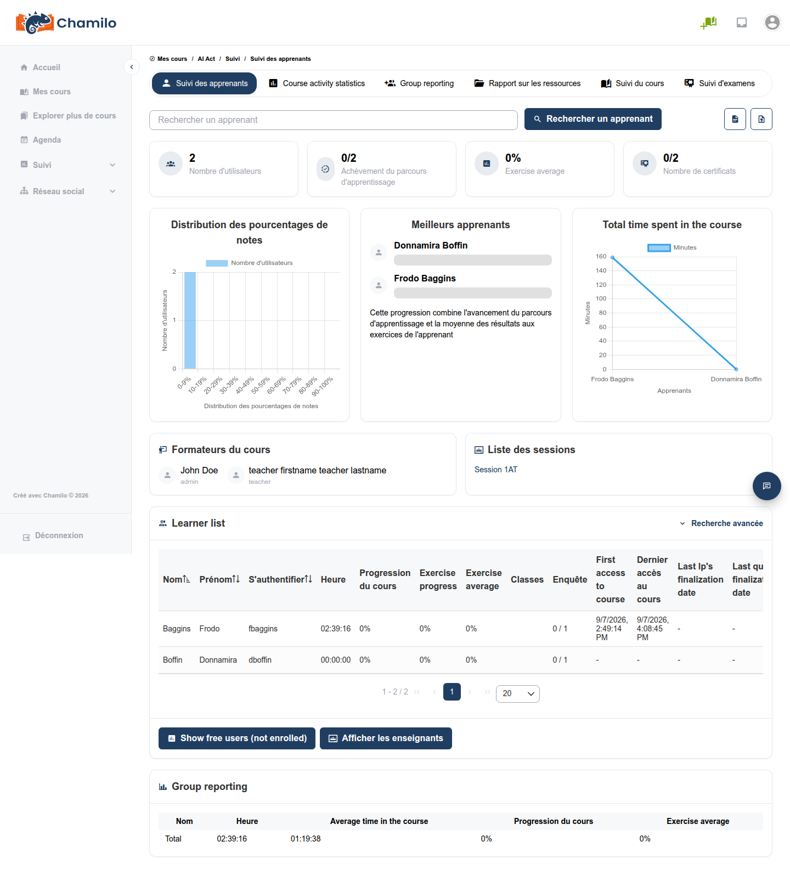

# Rapports de cours

Les rapports de cours vous offrent une vue agrégée de l’activité et des performances de l’ensemble des apprenants de votre cours.

## Accéder aux rapports de cours

Ouvrez l’outil **Suivi**  depuis la page d’accueil du cours et sélectionnez la vue des rapports au niveau du cours.

## Rapports disponibles

### Vue d’ensemble de l’activité

Un résumé de l’engagement global dans le cours, comprenant les apprenants inscrits, le temps passé dans le cours, la progression du cours, la progression des exercices et la note moyenne, ainsi que l’activité des devoirs.

Des vues détaillées distinctes sont disponibles depuis la section de suivi pour les **ressources** (nombre d’accès par ressource), les **outils** (utilisation par outil) et les **événements** (journal brut des événements).

### Rapports d’exercices

Pour chaque exercice du cours :

* Nombre d’apprenants l’ayant tenté
* Note moyenne
* Distribution des notes
* Nombre d’apprenants ayant réussi (selon le seuil de réussite que vous avez défini)

### Rapports de parcours d’apprentissage

Pour chaque parcours d’apprentissage :

* Taux d’achèvement pour l’ensemble des apprenants
* Pourcentage moyen de progression
* Temps passé par élément
* Apprenants ayant terminé le parcours par rapport à ceux encore en cours

### Rapports de devoirs

Pour chaque devoir :

* Nombre de soumissions reçues
* Nombre d’évaluations en attente

## Exporter les données

Vous pouvez exporter les données de suivi et de rapport pour une analyse plus approfondie. Recherchez l’option **Exporter**  pour télécharger les données dans un format compatible avec un tableur.

## Rapports de session

Si vous enseignez au sein d’une session, les rapports sont limités aux apprenants de la session. Les tuteurs de session ont accès aux rapports de tous les cours de leur session. Un paramètre de configuration global peut également permettre aux enseignants de voir les devoirs à travers toutes les sessions utilisant leur cours (demandez à votre administrateur).