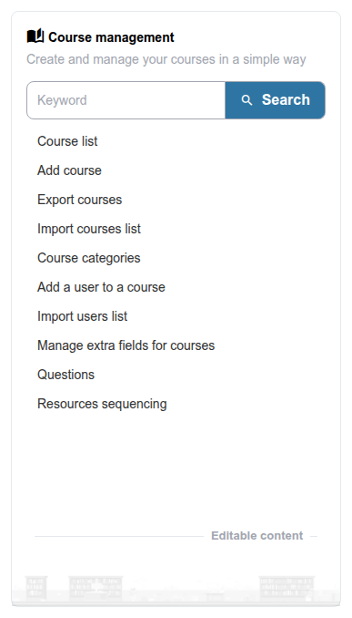

# Cursussen

Dit gedeelte behandelt cursusbeheer vanuit het perspectief van de beheerder: het overzien van de cursuscatalogus, het beheren van categorieën en het afhandelen van imports en exports.

* **[Cursussen beheren](managing-courses.md)** — Cursussen bekijken, aanmaken, bewerken en verwijderen
* **[Cursuscategorieën](course-categories.md)** — De cursuscatalogus organiseren met categorieën
* **[Cursusimport en -export](course-import-export.md)** — Cursussen importeren en exporteren tussen platformen