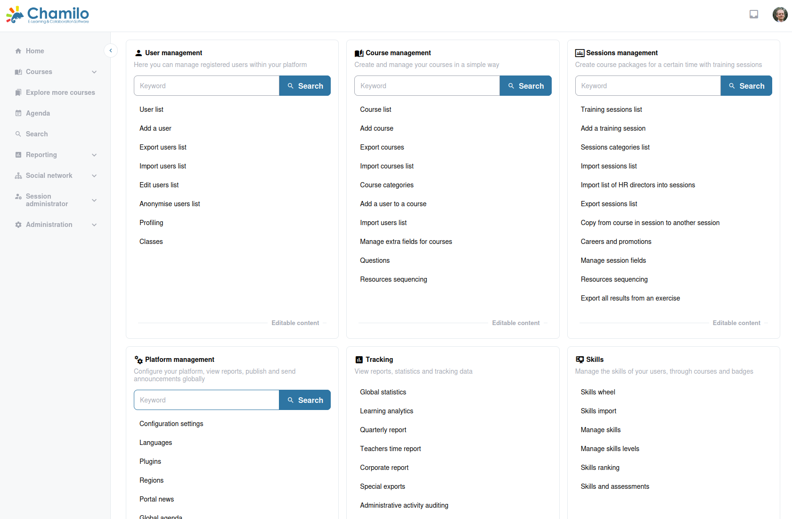

# Overzicht van de beheerinterface

Het beheerpaneel is uw commandocentrum voor het beheren van het Chamilo-platform. Open het door in de zijbalk op **Beheer**  te klikken.

## Beheerdashboard

Het beheerdashboard is ingedeeld in functionele blokken. Elk blok groepeert gerelateerde beheertaken:

### Gebruikers

* **Gebruikerslijst** — Alle gebruikers op het platform bekijken, zoeken, bewerken en beheren
* **Gebruiker toevoegen** — Individuele gebruikersaccounts aanmaken
* **Klassen** — Gebruikersklassen beheren voor bulkinschrijving in sessies

Zie het hoofdstuk [Gebruikers](../users/README.md) voor details.

### Cursussen

* **Cursuslijst** — Alle cursussen op het platform bekijken en beheren
* **Cursus aanmaken** — Een nieuwe cursus aanmaken
* **Cursuscategorieën** — Cursussen indelen in categorieën voor de catalogus

Zie het hoofdstuk [Cursussen](../courses/README.md) voor details.

### Sessies

* **Sessielijst** — Trainingssessies bekijken en beheren
* **Sessie aanmaken** — Een nieuwe sessie instellen met cursussen en inschrijving
* **Sessiecategorieën** — Sessies indelen in categorieën
* **Carrières en promoties** — Carrièrepaden en promotieworkflows beheren

Zie het hoofdstuk [Sessies](../sessions/README.md) voor details.

### Platform

* **Configuratie-instellingen**, **Talen**, **Portaalnieuws**, **Globale agenda**, **Pagina's**, **Extra velden**, **E-mailsjablonen**, **Categorieën contactformulier**, en meer — zie het hoofdstuk [Platform](../platform/README.md) voor details. De koppeling "Configuratie-instellingen" is het toegangspunt tot het afzonderlijke hoofdstuk [Platforminstellingen](../platform-settings/README.md).

### Analytics

* **Globale statistieken**, **Rapportencatalogus**, **Leeranalytics**, **Kwartaalrapport**, **Tijdsrapport docenten**, **Bedrijfsrapport**, **Speciale exports**, **Tickets** — Platformstatistieken en rapportage; zie het hoofdstuk [Analytics](../analytics/README.md) voor details

### Skills

* **Vaardighedenwiel**, **Vaardigheden importeren**, **Vaardigheden beheren**, **Vaardigheidsniveaus beheren**, **Vaardighedenranglijst**, **Vaardigheden en beoordelingen** — Competentiebadges gekoppeld aan cijferboekresultaten; zie het hoofdstuk [Skills](../skills/README.md) voor details

### Systeem

* **Tijdelijke bestanden opschonen**, **Systeemstatus**, **Systeemupdate**, **Kleuren**, **Bestandsinfo**, **Bronnen per type**, **Pictogrammenlijst** — Serveronderhoud, zelfupdate en huisstijl; zie het hoofdstuk [Systeem](../system/README.md) voor details

### Ruimtes

* **Vestigingen**, **Ruimtes**, **Zoeker beschikbaarheid ruimtes** — Fysieke locaties en reserveerbare trainingsruimtes; zie het hoofdstuk [Ruimtes](../rooms/README.md) voor details

### Beveiliging

* **Activiteitenaudit**, **Aanmeldpogingen**, **Eenvoudige IDS**, **Wachtwoordsterktecontrole**, **Bestandsintegriteit** — Hulpmiddelen voor beveiligingsmonitoring en auditing; zie het hoofdstuk [Beveiliging](../security/README.md) voor details

### Plugins

* Snelkoppelingen naar geïnstalleerde plugins die een beheermenu-pagina declareren, plus algemeen pluginbeheer — zie het hoofdstuk [Plugins](../plugins/README.md) voor details

### Health Check

* Live geslaagd/mislukt-controles (e-mailinstellingen, toewijzing van de beheer-URL, bestandsrechten) — zie de pagina [Health Check](../health-check.md) voor details

### Overige blokken

* **Chamilo.org**, **Versiecontrole**, **Professionele ondersteuning**, **Nieuws van Chamilo** — koppelingen en statuspanelen die inhoud ophalen van het Chamilo-project; zie [Overige beheerblokken](../other-admin-blocks/README.md) voor details

Elk onderdeel wordt in detail behandeld in het bijbehorende hoofdstuk van deze gids.

Authenticatiemethoden zoals OAuth2, LDAP, CAS en andere externe authenticatieproviders worden niet geconfigureerd in het beheerdashboard, maar in `config/authentication.yaml`.