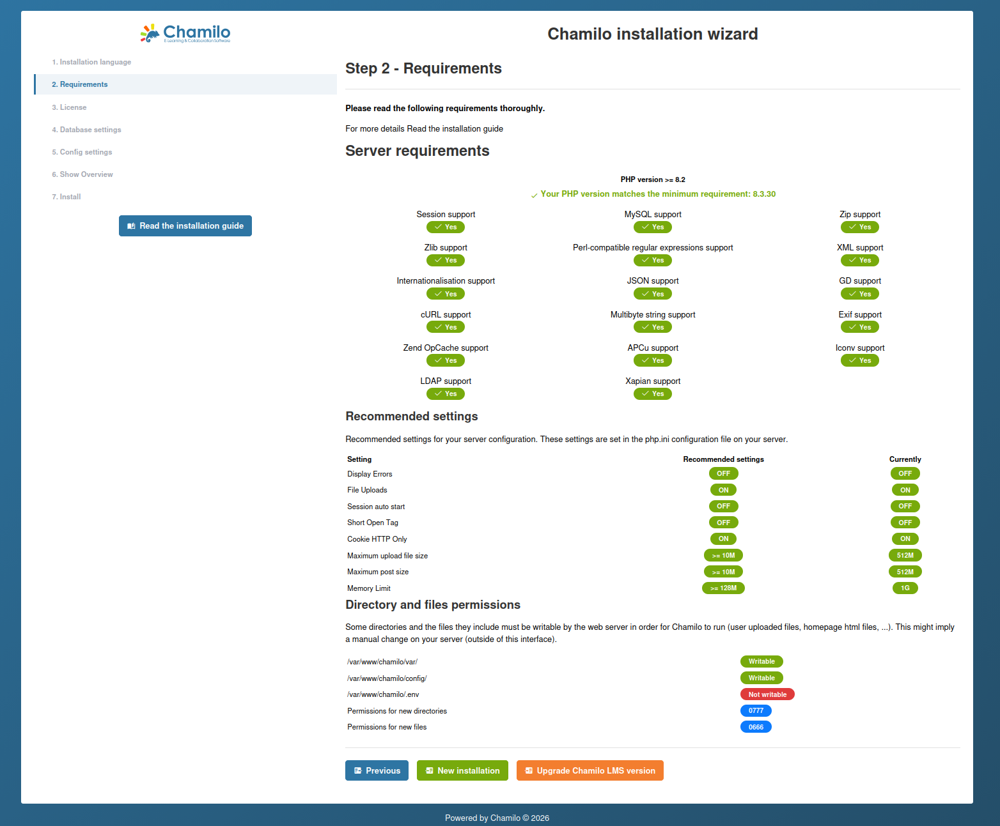
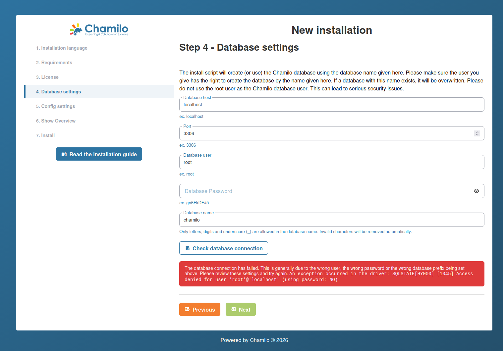

# Installatiewizard

Chamilo 3.0 bevat een webbased installatiewizard die u door de initiële configuratie leidt. De wizard start automatisch wanneer u het platform voor het eerst opent.

## Voordat u begint

Zorg dat aan de volgende vereisten is voldaan:

1. Uw server voldoet aan alle [serververeisten](server-requirements.md).
2. U hebt een verpakte versie (zip of tar.gz) van Chamilo gedownload.
3. Uw webserver is zo geconfigureerd dat de map `public/` als document root wordt geserveerd.
4. Uw `.env`-bestand bestaat en is leeg (de wizard begeleidt de databaseconfiguratie).

## Stap 1: Installatietaal

In de eerste stap kiest u de taal voor het installatieproces. Selecteer uw voorkeurstaal in de keuzelijst.

Als Chamilo een bestaande installatie detecteert (voor een upgrade), toont het de migratiestatus en biedt het een upgradepad in plaats van een nieuwe installatie.

## Stap 2: Controle van de vereisten

De wizard controleert uw serveromgeving:

* **PHP-versie** is 8.3, 8.4 of 8.5
* **Vereiste PHP-extensies** zijn geïnstalleerd (intl, gd, curl, zip, mbstring, xml, enz.)
* **Aanbevolen PHP-instellingen** — `date.timezone` is geconfigureerd, voldoende upload-/geheugenlimieten
* **Map- en bestandsrechten** — `var/`, `config/` en `public/upload/` zijn schrijfbaar voor de webserver

Als niet aan alle vereisten is voldaan, toont de wizard waarschuwingen of fouten. Los deze op voordat u verdergaat.

## Stap 3: Licentie

Deze stap toont de GNU/GPLv3-licentie. U moet het selectievakje **"I accept"** aanvinken om verder te gaan.

Optioneel kunt u de sectie **Contact information** uitvouwen om gegevens over uw organisatie te verstrekken (naam, e-mail, bedrijf, land). Dit is vrijwillig en helpt de Chamilo-gemeenschap te begrijpen wie het platform gebruikt, maar stelt ons ook in staat u *zeer zelden* te contacteren over evenementen in uw buurt.

## Stap 4: Database-instellingen

Voer de gegevens van uw databaseverbinding in:

| Veld | Beschrijving |
|-------|-------------|
| **Database host** | De hostnaam of het IP-adres van uw databaseserver (bijv. `localhost` of `127.0.0.1`) |
| **Database port** | Standaard: 3306 voor MySQL/MariaDB |
| **Database name** | De naam van de te gebruiken database (alleen alfanumeriek en underscores) |
| **Database user** | Een databasegebruiker met volledige rechten op de opgegeven database |
| **Database password** | Het wachtwoord van de databasegebruiker |

Klik op **Check database connection** om te testen. De wizard laat u niet verdergaan totdat de verbinding slaagt. Als de database al bestaat, wordt een waarschuwing weergegeven.

## Stap 5: Configuratie-instellingen

Deze stap combineert het aanmaken van het beheerdersaccount, de portaalinstellingen en de e-mailconfiguratie.

### Beheerdersaccount

| Veld | Beschrijving |
|-------|-------------|
| **Login** | De gebruikersnaam van de beheerder |
| **Password** | Kies een sterk wachtwoord — dit account heeft volledige toegang tot het platform |
| **First name** | De voornaam van de beheerder |
| **Last name** | De achternaam van de beheerder |
| **Email** | Gebruikt voor systeemmeldingen en wachtwoordherstel |
| **Phone** | Optioneel contactnummer |

Deze beheerdersgegevens worden door Chamilo ook gebruikt om de contactgegevens voor ondersteuning in te vullen. Zorg er daarom voor dat u die na de installatie in de instellingen opnieuw configureert.

### Portaalinstellingen

| Veld | Beschrijving |
|-------|-------------|
| **Language** | De standaard interfacetaal |
| **Portal name** | De naam van uw platform (bijv. "My Organization LMS") |
| **Company short name** | De afgekorte naam van uw organisatie |
| **Company URL** | De website van uw organisatie |
| **Encryption method** | Algoritme voor wachtwoordhashing — **bcrypt** wordt aanbevolen |
| **Allow self-registration** | Yes / No / After approval |
| **Allow self-registration as trainer** | Yes / No |

### E-mailconfiguratie

In de sectie e-mailinstellingen configureert u het mailtransport (SMTP, Amazon SES, Mailjet, enz.) en test u de e-maillevering. Zie [E-mailconfiguratie](email-configuration.md) voor details.

Al deze instellingen kunnen later vanuit het beheerpaneel worden gewijzigd.

## Stap 6: Laatste controle vóór installatie

Deze stap toont een samenvatting van alles wat u hebt ingevoerd ter controle:

* Beheerdersgegevens (het wachtwoord is standaard verborgen — klik op het oogpictogram om het te tonen)
* Portaalinstellingen
* Databaseverbindingsgegevens

Controleer zorgvuldig en klik vervolgens op **Chamilo installeren** om de installatie uit te voeren. De wizard maakt alle databasetabellen aan, vult initiële gegevens in en configureert het platform.

## Stap 7: Installatie voltooid

Nadat de installatie succesvol is voltooid, toont de wizard:

* **Advies om te beginnen** — Stelt voor om uw eerste cursus aan te maken om het platform te verkennen (als beheerder moet u dit doen vanuit het beheerderspaneel)
* **Beveiligingsaanbevelingen**:
  * Maak de map `config/` alleen-lezen (`chmod 0555`)
  * Verwijder de map `public/main/install/`
* Een **link naar uw portaal** om in te loggen met de zojuist aangemaakte beheerdersgegevens

## Na de installatie

Na het voltooien van de wizard:

* **Verwijder of beperk de toegang tot het installatieprogramma** -- De wizard mag na de installatie niet meer toegankelijk zijn. Chamilo vergrendelt deze doorgaans automatisch, maar controleer of het opnieuw bezoeken van de installatie-URL doorverwijst naar de inlogpagina.
* **Configureer e-mailbezorging** -- Zie [E-mailconfiguratie](email-configuration.md).
* **Stel back-ups in** -- Voordat u inhoud toevoegt, configureert u geautomatiseerde database- en bestandsback-ups (Chamilo biedt hiervoor geen oplossing, maar het kopiëren van de map var/ en de database zijn de 2 belangrijkste elementen).
* **Controleer de beveiligingsinstellingen** -- Zie [Beveiligingsinstellingen](../platform-settings/security-settings.md).

## Probleemoplossing

| Probleem | Oplossing |
|---------|----------|
| Lege pagina bij de installatie-URL | Controleer de PHP-foutenlogboeken. Wijzig tijdelijk naar `APP_ENV=dev` in .env om fouten in de browser te zien. |
| Databaseverbinding mislukt | Controleer de inloggegevens, bevestig dat de database bestaat en controleer of de databaseserver verbindingen vanaf de host van de webserver toestaat. |
| Fouten wegens onvoldoende rechten | Zorg dat `var/` beschrijfbaar is voor de gebruiker van de webserver. |
| Assets worden niet geladen (geen CSS/JS) | Voer `yarn install && yarn build` uit om frontend-assets te compileren. |