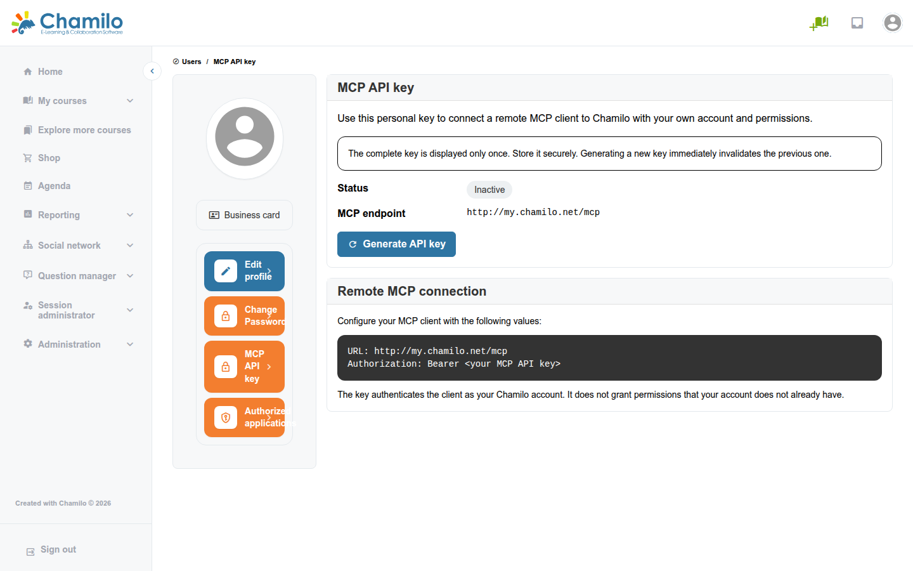

# MCP (Model Context Protocol)

Chamilo 3.0 stelt een MCP-server beschikbaar zodat AI-assistenten en -agents (Claude, ChatGPT-connectors of elke MCP-compatibele client) binnen het platform kunnen handelen namens een geauthenticeerde gebruiker, met de eigen rechten van die gebruiker — er is geen apart serviceaccount of verhoogde toegang.

## Wat MCP toevoegt aan Chamilo

MCP (Model Context Protocol) is een open standaard waarmee AI-clients een gedefinieerde set "tools" kunnen aanroepen die door een server worden aangeboden. De MCP-server van Chamilo is bereikbaar via één endpoint, `/mcp`, en biedt een zorgvuldig samengestelde set tools voor cursusbeheer door docenten, in plaats van het volledige API-oppervlak.

## Beschikbare mogelijkheden

Elke aanroep wordt uitgevoerd als de verbonden gebruiker, zodat een tool alleen cursussen ziet en wijzigt die die gebruiker beheert. De huidige set tools:

| Tool | Wat het doet |
|------|---------------|
| Current user | Geeft de identiteit en rollen van de geauthenticeerde gebruiker terug |
| Teacher courses | Lijst de cursussen die de gebruiker als docent beheert |
| Course overview | Geeft basisinformatie over de cursus en aantallen resources terug |
| Create course | Maakt een nieuwe cursus aan volgens de cursusaanmaakregels van het platform |
| Create course assignment | Maakt een concept- of gepubliceerde opdracht aan met een beschrijving en maximale score |
| Create course test | Maakt een AI-ondersteunde meerkeuzetoets aan op basis van een onderwerpsbeschrijving of een bestaand document |
| Get course test response status | Rapporteert welke studenten hebben geantwoord, bezig zijn of nog moeten beginnen aan een toets |
| Get user course test score | Geeft de laatste en beste voltooide scores van een student op een toets terug |
| Create training satisfaction survey | Maakt een tevredenheidsenquête van zeven vragen aan |
| Create course learning path | Maakt een leerpad aan op basis van pagina's die de MCP-client aanlevert |
| List documents | Lijst de documenten in de tool Documenten van een cursus |
| Read course document | Geeft de HTML-inhoud, titel en metadata van een bewerkbaar document terug |
| Edit course document | Vervangt de volledige HTML-inhoud van een bestaand bewerkbaar document |
| Create course document | Maakt een AI-ondersteund HTML-document aan in de hoofdmap van Documenten |
| Create course illustration | Genereert een AI-illustratie voor een onderwerp en slaat die op als document |
| Illustrate document paragraph | Voegt een bestaande afbeelding of video in vóór of na een alinea in een document |
| Find recent course forum activity | Zoekt recente, zichtbare forumberichten die gerelateerd zijn aan een onderwerp |
| Review course quality | Analyseert leerpaden, documenten, toetsen, opdrachten en enquêtes van een cursus en geeft verbeteraanbevelingen terug |

Deze lijst wordt samengesteld door het Chamilo-kernteam en is vanuit het platform niet door gebruikers uitbreidbaar — docenten kunnen geen eigen tools toevoegen.

## Hoe gebruikers verbinding maken

### Persoonlijke MCP API-sleutel

Elke gebruiker genereert een eigen sleutel onder **Sociaal netwerk** > **MCP API-sleutel**:



* Door op **API-sleutel genereren** te klikken wordt een sleutel aangemaakt en eenmaal getoond — Chamilo slaat daarna alleen een gemaskeerde versie op, dus de volledige sleutel moet onmiddellijk worden gekopieerd en veilig worden bewaard.
* Het genereren van een nieuwe sleutel trekt de vorige onmiddellijk in.
* De pagina toont de status van de sleutel (actief/inactief), het MCP-endpoint om in de client te configureren, en de aanmaak- en laatst-gebruikte datums.
* Het paneel **Remote MCP-verbinding** vermeldt precies wat in de MCP-client moet worden ingevuld: de endpoint-URL en een header `Authorization: Bearer <your MCP API key>`.

Zoals de pagina zelf aangeeft, authenticeert de sleutel de client als het account van die gebruiker — ze verleent geen rechten die het account niet al heeft.

### OAuth 2.1 (externe clients en connectors)

Voor MCP-clients die OAuth-discovery en dynamische clientregistratie ondersteunen (in plaats van een handmatig geplakte sleutel) fungeert Chamilo ook als OAuth 2.1-autorisatieserver: de client ontdekt de endpoints van Chamilo, registreert zichzelf en leidt de gebruiker om naar `/oauth/authorize` om toegang goed te keuren. Goedgekeurde toepassingen verschijnen onder **Sociaal netwerk** > **Geautoriseerde toepassingen**, waar de gebruiker toepassingen kan intrekken die hij of zij niet meer gebruikt of herkent.

## Beveiligingsoverwegingen

* **Geen privilege-escalatie.** Elke MCP-toolaanroep en elke OAuth-geautoriseerde app draait met de eigen Chamilo-rechten van de verbindende gebruiker — een persoonlijke API-sleutel of een geautoriseerde app kan nooit meer doen dan die gebruiker al handmatig zou kunnen.
* **Alleen Bearer, met rate limiting.** `/mcp` accepteert alleen een Bearer-credential — een persoonlijke MCP-API-sleutel, een OAuth-accesstoken of (in ontwikkeling) een JWT. Authenticatiepogingen worden per IP-adres beperkt om het raden van credentials te vertragen.
* **Beperkt publiek oppervlak.** Het enige niet-geauthenticeerde verkeer dat `/mcp` accepteert is de `OPTIONS`-preflight; elke daadwerkelijke aanroep vereist `ROLE_USER`. De OAuth-discovery-, dynamische clientregistratie- en token-eindpunten zijn bewust publiek, zoals vereist door de OAuth 2.1- / MCP-specificaties — dit verleent op zichzelf geen toegang, het laat een client alleen weten hoe de autorisatiestroom te starten.
* **DNS-rebindingbescherming is bewust uitgeschakeld voor `/mcp`.** De bundle die MCP implementeert beperkt het eindpunt normaal tot `localhost`, tenzij een statische lijst van toegestane hostnamen is geconfigureerd — slecht passend bij een Chamilo-portaal met meerdere URL's dat onder veel hostnamen bereikbaar is. Chamilo schakelt die controle uit omdat die hier overbodig is: elke `/mcp`-aanvraag vereist al een Bearer-credential, ongeacht de `Host`-/`Origin`-header, en een DNS-rebindingaanval (die steunt op ambient, cookie-achtige authenticatie die meereist met een vervalste Host) kan geen bearer-token vervalsen die hij nog niet heeft.

## De MCP-server configureren

In tegenstelling tot de meeste integraties in deze gids heeft MCP geen instellingenpagina in het beheerpaneel — het wordt op bestandsniveau geconfigureerd, in `config/packages/mcp.yaml`, en vereist shelltoegang tot de server:

| Sleutel | Doel |
|-----|---------|
| `app`, `version`, `description` | Identiteit die Chamilo rapporteert aan verbindende MCP-clients |
| `client_transports.stdio` / `client_transports.http` | Welke transports actief zijn; Chamilo schakelt beide standaard in |
| `http.path` | Het MCP-HTTP-eindpunt (standaard `/mcp`) |
| `http.allowed_hosts` | DNS-rebinding-host-allowlist — ingesteld op `false` op Chamilo (zie Beveiligingsoverwegingen hierboven) |
| `http.session.store`, `.directory`, `.ttl` | Waar MCP-sessiestatus wordt bewaard en hoe lang |

Om de MCP-server volledig uit te schakelen, stel `client_transports.http: false` in (en `stdio: false` als het CLI-transport ook moet worden uitgeschakeld) en wis de cache:

```bash
php bin/console cache:clear --env=prod
php bin/console cache:warmup --env=prod
```

## Tips

* Behandel een MCP-API-sleutel als een wachtwoord — wie hem heeft, kan als die gebruiker optreden via elke MCP-client.
* Moedig gebruikers aan om periodiek **Geautoriseerde toepassingen** te controleren en alles in te trekken dat ze niet herkennen.
* Zie [AI-configuratie](integrations/ai-configuration.md) voor de AI-providers die de hierboven vermelde tools voor contentgeneratie (toetsaanmaak, documentaanmaak, illustraties) ondersteunen.