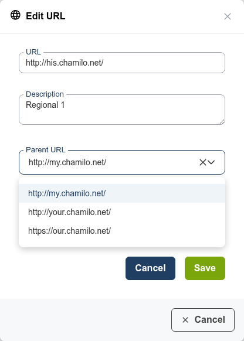
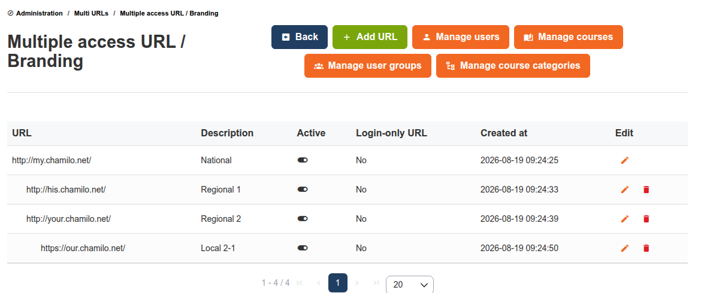

# Access-URL's

Access-URL's maken het mogelijk dat één Chamilo-installatie meerdere aparte portals bedient.

Dit hulpmiddel is ook bereikbaar vanuit het blok [Platform](../platform/README.md) op het beheerdersdashboard, als **Meerdere access-URL's configureren**.

## Gebruiksscenario's

* **Multi-tenant-implementaties** — Host aparte trainingsportals voor verschillende organisaties op één server
* **Afdelingsportals** — Geef elke afdeling een eigen portal met huisstijl (bijv. `hr.training.company.com`, `it.training.company.com`)
* **Regionale portals** — Aparte portals voor verschillende regio's of talen

## Werking

Elke access-URL is een apart toegangspunt tot dezelfde Chamilo-installatie:

* Gebruikers kunnen aan één of meer access-URL's worden toegewezen
* Cursussen en sessies horen bij specifieke access-URL's
* Platforminstellingen kunnen per access-URL worden aangepast
* Huisstijl en thema's kunnen per URL verschillen
* Gebruikers op de ene portal zien geen gebruikers of cursussen van een andere (tenzij expliciet gedeeld)

## Configuratie

### Multi-URL inschakelen

Multi-URL moet worden ingeschakeld in de Chamilo-configuratie (doorgaans in de omgevingsinstellingen). Dit gebeurt meestal tijdens de initiële installatie.

### Een access-URL aanmaken

1. Ga vanuit het beheerderspaneel naar **Access-URL's**
2. Klik op **URL toevoegen**
3. Voer de URL in (bijv. `https://portal2.yoursite.com`) en een beschrijving
4. Kies optioneel een **Bovenliggende URL** om deze URL onder een andere te nesten — zie [URL-hiërarchie](#url-hierarchy) hieronder
5. Opslaan

### Gebruikers en cursussen toewijzen

* **Gebruikers** — Wijs gebruikers toe aan specifieke access-URL's. Een gebruiker kan tot meerdere URL's behoren.
* **Cursussen** — Wijs cursussen toe aan specifieke access-URL's
* **Sessies** — Wijs sessies toe aan specifieke access-URL's

### Instellingen per URL

Elke access-URL kan eigen instellingen hebben:

* **Kleurenthema** — Andere visuele huisstijl
* **Platformnaam en logo** — Eigen identiteit
* **Instellingsoverschrijvingen** — Bepaalde platforminstellingen kunnen per URL worden aangepast

## URL-hiërarchie

Access-URL's kunnen in een boom van ouder/kind worden georganiseerd in plaats van een platte lijst. Bij het aanmaken of bewerken van een URL kan een onbeperkte Global Administrator (zie [Subtree-beheerders](#subtree-administrators) hieronder) een willekeurige andere URL als **Bovenliggende URL** kiezen:

* Het keuzemenu biedt nooit de URL die wordt bewerkt, noch een van de eigen nakomelingen, als mogelijke ouder — dit voorkomt een cyclus. De backend valideert dit opnieuw, ongeacht wat de interface toont.
* Als een URL wordt aangemaakt zonder ouder te kiezen, wordt standaard de **login-only URL** gebruikt als die bestaat (zie [Instellingen per URL](#per-url-settings) hierboven), of anders de eerste access-URL — hetzelfde standaardgedrag als vóór deze functie.
* De bovenste URL van een boom — die zonder ouder — is de **root** van die boom. Eén Chamilo-installatie kan meer dan één onafhankelijke boom hosten.

Overal waar access-URL's worden weergegeven — het Multi-URL-dashboard en de beheerpagina Access-URL's — wordt de boom getoond via inspringing, waarbij een ouder onmiddellijk gevolgd wordt door de eigen kinderen (broers/zussen alfabetisch gesorteerd), in plaats van een aparte kolom "Ouder":

## Subtree-beheerders

De URL-hiërarchie bepaalt ook wat een [Global Administrator](../users/user-roles.md) kan beheren:

* Iemand die is geregistreerd op de **root**-URL van een boom is **onbeperkt**: die beheert elke access-URL, precies zoals vóór deze functie.
* Iemand die alleen op een **niet-root**-URL is geregistreerd is **beperkt tot een bereik**: de pagina's Multi-URL en Access-URL's tonen alleen die URL en de nakomelingen, en de inloggrafiek op het Multi-URL-dashboard vermeldt "Logins (uw URL's)" in plaats van "Logins (alle URL's gecombineerd)".

Ongeacht het bereik blijven de volgende handelingen voorbehouden aan een **onbeperkte** Global Administrator — een scoped beheerder kan ze niet uitvoeren, zelfs niet voor URL's binnen de eigen subtree:

* Een nieuwe access-URL aanmaken
* De eigen URL, beschrijving of ouder van een access-URL bewerken
* Een access-URL activeren of deactiveren
* Een access-URL verwijderen (de root-URL van de hele installatie kan nooit worden verwijderd, door niemand)
* Zichzelf in één keer bij elke access-URL registreren

Een scoped beheerder kan nog steeds alles beheren dat *is toegewezen aan* de URL's in de subtree — gebruikers, cursussen, sessies, huisstijl en instellingen — alleen niet de access-URL-vermeldingen zelf.

## Tips

* **Beslis vroeg** — Als u kiest voor een configuratie met meerdere URL's, moet u dat aan het begin van uw Chamilo-project doen, omdat de eerste URL relatief leeg van inhoud moet blijven. Multi-URL achteraf inschakelen is lastiger (vereist handmatige databasewijzigingen).
* **Plan de URL-structuur** — Bepaal uw URL-schema voordat u access-URL's aanmaakt, omdat het later wijzigen van URL's alle bestaande links en bladwijzers beïnvloedt
* **DNS-configuratie** — Elke access-URL moet naar dezelfde Chamilo-server resolven. Configureer de DNS-records dienovereenkomstig.
* **Globale beheerder** — Gebruik de rol Global Administrator om over alle access-URL's heen te beheren. Om het beheer van slechts één tak te delegeren, registreert u de beheerder op een niet-root-URL — zie [Subtree Administrators](#subtree-administrators)