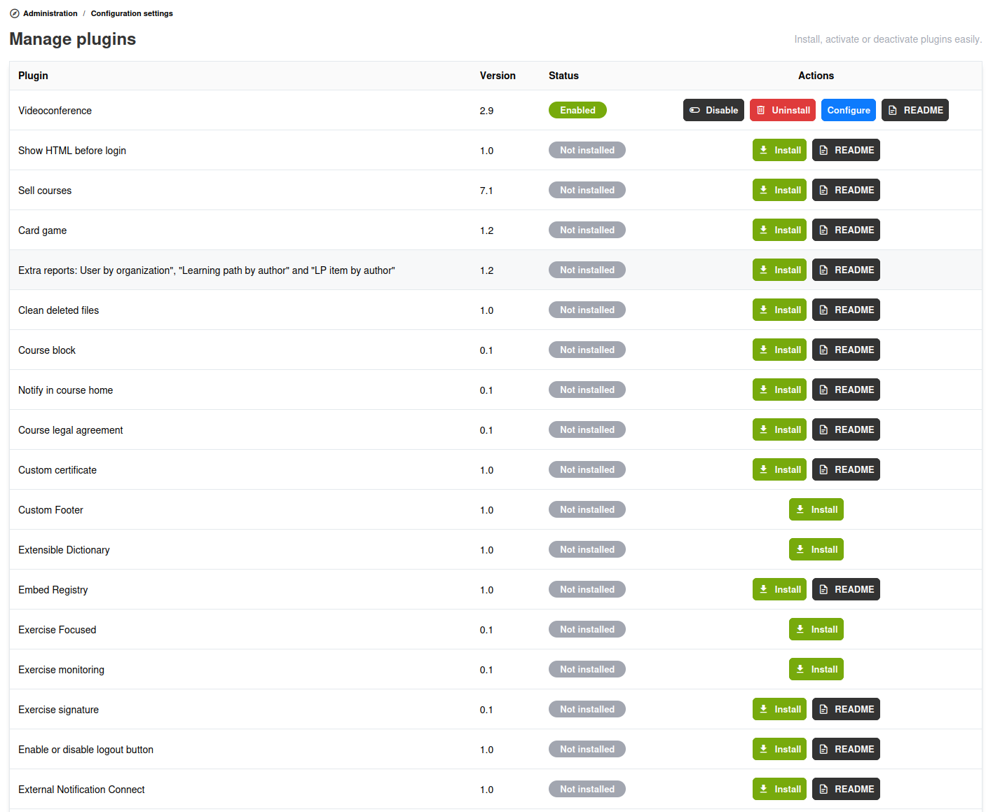

# Plugins beheren

## De pluginbeheerder openen

Klik in het beheerpaneel op **Plugins beheren** om de lijst van beschikbare plugins te bekijken.

## Pluginstatussen

Elke plugin heeft een van twee statussen:

* **Actief** — De plugin is ingeschakeld en de functies ervan zijn beschikbaar op het platform
* **Inactief** — De plugin is geïnstalleerd maar uitgeschakeld

## Een plugin activeren

1. Zoek de plugin in de lijst
2. Klik op **Installeren**, daarna op **Inschakelen** of schakel deze in
3. Configureer de plugininstellingen (indien van toepassing, zoek de knop **Configureren**)
4. Opslaan
5. Schakel de plugin, indien aanbevolen in de README, in een specifieke **regio** in

Sommige plugins voegen tools toe aan cursussen, nieuwe pagina's aan het platform, of extra functionaliteit aan bestaande functies.

## Een plugin configureren

Veel plugins hebben configuratieopties. Na het activeren van een plugin:

1. Klik op de knop **Configureren** naast de plugin
2. Vul de vereiste configuratie in (API-sleutels, URL's, opties, enz.)
3. Opslaan

## Een plugin deactiveren

1. Zoek de plugin in de lijst
2. Klik op **Uitschakelen** of schakel deze uit
3. De functies van de plugin verdwijnen onmiddellijk van het platform, maar de plugin blijft geïnstalleerd en behoudt de configuratie totdat u deze **deïnstalleert**

Het uitschakelen van een plugin verwijdert de gegevens niet. Als u de plugin later weer inschakelt, zijn de gegevens nog beschikbaar.

## Tips

* **Activeer alleen wat u nodig hebt** — Elke actieve plugin voegt enige overhead toe. Houd ongebruikte plugins gedeactiveerd.
* **Test vóór productie** — Activeer nieuwe plugins eerst in een testomgeving
* **Controleer de compatibiliteit** — Controleer na een upgrade van Chamilo of alle actieve plugins nog correct werken