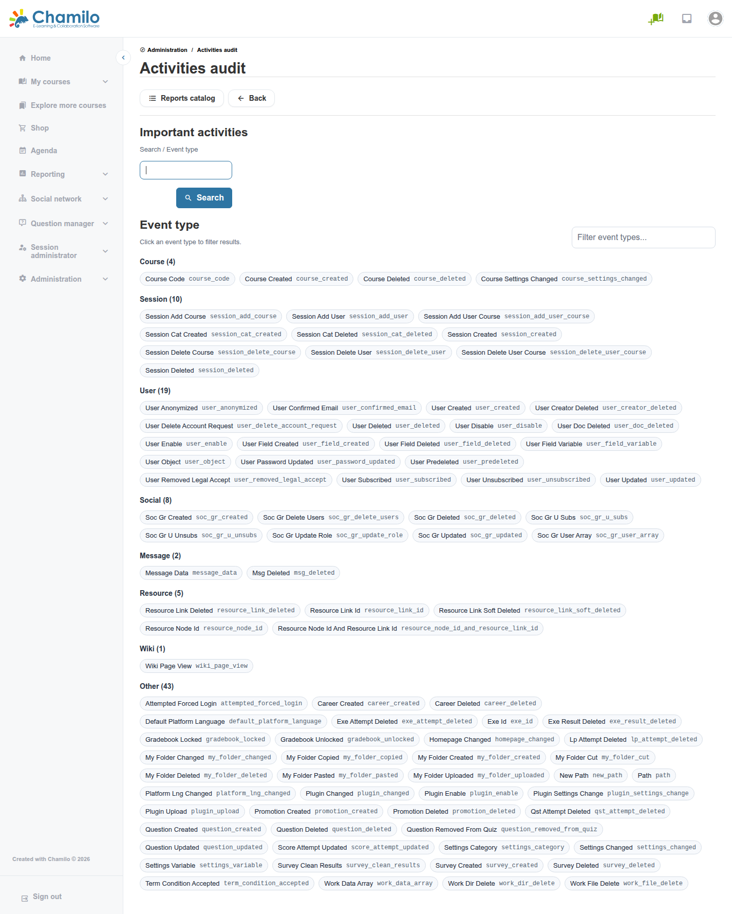

# Activiteitenaudit

Het rapport Activiteitenaudit laat u belangrijke administratieve en platformactiviteiten doorbladeren, gefilterd op gebeurtenistype. Het is hetzelfde onderliggende rapport dat eerder bereikbaar was via **Tracking > Administrative activity auditing**; het is nu ook rechtstreeks gekoppeld vanuit het blok Security, omdat het in de eerste plaats een beveiligings- en verantwoordingsinstrument is.

## Activiteitenaudit openen

Klik in het beheerpaneel op **Security > Activities audit**.

## Wat het toont

Gebeurtenissen zijn gegroepeerd in categorieën:

* **Course** — Aanmaken, verwijderen en instellingswijzigingen van cursussen
* **Session** — Aanmaken, verwijderen en inschrijvingswijzigingen van sessies en sessiecategorieën
* **User** — Aanmaken en verwijderen van accounts, wachtwoordupdates, veldwijzigingen en meer
* **Social** — Aanmaken, verwijderen en lidmaatschapswijzigingen van sociale groepen
* **Message** — Wijzigingen en verwijderingen van berichtgegevens
* **Resource** — Aanmaken en verwijderen van resources en resourcekoppelingen
* **Wiki** — Weergaven van wikipagina's
* **Other** — Al het overige, inclusief pluginactiviteit, vergrendeling van het cijferboek, verwijderingen van oefenpogingen, gedwongen inlogpogingen en wijzigingen van platforminstellingen

Klik op een chip van een gebeurtenistype (bijvoorbeeld **Attempted Forced Login**) om het rapport te filteren tot een tabel met overeenkomende vermeldingen. U kunt ook rechtstreeks op trefwoord zoeken via het veld **Search** boven de lijst met gebeurtenistypen.

## Gebruiksscenario's

* Onderzoeken wie een cursus, sessie of gebruikersaccount heeft verwijderd, en wanneer
* Bevestigen of een specifieke administratieve wijziging (een instellingsupdate, een plugininstallatie) is uitgevoerd door een verwachte beheerder
* **Attempted Forced Login**-gebeurtenissen opvolgen naast het rapport [Login Attempts](login-attempts.md)