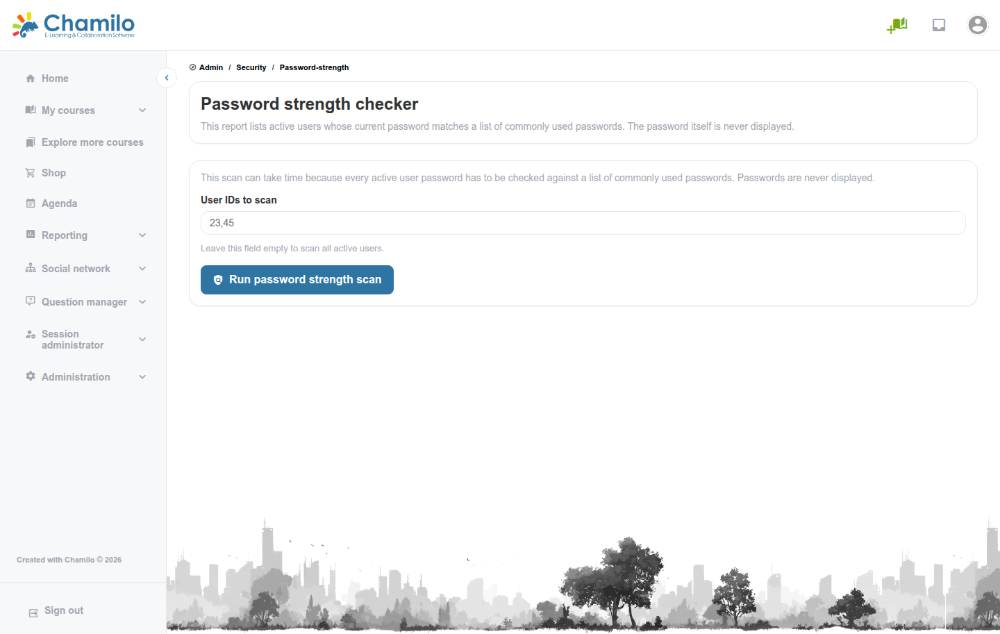
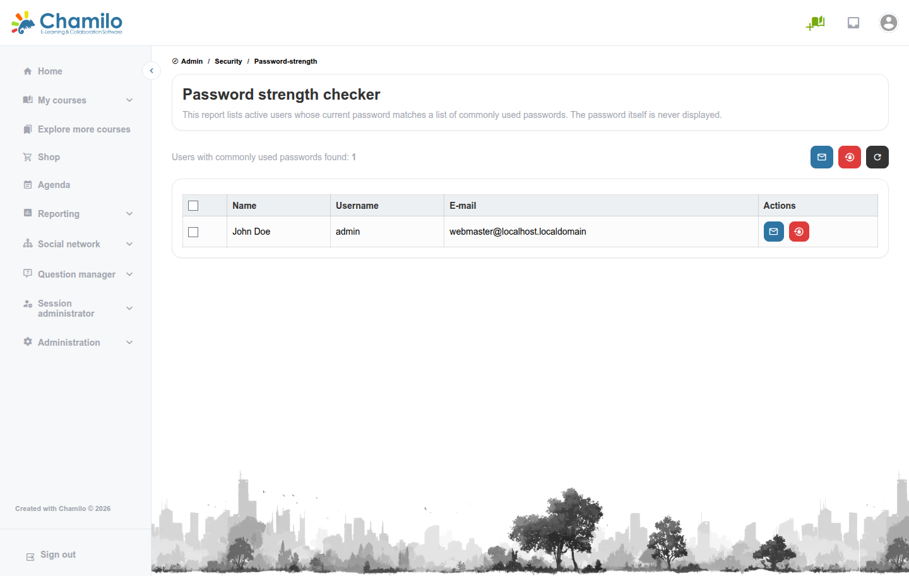

# Wachtwoordsterktecontrole

De Wachtwoordsterktecontrole scant de opgeslagen wachtwoordhashes van actieve gebruikers tegen een korte lijst van veelgebruikte wachtwoorden (`123456`, `password`, `qwerty123` en vergelijkbare). De wachtwoorden zelf worden nooit weergegeven of verzonden — alleen of het huidige wachtwoord van een gebruiker overeenkomt met een van de bekende zwakke kandidaten.

## De Wachtwoordsterktecontrole openen

Klik in het beheerpaneel op **Beveiliging > Wachtwoordsterktecontrole**.

## Een scan uitvoeren

* Laat **Te scannen gebruikers-ID's** leeg om elke actieve gebruiker te scannen, of voer een door komma's gescheiden lijst van gebruikers-ID's in om een subset te controleren
* Klik op **Wachtwoordsterktescan uitvoeren**

De scan draait asynchroon op de achtergrond, zodat de pagina niet vastloopt, en toont live voortgang (tot nu toe geverifieerde gebruikers, van het totaal, en hoeveel zwakke wachtwoorden zijn gevonden). Omdat elk kandidaatwachtwoord tegen de hash van elke geselecteerde gebruiker moet worden gecontroleerd, kan het scannen van alle gebruikers op een groot platform enige tijd duren — de kandidatenlijst wordt opzettelijk kort gehouden om deze kosten te beperken.

## Actie ondernemen op resultaten

Zodra de scan is voltooid, worden gemarkeerde gebruikers weergegeven met twee beschikbare acties, per gebruiker of als bulkactie voor alle geselecteerde gebruikers:

* **Wachtwoordwijziging aanvragen** (enveloppictogram) — Stuurt de gebruiker een e-mail met het verzoek hun wachtwoord te wijzigen
* **Wachtwoordreset afdwingen** (resetpictogram) — Maakt het huidige wachtwoord van de gebruiker onmiddellijk ongeldig en mailt hen een nieuw wachtwoord

Beide acties verifiëren de geselecteerde gebruikers opnieuw tegen de lijst met zwakke wachtwoorden voordat ze worden uitgevoerd, zodat een verouderd of gemanipuleerd verzoek niet kan worden gebruikt om een account te resetten dat geen zwak wachtwoord meer heeft.

## Aanbevolen gebruik

* Voer deze scan periodiek uit, vooral na een bulkimport van gebruikers (geïmporteerde accounts hebben soms eenvoudige standaardwachtwoorden)
* Combineer dit met de instellingen **Minimale wachtwoordsyntaxisvereisten** en **Wachtwoordrotatie-interval** in [Beveiligingsinstellingen](../platform-settings/security-settings.md) om te voorkomen dat zwakke wachtwoorden überhaupt worden ingesteld, in plaats van ze alleen achteraf te detecteren