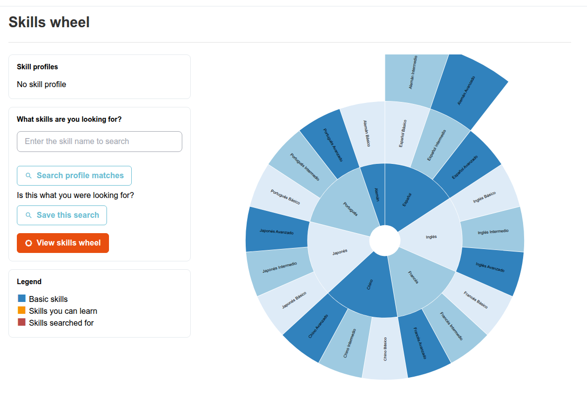
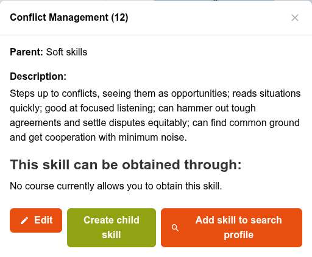

# Vaardighedenwiel

Het Vaardighedenwiel is een inzoombaar, wielvormig diagram van de volledige vaardighedenboom — een visueel alternatief voor het bladeren door de platte lijst in [Vaardigheden beheren](managing-skills.md).

## Het Vaardighedenwiel openen

Klik in het beheerderspaneel op **Skills > Skills wheel**.

## Wat het toont

Elk segment van het wiel is een vaardigheid, uitvouwbaar tot de onderliggende vaardigheden. Een segment geeft aan of de vaardigheid een gekoppeld cijferboek heeft (zie [Vaardigheden en beoordelingen](skills-assessments.md)) en, bij weergave van een specifieke gebruiker, of die gebruiker de vaardigheid al heeft behaald.

Klik op een segment om erin te zoomen en de onderliggende vaardigheden te tonen; klik op de cirkel in het midden om weer uit te zoomen.

Klik met de rechtermuisknop op een segment om de details te openen: beschrijving, bovenliggende vaardigheid en de cursussen (indien aanwezig) die de vaardigheid toekennen. Vanuit dit dialoogvenster kunnen beheerders de vaardigheid ook bewerken, er een onderliggende vaardigheid onder aanmaken of deze toevoegen aan de profielzoekopdracht die hieronder wordt beschreven.

Beheerders en gebruikers met de rol Human Resources Manager krijgen hier ook een profielzoekopdracht: vaardigheden kunnen worden gegroepeerd in "profielen" (sets van vaardigheden die worden verwacht voor een bepaalde rol of functiebeschrijving), en deze pagina laat u zoeken naar gebruikers waarvan de verworven vaardigheden overeenkomen met een gegeven profiel — nuttig om te identificeren wie klaar is voor een rol, of waar de hiaten in een team liggen.