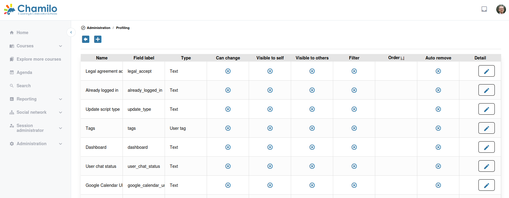

# Gebruikersprofilering

Chamilo stelt u in staat om aangepaste profielvelden (extra velden) te definiëren om aanvullende informatie over gebruikers vast te leggen, naast de standaardnaam, het e-mailadres en de rol.

## Extra profielvelden

Extra velden laten u metadata opslaan die specifiek is voor uw organisatie, zoals:

* Personeelsnummer
* Afdeling
* Functietitel
* Locatie/kantoor
* Telefoonnummer
* Aangepaste identificatoren

## Extra velden aanmaken

1. Navigeer vanuit het beheerpaneel naar **Extra fields** of **Profile fields**
2. Klik op **Add**
3. Configureer het veld:
   * **Name** — De veldtitel die aan gebruikers wordt getoond
   * **Description** — Optionele beschrijving
   * **Helper text** — Wordt onder het veld getoond in elk formulier waarin het voorkomt
   * **Field type** — Tekst, dropdown, datum, selectievakje, enz.
   * **Field label** — De interne naam van het veld, voor integratie van plugins 
   * **Possible values** — Als het veld een selector is tussen die waarden 
   * **Default value** — Een optionele standaardwaarde
   * **Visible to self** — Of het veld zichtbaar is op het gebruikersprofiel voor de gebruiker zelf
   * **Visible to others** — Of het veld zichtbaar is voor andere gebruikers van het platform
   * **Can change** — Of de gebruiker het eigen veld zelf kan wijzigen (of dat alleen de beheerders dat kunnen)
   * **Filter** — Als dit een veld van het type selector is, of het als filter moet worden opgenomen op beheerpagina's (bijv. om gebruikers in te schrijven voor cursussen of sessies)
   * **Order** — Als u de weergavevolgorde van de velden wilt beheren, moet u elk veld een numerieke volgorde geven
   * **Remove on anonymization** — Belangrijk voor privacyregels en -wetten: als de gebruiker wordt geanonimiseerd maar niet verwijderd, moet dit veld dan worden beschouwd als mogelijke houder van persoonlijk identificeerbare gegevens? 
4. Opslaan

## Veldtypen

De extra-veldenengine ondersteunt een breed scala aan invoertypen. Veelvoorkomende typen zijn:

| Type | Beschrijving |
|------|-------------|
| **Text** | Een tekstinvoer op één regel |
| **Textarea** | Een tekstinvoer op meerdere regels |
| **Radio** | Een keuzegroep met één keuze |
| **Dropdown / Dropdown multiple** | Een lijst met vooraf gedefinieerde opties (enkel- of meervoudige selectie) |
| **Double select** | Twee afhankelijke dropdowns (bijv. land → stad) |
| **Checkbox** | Een ja/nee-schakelaar |
| **Date / Date and time** | Datum- of datum+tijd-kiezer |
| **Integer** | Een numerieke invoer |
| **Tag** | Meerdere vrije tagwaarden |
| **File** | Veld voor bestandsupload |
| **Video URL** | Een URL die naar een video wijst |
| **Mobile phone number** | Een opgemaakt telefoonnummerveld |
| **Timezone** | Een tijdzonekiezer |
| **Social profile** | Een link naar een profiel op een sociaal netwerk |
| **Divider** | Een visuele scheiding in het formulier (geen waarde) |

De exacte set bruikbare typen hangt af van de Chamilo-versie; de dropdown voor veldtype op de beheerpagina **Extra fields** is de bron van waarheid.

## Extra velden gebruiken

Extra velden verschijnen:

* In de formulieren voor het aanmaken (indien zichtbaar voor zichzelf) en bewerken van gebruikers
* Op gebruikersprofielpagina's (indien zichtbaar voor zichzelf)
* Bij gebruikersimports (u kunt extra veldwaarden opnemen in CSV-imports)
* In exports en rapporten (filteren of groeperen op extra veldwaarden)

## Tips

* **Plan voordat u aanmaakt** — Bepaal welke informatie u nodig hebt voordat u velden aanmaakt, omdat het wijzigen van veldtypen nadat gegevens zijn ingevoerd problematisch kan zijn
* **Gebruik dropdowns voor consistentie** — Wanneer een veld een bekende set mogelijke waarden heeft, gebruik dan een dropdown in plaats van vrije tekst om gegevensconsistentie te waarborgen
* **Gebruik voor rapportage** — Extra velden zijn nuttig voor het filteren van rapporten (bijv. "toon alle gebruikers in Afdeling X die Training Y hebben voltooid")