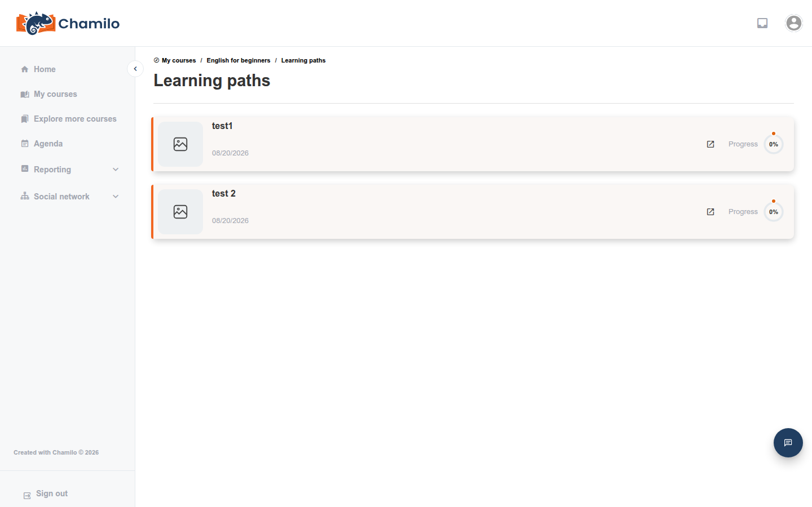

# Een leerpad volgen

Een **leerpad** leidt u door een gestructureerde reeks activiteiten — documenten, toetsen, links en meer — in een volgorde die uw docent heeft vastgelegd. In veel cursussen is het het belangrijkste (of enige) hulpmiddel dat u daadwerkelijk nodig hebt, omdat het al het overige erin kan bundelen.

## Een leerpad openen

Open het hulpmiddel **Leerpaden**  vanaf de startpagina van de cursus en klik op een leerpad om te starten. Als uw docent **automatisch starten** heeft ingeschakeld, kan het leerpad automatisch openen zodra u de cursus binnenkomt.

## Door het pad navigeren

Binnen een leerpad ziet u:

* Een **lijst met items** (stappen) in een paneel, georganiseerd in secties die uw docent mogelijk heeft gegroepeerd als hoofdstukken
* De **inhoud van het huidige item** in het hoofdgebied — een document, een ingesloten toets, een link, enzovoort

Naarmate u items voltooit, worden ze gemarkeerd met een vinkje, en een **voortgangsbalk** toont uw algehele voltooiingspercentage voor het hele pad. Als u weggaat en later terugkomt, hervat u precies waar u was gebleven — er gaat niets verloren.

## Vergrendelde items en vereisten

Sommige items kunnen **vergrendeld** lijken totdat u aan een vereiste voldoet die uw docent heeft ingesteld — doorgaans het afronden van een eerder item, of het behalen van een minimumscore op een toets eerder in het pad. Als u een stap niet kunt openen, controleer dan of een eerdere stap nog onvoltooid is.

## Toetsen en certificaten in een pad

Een leerpad kan een toets als een van de stappen bevatten — het afleggen ervan werkt hetzelfde als beschreven in [Toetsen afleggen](taking-tests.md). Sommige paden eindigen met een **certificaat**-stap: wanneer u die bereikt (nadat u eventuele scorevereisten onderweg hebt gehaald), wordt uw voltooiingscertificaat geactiveerd, als uw docent er een voor de cursus heeft geconfigureerd.

## SCORM en andere geïmporteerde inhoud

Sommige items in een leerpad zijn niet rechtstreeks in Chamilo gebouwd, maar geïmporteerd als een **SCORM**-pakket, een **CMI5/xAPI**-pakket, of gebouwd met de C-Studio-plugin. Deze zien er over het algemeen uit en gedragen zich als elke andere interactieve inhoud — Chamilo volgt uw voortgang en score erdoorheen op dezelfde manier, ook al is de inhoud zelf elders gemaakt.

## Tips

* **Gebruik de voortgangsbalk** om in te schatten hoeveel van het pad er nog over is.
* **Maak u geen zorgen over het verliezen van uw plaats** — Chamilo onthoudt precies waar u zich in een pad bevindt tussen sessies.
* **Een vergrendelde stap betekent meestal onvoltooid werk eerder in het pad** — ga terug en controleer in plaats van aan te nemen dat de toegang per vergissing is geweigerd.