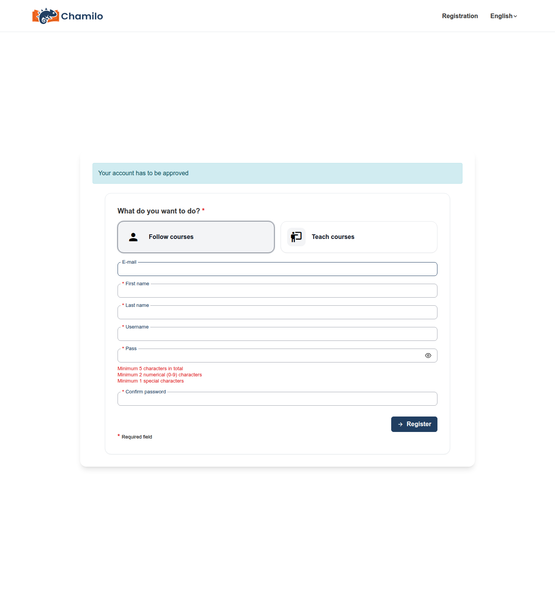

# Een account aanmaken

Of u zelf een account kunt aanmaken, hangt af van hoe uw platform is geconfigureerd. Deze pagina beschrijft wat u van het zelfregistratieformulier kunt verwachten, en wat er gebeurt als het voor u niet beschikbaar is.

## Als zelfregistratie niet beschikbaar is

Niet elk Chamilo-platform laat bezoekers zichzelf inschrijven — een school of bedrijf geeft er vaak de voorkeur aan om accounts voor haar leden rechtstreeks aan te maken, of de registratie te beperken tot personen die een specifieke uitnodiging hebben ontvangen. Als u op de inlogpagina geen koppeling **Aanmelden** (of **Registreren**) ziet, is dat de reden. In dat geval:

* Vraag uw instelling of platformbeheerder om een account voor u aan te maken, of
* Vraag uw docent om een **cursusuitnodiging** — een eenmalige koppeling die naar uw e-mailadres wordt gestuurd en waarmee u zich rechtstreeks kunt registreren, zelfs op een platform waar algemene registratie gesloten is, en die u na afronding onmiddellijk inschrijft voor de cursus van die docent. Zie [Wat de uitgenodigde persoon ziet](../../teacher-guide/assessing-learners/subscribing-users.md#what-the-invited-person-sees) voor hoe dit er van uw kant uitziet.

## Het registratieformulier invullen

Als zelfregistratie is ingeschakeld, klikt u op **Aanmelden** op de inlogpagina. Het formulier vraagt om een combinatie van het volgende, afhankelijk van wat uw beheerder heeft geconfigureerd:

* E-mailadres en/of gebruikersnaam
* Voor- en achternaam
* Wachtwoord (met een sterkte-indicator terwijl u typt)
* Telefoonnummer, taal, officiële code of geboortedatum
* Extra profielvelden die specifiek zijn voor uw platform

U hoeft zich geen zorgen te maken als uw formulier er anders uitziet dan deze lijst — beheerders kunnen afzonderlijke velden tonen, verbergen of verplicht maken.

## Dit formulier maakt alleen leerlingaccounts aan

Standaard heeft het openbare registratieformulier helemaal geen optie om zich als docent te registreren — elk account dat via dit formulier wordt aangemaakt, is een leerlingaccount. Er is geen vervolgkeuzelijst, selectievakje of uitgeschakelde optie die op een docentenrol wijst; de keuze maakt eenvoudigweg geen deel uit van het formulier.

Sommige platforms schakelen wel een stap **"Wat wilt u doen?"** in met twee kaarten — **Cursussen volgen** en **Cursussen geven** — maar dit verschijnt alleen als uw beheerder specifiek registratie als docent heeft ingeschakeld. Zelfs dan kan het kiezen voor lesgeven vereisen dat uw account wordt goedgekeurd voordat u docentenrechten krijgt.

Als u een docentenaccount nodig hebt en deze optie niet ziet, vraag dan uw platformbeheerder om er een voor u aan te maken of om uw bestaande account te upgraden.

## Algemene voorwaarden en CAPTCHA

Afhankelijk van de configuratie van uw platform kan het formulier ook het volgende bevatten:

* Een selectievakje **Algemene voorwaarden** onderaan het formulier ("Ik heb de Algemene voorwaarden gelezen en ga ermee akkoord"), met de volledige tekst in een scrollbaar vak erboven.
* Een **CAPTCHA**-uitdaging aan het einde van het formulier, waarbij u de letters moet typen die in een afbeelding worden getoond. Zie [CAPTCHA](../account-and-security/captcha.md) voor waarom dit er is.

Op sommige platforms toont het indienen van het formulier een bevestigingsstap ("U bevestigt dat u zich echt wilt inschrijven op dit platform.") voordat uw account daadwerkelijk wordt aangemaakt — dit is een beveiliging tegen per ongeluk indienen, geen extra goedkeuringsstap.

## Wat er gebeurt nadat u hebt ingediend

Afhankelijk van hoe uw beheerder de registratie heeft geconfigureerd, gebeurt een van de volgende drie dingen:

* **U bent onmiddellijk ingelogd** — de meest voorkomende instelling, vooral voor open platforms.
* **Uw account heeft goedkeuring nodig** — uw account wordt aangemaakt maar blijft uitgeschakeld tot een beheerder het handmatig goedkeurt. U wordt op de hoogte gesteld zodra dat gebeurt.
* **U moet uw e-mailadres bevestigen** — u ontvangt een bevestigingskoppeling per e-mail; uw account blijft uitgeschakeld tot u erop klikt.

Als u niet zeker weet wat voor u van toepassing is en er na het registreren niets lijkt te gebeuren, controleer dan uw inbox (inclusief spam) op een bericht van het platform, of neem contact op met uw beheerder.

## Tips

* **Gebruik een e-mailadres dat u regelmatig controleert** — via dit adres ontvangt u wachtwoordresets, cursusuitnodigingen en accountbevestigingen.
* **Kies een sterk wachtwoord** — de sterkte-indicator op het formulier geeft u realtime feedback terwijl u typt.
* **Kunt u helemaal niet registreren?** Neem contact op met wie uw platform beheert — het sluiten van zelfregistratie is op veel institutionele en bedrijfsplatforms een bewuste keuze.