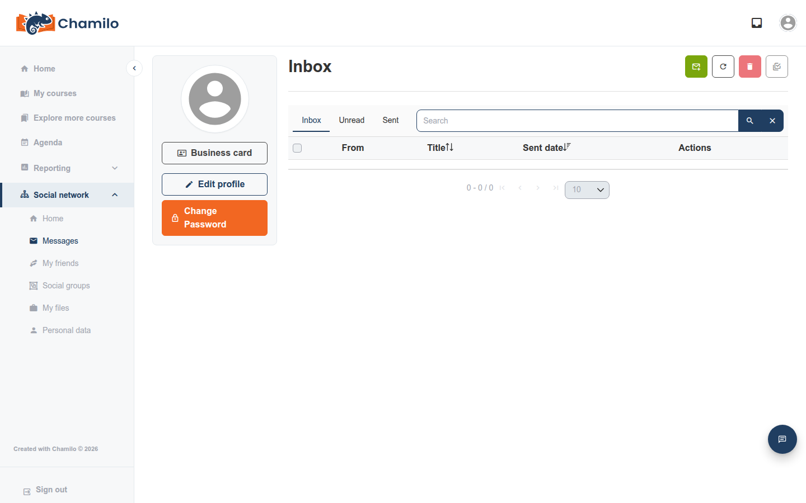

# Inbox

De **Inbox** is het privéberichtensysteem van Chamilo — asynchrone, e-mailachtige berichten tussen u en andere gebruikers op het platform, onafhankelijk van een specifieke cursus.

## Uw Inbox openen

Klik op het pictogram **Inbox**  in de bovenbalk. Een rood badge toont hoeveel ongelezen berichten u hebt. Als dit pictogram helemaal ontbreekt, heeft uw beheerder platformberichten uitgeschakeld.

## Lezen en beantwoorden

Uw inbox toont ontvangen berichten en geeft aan welke ongelezen zijn. Open een bericht om het te lezen en gebruik **Reply** om te antwoorden — u kunt in één antwoord meerdere ontvangers opnemen, handig om een kleine groep op de hoogte te houden zonder een formele cursus of sociale groep in te richten.

## Een nieuw bericht opstellen

Klik op de knop **new message** , kies een of meer ontvangers, schrijf een onderwerp en een berichttekst, en verstuur. Net als bij een antwoord kan een nieuw bericht naar meerdere personen tegelijk gaan.

## Tabbladen en acties

Naast uw **Inbox** toont een tabblad alleen uw **Unread**-berichten, en een ander toont **Sent** — wat u hebt verzonden, ter eigen naslag. Met een zoekvak kunt u een bericht op trefwoord vinden. De knoppen boven de lijst laten u een nieuw bericht opstellen, vernieuwen, geselecteerde berichten verwijderen en geselecteerde berichten als gelezen markeren.

## Berichtentags

Als uw platform berichtentags gebruikt, ziet u in uw inbox een taglijst waarop u kunt klikken om berichten op die tag te filteren — handig om gerelateerde conversaties makkelijk terug te vinden naarmate uw inbox groeit.

## Relatie tot andere berichtfuncties

De Inbox is onafhankelijk van de cursustool [Chat](courses/using-the-chat-tool.md) en van het zwevende chatpaneel voor direct messaging en de [AI Tutor](courses/ai-tutor.md) — elk is een echt aparte functie, ook al gaat het overal om het uitwisselen van berichten. Het [Social Network](social-network.md), indien ingeschakeld, gebruikt dezelfde Inbox voor privéberichten in plaats van een eigen systeem.

## Tips

* **Controleer het badge op het Inbox-pictogram** — dat is de snelste manier om nieuwe berichten op te merken zonder de pagina te openen.
* **Gebruik de Inbox voor alles wat niet aan één cursus is gebonden** — cursusspecifieke discussie hoort in het Forum of de Chat van die cursus.
* **De koppeling "Messages" van het Social Network gaat naar dezelfde Inbox** — u mist geen aparte mailbox als u die via daar bereikt in plaats van via de bovenbalk.