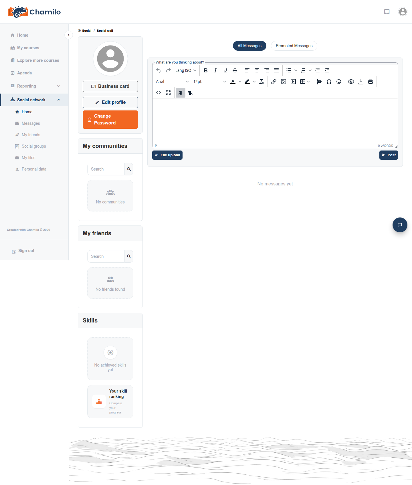

# Sociaal netwerk

Chamilo bevat een ingebouwd sociaal netwerk om contact te leggen met andere gebruikers op het platform — los van een specifieke cursus. Of u er toegang toe hebt, hangt volledig af van uw beheerder: het staat standaard aan, maar kan platformbreed worden uitgeschakeld.

## Of u toegang hebt

Klik op **Sociaal netwerk**  in de zijbalk om het uit te klappen en klik vervolgens op **Home**. Als deze optie helemaal niet aanwezig is, heeft uw beheerder het voor uw platform uitgeschakeld — er ontbreekt niets aan uw kant.

In dezelfde uitgeklapte sectie staan ook **Berichten**, **Mijn vrienden**, **Sociale groepen** — en, enigszins onverwacht, **Mijn bestanden** (uw persoonlijke bestandsopslag) en **Persoonlijke gegevens** (een export van de persoonlijke gegevens die het platform over u bijhoudt). Die laatste twee zijn geen sociale functies; ze zijn alleen in dit deel van de zijbalk gegroepeerd.

## Uw sociale muur

Eenmaal binnen toont uw **muur** een feed van activiteit van u en de mensen met wie u verbonden bent. U kunt updates plaatsen en — indien ingeschakeld door uw beheerder — berichten van uw connecties liken of disliken, en erop reageren.

## Verbinden met anderen

U kunt andere gebruikers zoeken en hen een verbindingsverzoek sturen. Als **cursist kunt u alleen verbinding maken met andere cursisten** — u kunt geen verbindingsverzoek naar een docent sturen. Een docent kan daarentegen wel een verzoek naar u sturen. Op sommige platformen configureert de beheerder dat docenten automatisch als vrienden verschijnen voor elke cursist, zonder dat een van beide kanten het hoeft aan te vragen — als u docenten al als connecties ziet zonder te vragen, is dat de reden.

## Berichten vanuit het sociale netwerk

Berichten en connecties vormen de sociale kant; iemand een privébericht sturen gebeurt via de aparte [Inbox](inbox.md) van het platform — het sociale netwerk koppelt daaraan in plaats van een eigen, afzonderlijk berichten systeem te hebben.

## Sociale groepen

U kunt bestaande **sociale groepen** rond gedeelde interesses lid worden, en — als uw beheerder cursisten toestaat groepen aan te maken — zelf een groep starten. Sociale groepen zijn platformbreed en staan los van de **Groepen**-tool van een cursus (zie [Uw weg vinden in een cursus](courses/course-tools-overview.md)); lid worden of posten in een sociale groep heeft geen effect op een cursus waarin u bent ingeschreven.

## Tips

* **Verwacht niet zelf een docent als vriend toe te voegen** — het werkt alleen andersom, tenzij uw beheerder automatische connecties heeft geconfigureerd.
* **Sociale groepen en cursusgroepen zijn niet gerelateerd** — verwar een projectgroep van een cursus niet met een groep van het sociale netwerk met dezelfde naam.
* **Geen likes of dislikes te zien?** Uw beheerder kan die functie platformbreed inschakelen, of gedeeltelijk uitschakelen (alleen "like" behouden).