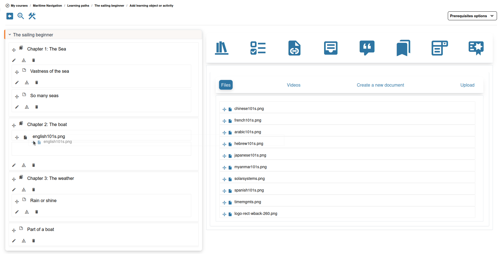
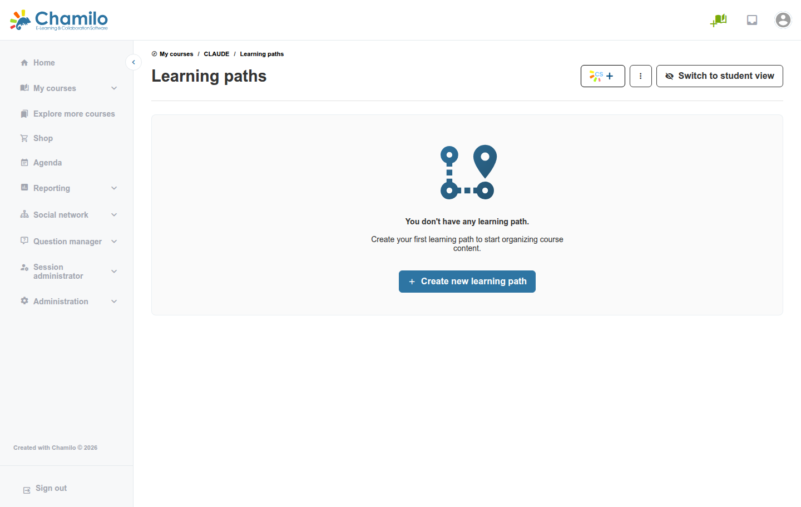
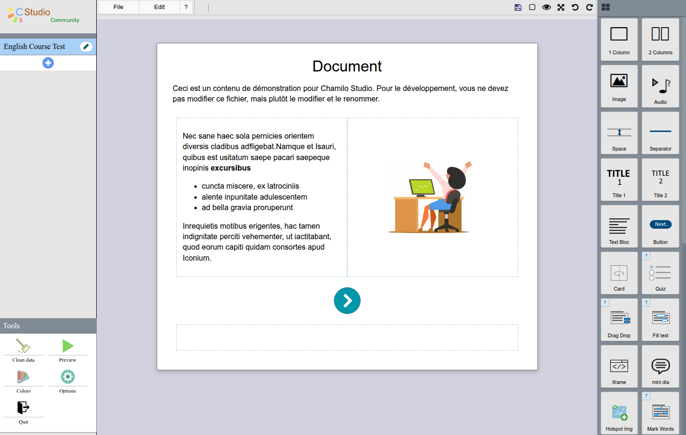
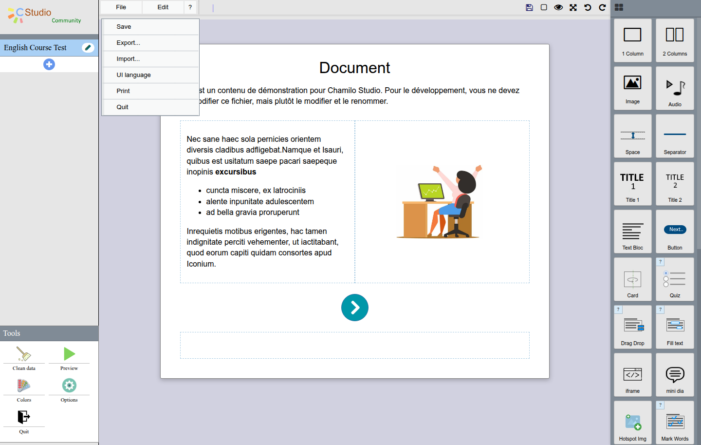

# Leerpaden

Leerpaden laten u gestructureerde reeksen van leeractiviteiten maken. Een leerpad begeleidt uw cursisten door een specifieke volgorde van documenten, oefeningen, links en andere bronnen, met optionele vereisten en voortgangsregistratie.

Deze tool is waarschijnlijk de meest gebruikte cursustool, omdat ze fungeert als een samensteller voor veel andere tools en voor cursisten zeer goed de ***enige*** tool kan zijn waarmee ze te maken hebben.

## Waarom leerpaden gebruiken?

Leerpaden zijn nuttig wanneer u wilt:

* **De volgorde van inhoudsconsumptie sturen** — ervoor zorgen dat cursisten fundamenteel materiaal afronden voordat ze verdergaan
* **Voortgang bijhouden** — precies zien waar elke cursist zich in de reeks bevindt
* **Vereisten instellen** — vereisen dat cursisten een oefening slagen voordat ze toegang krijgen tot het volgende onderdeel
* **Afronding belonen** — afronding van het leerpad koppelen aan het cijferboek en certificaten
* **Inhoud verpakken** — zelfstandige leermodules maken die cursisten in hun eigen tempo kunnen doorlopen

## Een leerpad maken

1. Open de tool **Leerpaden**  vanaf de startpagina van de cursus
2. Klik op **Een leerpad maken**
3. Voer een **titel** en optionele beschrijving in
4. Sla op — u wordt naar de leerpad-editor gebracht

## De leerpad-editor

De editor heeft twee hoofdgebieden:

* **Linkerpaneel** — De lijst met items (stappen) in het leerpad, weergegeven als een boomstructuur
* **Rechterpaneel** — De inhoud van het geselecteerde item

### Items toevoegen

Klik op **Een item toevoegen** en kies wat u wilt toevoegen:

| Itemtype | Beschrijving |
|-----------|-------------|
| **Sectie** | Een kop die gerelateerde items groepeert (zoals een hoofdstuktitel). Secties bevatten zelf geen inhoud. |
| **Document** | Een bestand of webpagina uit de tool Documenten van uw cursus |
| **Oefening** | Een quiz of toets uit de tool Oefeningen |
| **Link** | Een externe URL |
| **Opdracht** | Een studentpublicatie uit de tool Opdrachten |
| **Forum** | Een link naar een cursusforum |
| **Enquête** | Een link naar een enquête |
| **Certificaat** | Een speciale pagina om het genereren van een afrondingscertificaat of het toekennen van vaardigheden te activeren |

### Items organiseren

* **Sleep** items om ze te herschikken
* **Nest items** onder secties door ze naar rechts te slepen
* **Verwijder** items die u niet meer nodig hebt

### Vereisten instellen

Vereisten zorgen ervoor dat cursisten bepaalde stappen afronden voordat ze toegang tot andere krijgen:

1. Selecteer een item in het leerpad
2. Open de instellingen voor **vereisten**
3. Kies welk(e) voorgaande item(s) eerst moet(en) zijn afgerond
4. Voor oefeningen kunt u een **minimumscore** vereisen (bijv. "Moet minstens 70% scoren op Quiz 1 voordat toegang tot Module 2")

## Ervaring van de cursist

Wanneer een cursist een leerpad opent:

* Zien ze de lijst met items in het linkerpaneel
* Worden afgeronde items gemarkeerd met een vinkje
* Zijn items met onvervulde vereisten vergrendeld
* Wordt de voortgang automatisch bijgehouden — als een cursist weggaat en terugkomt, hervatten ze waar ze gebleven waren
* Toont een voortgangsbalk het algemene afrondingspercentage

## SCORM-inhoud

De leerpad-tool van Chamilo kan **SCORM 1.2**-pakketten importeren — de meest gebruikte e-learningstandaard. Upload een SCORM-ZIP-bestand en Chamilo maakt er een leerpad van, waarbij voortgang en scores volgens de SCORM-specificatie worden bijgehouden.

Een SCORM-pakket importeren:

1. Open in de tool Leerpaden het actiemenu en klik op **Uploaden**
2. Upload het ZIP-bestand
3. Chamilo pakt het uit en maakt het leerpad automatisch

### CMI5- / xAPI-pakketten

CMI5-pakketten (de moderne, op xAPI gebaseerde opvolger van SCORM) worden ondersteund via de plugin **XApi**. Zodra de plugin door uw beheerder is ingeschakeld, kunt u een CMI5-pakket importeren en kunnen cursisten het vanuit de cursus starten; hun statements worden doorgestuurd naar de geconfigureerde Learning Record Store.

## Inhoudsauteurschap met C-Studio

*Beschikbaar als uw beheerder de C-Studio-plugin heeft ingeschakeld.*

C-Studio voegt een ingebouwde visuele editor met slepen-en-neerzetten toe voor het maken van interactieve inhoud rechtstreeks in een leerpad — een alternatief voor het importeren van een SCORM-pakket wanneer u geen (of geen zin hebt om te leren werken met) een aparte auteurstool zoals Articulate of iSpring hebt. U bouwt de inhoud pagina voor pagina rechtstreeks in Chamilo, en deze wordt opgeslagen en bijgehouden zoals elk ander leerpad-item.

### Een C-Studio-project starten

Wanneer de plugin actief is, toont de lijst Leerpaden een extra knop naast het gebruikelijke actiemenu, gemarkeerd met een "+" en een tooltip "Studio Tools":

Klik erop om te starten. U wordt gevraagd een nieuw project vanaf nul te maken of een bestaand project te importeren:

Dit specifieke scherm is momenteel alleen beschikbaar in het Frans, ongeacht de taal van uw platform of cursus — een bekende beperking van de gebruikte pluginversie. Geef uw project een titel en het opent rechtstreeks in de editor.

### De editor

De editor is een visuele bouwer pagina per pagina:

* **Linkerpaneel** — de pagina's van uw project, met een "+" om er meer toe te voegen, en een sectie **Tools** onderaan (Clean data, Preview, Colors, Options, Quit)
* **Centraal canvas** — de pagina die u bouwt; klik op een element om het ter plaatse te bewerken
* **Rechterpaneel** — het componentenpalet, dat u op het canvas sleept

Het palet omvat basiselementen (kolommen, afbeeldingen, audio, titels, tekst, knoppen, kaarten) evenals verschillende interactieve oefeningstypen: **Drag Drop**, **Fill text**, **Hotspot Img**, **Mark Words**, **Find Words** en **Sort paragraphs**, plus een **iframe**-blok om externe inhoud in te sluiten en een **Quiz**-blok.

### Taal

De eigen interface van C-Studio kan de eerste keer dat u deze opent standaard in het Frans staan, onafhankelijk van de interfacetaal van Chamilo of de taal van de cursus. Ga in dat geval naar **File > UI language** en kies uw taal — de editor wordt onmiddellijk opnieuw geladen en onthoudt daarna uw keuze.

### Opslaan en exporteren

Gebruik **File > Save** terwijl u werkt. **File > Export...** verpakt uw project als een SCORM-bestand dat u kunt downloaden, back-uppen of elders hergebruiken via **Import...**. **File > Quit** brengt u terug naar de lijst leerpaden, waar uw C-Studio-project nu als een gewoon item verschijnt.

## Instellingen van het leerpad

Configureer hoe het leerpad zich gedraagt:

| Instelling | Beschrijving |
|---------|-------------|
| **Zichtbaarheid** | Het leerpad verbergen of tonen voor cursisten |
| **Vereisten** | Voltooiing van andere leerpaden vereisen voordat dit pad beschikbaar is |
| **Automatisch starten** | Dit leerpad automatisch openen wanneer cursisten de cursus binnenkomen |
| **Opgetelde SCORM-tijd** | Of tijd over meerdere sessies moet worden opgeteld |

## Koppelen aan het cijferboek

U kunt de voltooiing van een leerpad als beoordeelde activiteit in het cijferboek opnemen. Zo kan de voortgang in het leerpad bijdragen aan het algemene cursuscijfer van de cursist en aan de in aanmerking koming voor een certificaat.

## AI gebruiken

Als de beheerder AI-ondersteunde generatie van leerpaden heeft ingeschakeld, vindt u een AI-generatoroptie in het vervolgkeuzemenu Acties. Geef de AI zo precies mogelijk de context die u voor uw leerpad wilt, vraag een aantal pagina's en een geschat aantal woorden per pagina, geef aan of u het wilt vullen met toetsen en start. Enkele minuten later bekijkt u een volledig, tekstgebaseerd leerpad.

Bewerk de documenten om illustraties met extra AI te genereren; daarna hoeft u alleen nog te controleren voordat u het met uw cursisten deelt.

## Tips

* **Begin met een overzicht** — Plan uw secties en items voordat u het pad opbouwt
* **Gebruik secties als hoofdstukken** — Groepeer gerelateerde items onder sectiekoppen voor duidelijkheid
* **Stel vereisten in voor beoordelingen** — Vereis dat cursisten de inhoud bestuderen voordat ze een toets maken
* **Mix inhoudstypen** — Combineer leesmateriaal, video's, interactieve oefeningen en externe bronnen voor een boeiende leerervaring
* **Controleer de cursistenweergave** — Gebruik de functie Student View om het leerpad te ervaren zoals een cursist dat zou doen
* **Gebruik SCORM voor interactiviteit** — Als u toegang hebt tot SCORM-auteurstools (zoals Articulate, iSpring of vergelijkbaar), maak rijke interactieve inhoud en importeer die in Chamilo. Als uw beheerder de C-Studio-plugin heeft ingeschakeld, kunt u vergelijkbare interactieve inhoud rechtstreeks in Chamilo bouwen — zie [Inhoud maken met C-Studio](#content-authoring-with-c-studio) hierboven