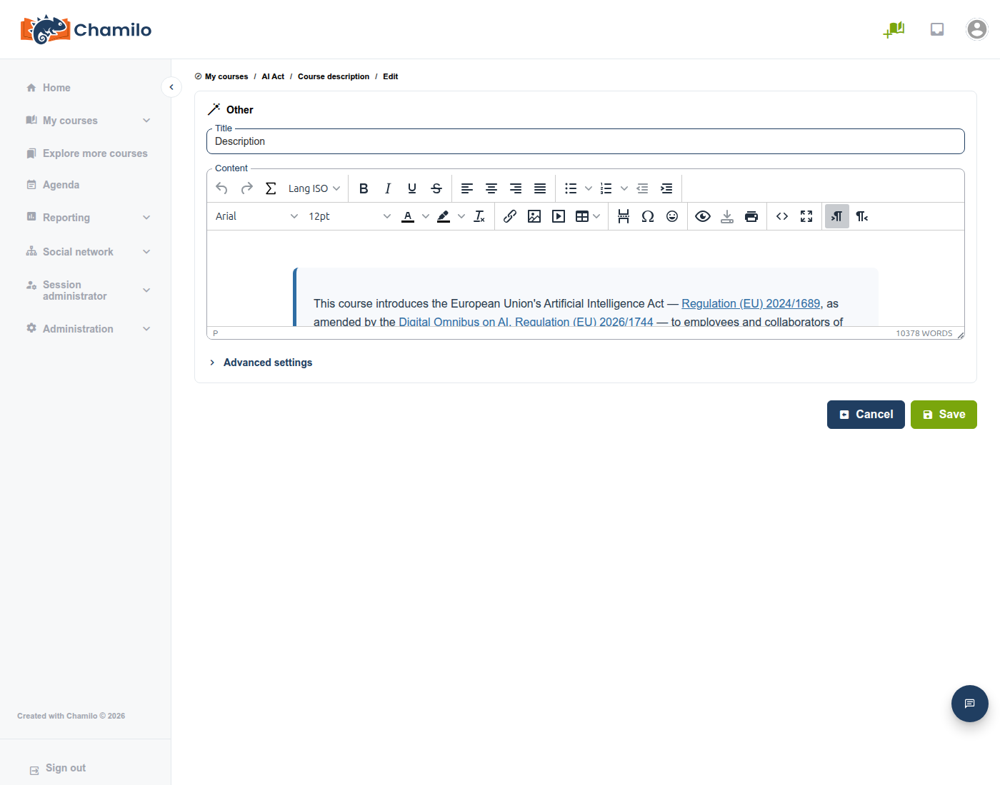

# Meertalige inhoud

Chamilo laat u **meerdere taalversies van hetzelfde stuk inhoud in één veld** schrijven — een sectie van de cursusbeschrijving, een document, een toetsvraag, een enquête — en zorgt ervoor dat elke cursist automatisch alleen de versie in de eigen taal te zien krijgt. Dit is de functie **translate_html**, genoemd naar de platforminstelling die haar aanstuurt.

Er zijn drie verschillende personen bij betrokken, die elk een andere kant ervan zien:

* **Uw beheerder** moet de functie platformbreed inschakelen voordat iemand haar kan gebruiken.
* **U (de docent)** schrijft de verschillende taalversies, met een knop in de rich-text-editor.
* **De cursist** profiteert ervan zonder ooit te weten dat ze bestaat — hij of zij ziet eenvoudigweg de inhoud in de eigen taal, zonder instelling om te zoeken of in te schakelen.

## De functie inschakelen

Dit is een taak voor de beheerder, niet voor de docent. Onder **Beheer > Configuratie-instellingen > Editor** moet de instelling **Ondersteuning voor meertalige HTML-inhoud** (`translate_html`) ingeschakeld zijn. Als u de hieronder beschreven knop **Lang ISO** niet in de werkbalk van uw editor ziet, is dat vrijwel zeker de reden — vraag het aan uw beheerder. Zie [Editorinstellingen](../../admin-guide/platform-settings/editor-settings.md) voor de volledige referentie van de instellingen. Vanaf v3.0.0 is deze instelling standaard ingeschakeld (dat was vóór deze versie niet het geval), tenzij u hebt geüpgraded vanaf een eerdere versie waarin de instelling uitgeschakeld was.

Het opnieuw uitschakelen van deze instelling verwijdert of beschadigt geen inhoud die al op deze manier is geschreven — zie [Wat cursisten zien](#what-learners-see) hieronder.

## Meertalige inhoud schrijven

De functie is beschikbaar overal waar u de volledige rich-text-editor hebt: secties van de [cursusbeschrijving](../creating-your-course/course-description.md), [documenten](documents.md), toets- en enquêtevragen, en meer.

1. Schrijf (of plak) de inhoud in uw standaardtaal, zoals gewoonlijk.
2. Selecteer die tekst en klik vervolgens op de knop **Lang ISO** in de werkbalk van de editor.

3. Kies in het menu de taal waarin u zojuist hebt geschreven — de lijst omvat elke taal die op uw platform actief is. Als de taal die u nodig hebt niet in de lijst staat, gebruik dan **Custom Chamilo ISO code...** onderaan en typ die in (bijv. `en_US`, `fr_FR`, `es`).

4. Chamilo omhult uw selectie met die taaltag. Schrijf (of plak) nu de versie in de volgende taal er pal achter, selecteer die en herhaal het met een andere taal.

Ga door voor zoveel talen als u wilt dekken. Ze staan allemaal in hetzelfde veld — tijdens het bewerken ziet u elke taalversie onder elkaar; pas wanneer iemand de pagina daadwerkelijk *bekijkt*, verbergt Chamilo alles behalve de ene taal die voor die persoon van toepassing is (zie hieronder).

### AI-ondersteunde vertaling

Als uw beheerder een AI-tekstprovider heeft geconfigureerd, biedt hetzelfde menu **Lang ISO** bovenaan ook **Add translation to...**. Dit stuurt uw bestaande inhoud naar het geconfigureerde AI-model en voegt een nieuw, automatisch vertaald blok in in de taal die u kiest (of in alle resterende talen tegelijk, als uw platform dat toestaat) — u hoeft het niet zelf te schrijven. Bestaande taalblokken blijven onaangeroerd, en talen die al aanwezig zijn, worden uit de lijst weggelaten, zodat herhaald gebruik geen duplicaten aanmaakt.

Net als bij alle AI-gegenereerde inhoud: proeflees het resultaat — het is een snelle manier om een stevige eerste versie te krijgen in een taal die u zelf misschien niet spreekt, geen vervanging voor controle.

## Wat cursisten zien

Elke cursist ziet precies één taalversie: Chamilo probeert eerst de eigen interfacetaal van de cursist; als geen van uw blokken daarmee overeenkomt, valt het terug op de eigen taal van de cursus, daarna op de standaardtaal van het platform; als ook die niet overeenkomen, toont het de taal die u toevallig als eerste hebt geschreven, in plaats van de inhoud leeg te laten. Dit gebeurt allemaal automatisch — de cursist hoeft niets in te stellen, en u hoeft ook niets per cursist in te stellen.

Hier is dezelfde sectie van de cursusbeschrijving, zoals gezien door drie cursisten met verschillende interfacetalen — verder is er niets aan de cursus veranderd tussen deze drie schermafbeeldingen, alleen de taal van de kijker:

### Onder de motorkap

Als u ooit de weergave **Broncode** van een meertalig veld opent (de knop `<>` in de werkbalk van de editor), ziet u elke taalversie als volgt omwikkeld:

Elke versie is omwikkeld in een `
` (of ``, voor een korte inline-frase in plaats van een heel blok) — dat attribuut `lang` is wat Chamilo afstemt op de taal van de kijker om te beslissen wat er getoond wordt. Het is de moeite waard om deze specifieke klassenaam te herkennen als u ooit de paginabron inspecteert of inhoud oplost die er verkeerd uitziet: **`mce-translatehtml`** is de markering waarnaar u moet zoeken.

Dit verklaart ook waarom het uitschakelen van `translate_html` in de platforminstellingen niets al geschreven kapotmaakt: de instelling bepaalt alleen of de *auteurknop* **Lang ISO** in de editor verschijnt. De hierboven beschreven filtering aan de *weergavekant* draait onvoorwaardelijk, zodat eerder geschreven meertalige inhoud voor elke kijker correct gefilterd blijft, zelfs op een platform waar een beheerder de auteurknop sindsdien heeft uitgeschakeld.

## Titels werken niet op deze manier

De titel van een cursus, de titel van een document, de titel van een toets — dit zijn velden met platte tekst, geen rich text, dus ze kunnen de hierboven beschreven `lang`-getagde markup niet bevatten. Ze blijven een enkele, neutrale waarde, ongeacht wie ernaar kijkt, hoeveel taalversies u ook in de onderliggende inhoud hebt geschreven.

De enige uitzondering: als uw beheerder **Titels opslaan als HTML** (`save_titles_as_html`, eveneens onder **Beheer > Configuratie-instellingen > Editor**) heeft ingeschakeld voor het specifieke titelveld waarmee u werkt, wordt dat veld ook een echt HTML-veld, en kan dezelfde hierboven beschreven techniek **Lang ISO** erop worden toegepast. Dit is ongebruikelijk en wordt vooral gebruikt voor toetsvragen — de meeste titels op het platform blijven platte tekst.

## Tips

* **Houd de brontaal eerst** — zet de meest voorkomende taal van uw platform als eerste in het veld; dat is de meest natuurlijke terugval als u later vergeet een zeldzamere taal te taggen.
* **Nest geen taalblokken** — schrijf elke versie als een afzonderlijk, opeenvolgend blok; het in elkaar wrappen van de ene in de andere wordt niet ondersteund en de editor wikkelt geneste markeringen actief uit wanneer u een nieuwe invoegt.
* **Een sectie die in één taal leeg lijkt** betekent meestal dat er nooit een blok voor die taal (of de uitgebreide terugval van cursus-/platformstandaard) is getagd — controleer de weergave Broncode op de talen die daadwerkelijk aanwezig zijn.