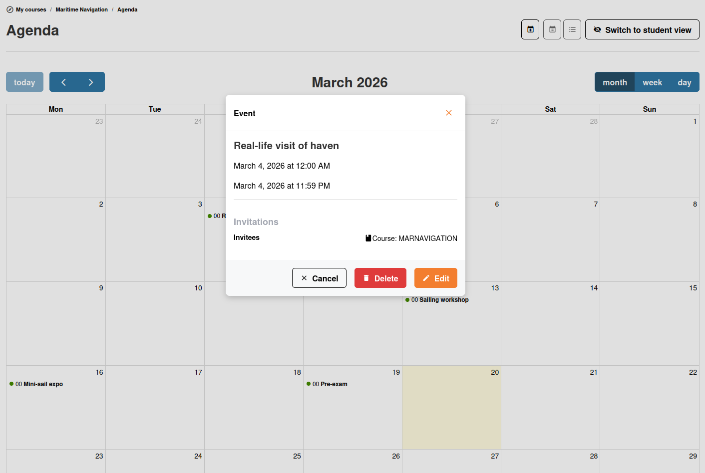
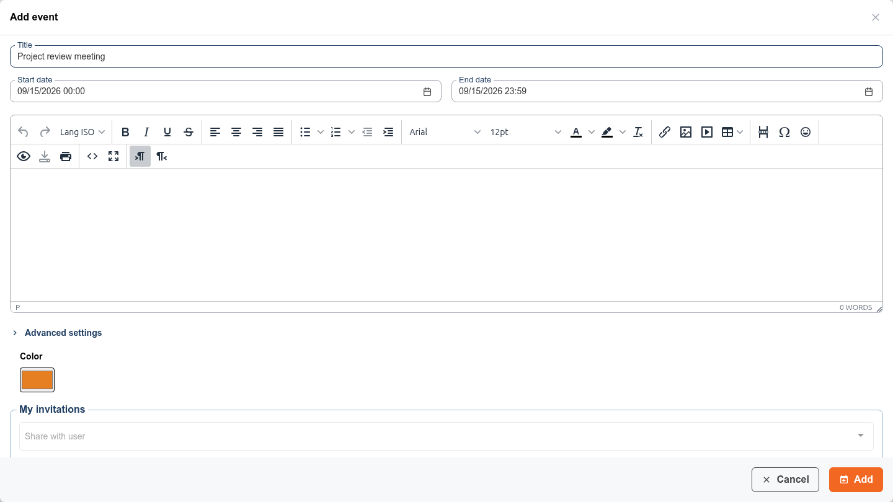
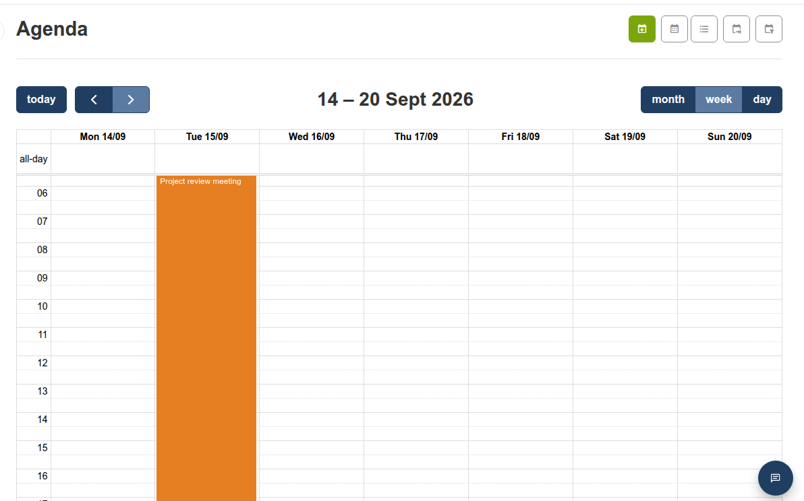

# Agenda

De agendatool laat u evenementen en deadlines binnen uw cursus plannen. Evenementen verschijnen op een kalender die uw cursisten kunnen bekijken.

## De agenda bekijken

Open de tool **Agenda**  vanaf de cursushomepage. U kunt evenementen in drie modi bekijken:

* **Kalenderweergave** — Een visuele maandelijkse/wekelijkse/dagelijkse kalender
* **Lijstweergave** — Evenementen weergegeven als een chronologische lijst
* **Persoonlijke evenementen** — Filteren om alleen evenementen te zien die voor u relevant zijn

## Een evenement aanmaken

1. Klik op **Evenement toevoegen** 
2. Vul de evenementgegevens in:
   * **Titel** — Een korte naam voor het evenement
   * **Startdatum en -tijd**
   * **Einddatum en -tijd**
   * **Beschrijving** — Aanvullende details (ondersteunt opgemaakte tekst)
3. Kies het **publiek**:
   * **Alle cursisten** — Iedereen die in de cursus is ingeschreven
   * **Specifieke gebruikers of groepen** — Selecteer individuele cursisten of groepen
4. Stel optioneel een **herinnering**  in om e-mailmeldingen vóór het evenement te versturen (*cron*-instelling voor het portaal vereist door een beheerder)
5. Kies een **kleur** voor het evenement door op het kleurstalenveld te klikken. Deze kleur wordt gebruikt om het evenement in de hele kalender te markeren (maand-, week- en dagweergaven), zodat evenementen in één oogopslag van elkaar te onderscheiden zijn — bijvoorbeeld om deadlines van gewone sessies te onderscheiden, of evenementen van verschillende cursussen in uw persoonlijke agenda.

   
6. Opslaan

De gekozen kleur wordt vervolgens overal weergegeven waar het evenement in de kalender verschijnt:

Standaard krijgen nieuwe evenementen een kleur op basis van hun context (cursus, sessie, persoonlijk of globaal), maar u kunt die overschrijven met elke gewenste kleur.

## Evenementen beheren

* **Bewerken**  — Klik op een evenement om de gegevens te wijzigen
* **Verwijderen**  — Een evenement uit de kalender verwijderen
* **Slepen en neerzetten** — Sleep evenementen in de kalenderweergave om ze opnieuw in te plannen

## Persoonlijke agenda

U hebt ook een **persoonlijke agenda** die toegankelijk is vanuit de zijbalk. De persoonlijke agenda bundelt evenementen uit al uw cursussen in één weergave. Dit is waar cursisten hun gecombineerde rooster zien van alle cursussen waarin zij zijn ingeschreven.

## Tips

* **Deadlines instellen** — Maak evenementen aan voor inleverdata van opdrachten en deadlines van oefeningen, zodat cursisten ze in hun kalender kunnen zien
* **Herinneringen gebruiken** — Schakel e-mailherinneringen in voor belangrijke evenementen om cursisten op schema te houden
* **Afstemmen met sessies** — Als u in meerdere sessies lesgeeft, heeft elke sessie eigen evenementen, die alleen zichtbaar zijn voor de cursisten van die sessie. Docenten hebben een functie om de evenementen (huiswerk, excursies, enz.) van andere cursussen in hun sessies te zien, om overbelasting van studenten te voorkomen.