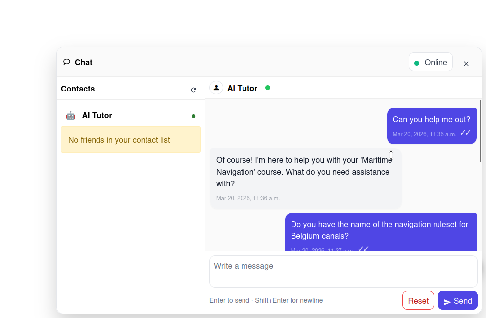

# AI-tutor

De AI-tutor is een chatbot die in Chamilo is geïntegreerd en waarmee cursisten kunnen interageren om directe, door AI gegenereerde antwoorden te krijgen. Hij werkt in twee contexten, met in elk een andere focus:

* **Binnen een cursus** — de AI-tutor is gericht op die cursus: het beantwoorden van vragen over de inhoud, het uitleggen van behandelde concepten en het begeleiden van cursisten door het materiaal.
* **Buiten een cursus** (op het algemene platform) — de AI-tutor behandelt in plaats daarvan algemene vragen over het gebruik van het platform, zoals hoe u iets vindt of een functie gebruikt, in plaats van cursusinhoud.

## Hoe het werkt

Wanneer de AI-tutor voor een cursus is ingeschakeld, zien cursisten een chatinterface waarin ze:

* **Vragen kunnen stellen** over de cursusinhoud
* **Uitleg kunnen krijgen** van concepten die in de cursus worden behandeld
* **Begeleiding kunnen ontvangen** zonder te wachten tot de docent reageert

Binnen een cursus gebruikt de AI-tutor de context van die cursus om relevante antwoorden te geven. Hij is bedoeld als aanvulling op uw onderwijs, niet als vervanging.

## De AI-tutor inschakelen

De AI-tutor vereist configuratie op twee niveaus:

1. **Platformniveau** — De beheerder moet AI-helpers inschakelen en minstens één AI-provider configureren (zie [AI-configuratie](../../admin-guide/integrations/ai-configuration.md))
2. **Cursusniveau** — De AI-tutor moet in de cursusinstellingen worden ingeschakeld (een eenvoudige aan/uit-schakelaar). De provider die voor de chat wordt gebruikt, is degene die door de beheerder is geconfigureerd.

## De chatinterface

De AI-tutor verschijnt als een **vastgezet chatpaneel** binnen de cursus. Cursisten kunnen:

* Berichten typen en door AI gegenereerde antwoorden ontvangen
* Hun gespreksgeschiedenis bekijken
* Het gesprek resetten om opnieuw te beginnen

De chatinterface toont de uitwisseling tussen de cursist en de AI in een vertrouwd berichtformaat.

## Belangrijk gedrag

* **Beperkt tot waar hij wordt geopend** — Binnen een cursus beantwoordt de AI-tutor alleen vragen over die cursus; geopend van buiten enige cursus schakelt hij over naar algemene vragen over het gebruik van het platform. De platformbrede modus (buiten de cursus) is een aparte schakelaar die uw beheerder onafhankelijk van de per-cursus-schakelaar bedient.
* **Uitgeschakeld tijdens examens** — De AI-tutor wordt automatisch uitgeschakeld wanneer een cursist een oefening maakt, om fraude te voorkomen
* **Gesprek per cursist** — Elke cursist heeft een eigen privégesprek met de AI-tutor, en de promptcontext bevat alleen de meest recente berichten
* **Failover van de provider** — Als de geconfigureerde provider faalt, valt Chamilo terug op een andere beschikbare provider zodat de chat blijft werken

## Als docent

U moet zich ervan bewust zijn dat:

* De AI-tutor niet altijd perfecte antwoorden geeft — moedig cursisten aan om belangrijke informatie te verifiëren
* U het gebruik van de AI-tutor kunt bekijken via platformtracking
* De AI-tutor een aanvulling is op uw onderwijs, geen vervanging. Gebruik hem naast forums, aankondigingen en rechtstreekse berichten voor uitgebreide ondersteuning van cursisten.

## Tips

* **Verwachtingen stellen** — Vertel cursisten aan het begin van de cursus dat er een AI-tutor beschikbaar is en leg uit hoe ze die passend kunnen gebruiken
* **Kritisch denken stimuleren** — Herinner cursisten eraan om kritisch na te denken over door AI gegenereerde antwoorden
* **Gebruiken voor veelgestelde vragen** — De AI-tutor is vooral nuttig voor het afhandelen van veelvoorkomende vragen die u anders herhaaldelijk zou beantwoorden