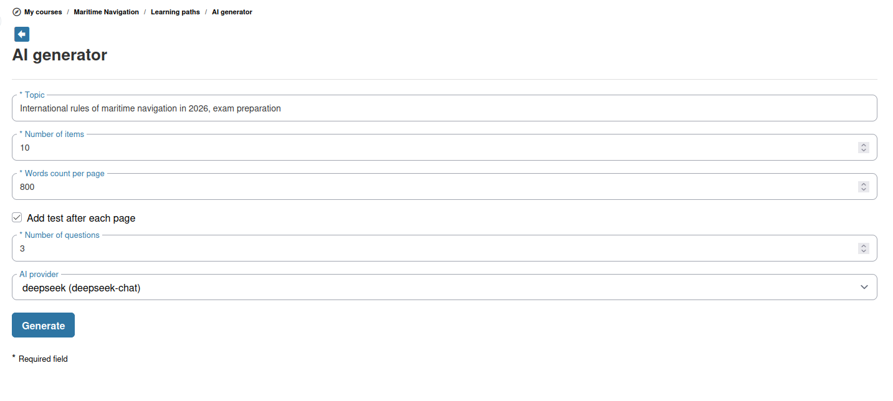

# Leerpadgenerator

De AI-leerpadgenerator helpt u automatisch gestructureerde leersequenties te maken. U geeft een onderwerp en doelstellingen op, en de AI genereert een leerpadoverzicht met secties en inhoudsitems die u kunt beoordelen en aanpassen.

## De leerpadgenerator openen

De leerpadgenerator is beschikbaar bij het aanmaken van een nieuw leerpad, mits:

1. AI-helpers op platformniveau zijn ingeschakeld
2. De leerpadgenerator in de cursusinstellingen is ingeschakeld
3. Ten minste één AI-tekstprovider is geconfigureerd

Zoek naar de sectie **AI Generator** in de interface voor het aanmaken van leerpaden.

## Een leerpad genereren

1. Open het formulier AI Generator
2. Configureer de parameters:
   * **Topic** — Het onderwerp van het leerpad
   * **Number of items** — Hoeveel inhoudspagina's het pad moet bevatten
   * **Words count per page** — Ongeveer hoe lang elke pagina moet zijn
   * **Add test after each page** — Indien aangevinkt, maakt de AI ook een korte meerkeuzetoets na elke pagina (standaard 2 vragen, maximaal 5)
3. Klik op **Generate**
4. De AI produceert een leerpad met één documentitem per pagina en, optioneel, een toetsitem na elk daarvan

## Beoordelen en aanpassen

Het gegenereerde leerpad is een **startpunt**. U dient:

* **De structuur te beoordelen** — Controleer of de secties in een logische volgorde staan
* **Inhoud te bewerken** — Pas de gegenereerde tekst aan, voeg uw eigen materialen toe en verwijder irrelevante secties
* **Bronnen toe te voegen** — Voeg uw eigen documenten, oefeningen, links en andere inhoud in
* **Voorwaarden in te stellen** — Configureer welke secties voltooid moeten zijn voordat andere kunnen worden gevolgd
* **Toetsen toe te voegen** — Voeg oefeningen toe op geschikte punten om begrip te controleren

## Vermelding van AI-gegenereerde inhoud

Door AI gegenereerde inhoud is voorzien van een vermelding, die aangeeft dat deze met kunstmatige intelligentie is gemaakt. Deze transparantie helpt cursisten de herkomst van het materiaal te begrijpen.

## Tips

* **Begin breed, verfijn daarna** — Genereer eerst een overkoepelende structuur en voeg daarna handmatig details en specifieke bronnen toe
* **Gebruik het voor cursusplanning** — Zelfs als u de gegenereerde inhoud niet rechtstreeks gebruikt, kan de door de AI voorgestelde structuur een nuttig planningsinstrument zijn
* **Combineer met oefeningengeneratie** — Gebruik na het genereren van een leerpad de Exercise Generator om toetsen voor elke sectie te maken