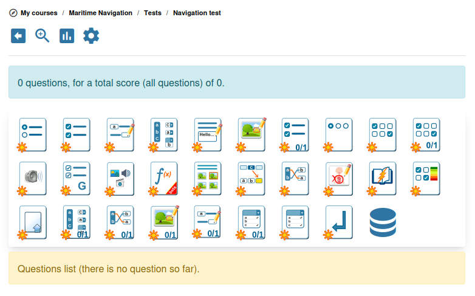

# Oefeningen

De oefeningentool (ook wel "toetsen" genoemd) laat u quizzen en examens maken met automatische beoordeling. Chamilo ondersteunt een breed scala aan vraagtypen, van eenvoudige meerkeuzevragen tot interactieve hotspotvragen.

## Een oefening maken

1. Open de tool **Oefeningen**  vanaf de startpagina van de cursus
2. Klik op **Nieuwe oefening**
3. Voer een **titel** en optionele **beschrijving** in
4. Configureer de oefeninginstellingen (zie hieronder)
5. Sla op en voeg vervolgens vragen toe

## Oefeninginstellingen

### Weergave en navigatie

| Instelling | Opties | Beschrijving |
|---------|---------|-------------|
| **Vragenindeling** | Alles op één pagina / Eén per pagina | Alle vragen tegelijk tonen of één tegelijk |
| **Vraagtitels verbergen** | Ja / Nee | Of vraagtitels aan cursisten worden getoond |
| **Knop Vorige tonen** | Ja / Nee | Cursisten toestaan terug te gaan naar vorige vragen |
| **Navigatie achterwaarts voorkomen** | Ja / Nee | Cursisten verplichten in volgorde te antwoorden zonder terug te gaan |

### Tijd en beschikbaarheid

| Instelling | Beschrijving |
|---------|-------------|
| **Tijdslimiet** | Maximale tijd (in minuten) om de oefening te voltooien. Een afteltimer wordt aan de cursist getoond |
| **Startdatum** | Wanneer de oefening beschikbaar wordt voor cursisten |
| **Einddatum** | Wanneer de oefening niet meer beschikbaar is |

### Pogingen en scoring

| Instelling | Beschrijving |
|---------|-------------|
| **Maximum aantal pogingen** | Hoe vaak een cursist de oefening mag maken (0 = onbeperkt) |
| **Slagingspercentage** | De minimale score om te slagen (bijv. 70%). Cursisten die deze drempel niet bereiken, zien een faalmelding |
| **Negatieve scoring doorgeven** | Of negatieve punten op afzonderlijke vragen de totaalscore onder nul mogen brengen |

### Feedback

| Instelling | Opties |
|---------|---------|
| **Aan het einde** | Resultaten en juiste antwoorden tonen nadat de cursist heeft ingediend |
| **Onmiddellijk** | Feedback tonen na elke vraag (nuttig voor leeroefeningen) |
| **Examenmodus** | Geen feedback of resultaten tonen |

### Resultaatweergave

Bepaal wat cursisten zien na het voltooien van de oefening:

* Score en verwachte antwoorden tonen
* Alleen score tonen
* Score met uitsplitsing per categorie tonen
* Rangschikking ten opzichte van andere cursisten tonen
* Alleen bij de laatste poging tonen
* Visualisatie met radardiagram tonen

### Afrondingsberichten

* **Succesbericht** — Aangepaste tekst die wordt getoond wanneer de cursist slaagt
* **Faalbericht** — Aangepaste tekst die wordt getoond wanneer de cursist het slagingspercentage niet bereikt

### Randomisatie van vragen

| Instelling | Beschrijving |
|---------|-------------|
| **Willekeurige volgorde van vragen** | De volgorde van vragen bij elke poging door elkaar schudden |
| **Willekeurige antwoorden** | Antwoordopties binnen elke vraag door elkaar schudden |
| **Willekeurig per categorie** | Willekeurige vragen uit elke vragencategorie selecteren |

U kunt ook geavanceerde selectiestrategieën configureren die categorieën en randomisatie combineren.

## Vraagtypen

Chamilo biedt een rijke set vraagtypen, ingedeeld in verschillende categorieën:

### Enkele keuze

* **Meerkeuze (één antwoord)** — De cursist selecteert één juist antwoord uit een lijst met opties
* **Enkel antwoord met afbeeldingen** — Hetzelfde als hierboven, maar de antwoordopties worden als afbeeldingen weergegeven

### Meerkeuze

* **Meerdere antwoorden** — De cursist selecteert een of meer juiste antwoorden
* **Meerdere antwoorden (vervolgkeuzemenu)** — Antwoordopties worden als vervolgkeuzemenu's aangeboden
* **Waar/onwaar** — Een reeks stellingen die de cursist als waar of onwaar markeert
* **Waar/onwaar met mate van zekerheid** — Waar/onwaar met een extra betrouwbaarheidsniveau, wat een genuanceerdere scoring mogelijk maakt

### Invullen

* **Invullen** — De cursist vult ontbrekende woorden in een tekst in. U definieert de open plekken en geaccepteerde antwoorden bij het maken van de vraag.

### Koppelen

* **Koppelen** — De cursist verbindt items uit twee kolommen
* **Koppelen (versleepbaar)** — Hetzelfde concept, maar met een drag-and-dropinterface
* **Versleepbaar** — Items naar de juiste posities slepen

### Open vragen

* **Vrij antwoord (essay)** — De cursist schrijft een tekstantwoord. Vereist handmatige beoordeling (of AI-ondersteunde beoordeling indien geconfigureerd)
* **Mondelinge expressie** — De cursist neemt een audioantwoord op met de microfoon
* **Antwoord uploaden** — De cursist uploadt een bestand als antwoord

### Hotspot

* **Hotspot** — De cursist klikt op specifieke gebieden van een afbeelding om te antwoorden
* **Hotspot-afbakening** — De cursist tekent grenzen rond gebieden op een afbeelding

### Berekend

* **Berekend antwoord** — Numerieke vragen met een formule en tolerantiebereik. Nuttig voor wiskunde- en natuurwetenschappelijke cursussen.

### Speciaal

* **Begrijpend lezen** — Toetsen op basis van het lezen van een tekstpassage
* **Annotatie** — De docent uploadt een afbeelding en de lerende annoteert deze
* **Antwoord in Office-document** — Wanneer de OnlyOffice-plugin is ingeschakeld, beantwoordt de lerende de vraag door een ingesloten Office-document (Word, Excel, PowerPoint) te bewerken. Het antwoord wordt als een apart bestand onder de oefening opgeslagen, zodat het samen met de rest van de poging kan worden nagekeken.

## Vragen aan een oefening toevoegen

1. Open de oefening en klik op **Een vraag toevoegen**
2. Selecteer het vraagtype
3. Voer de **vraagtekst** in (ondersteunt rijke tekst met afbeeldingen en opmaak)
4. Definieer de **antwoorden** en hun scoring:
   * Geef voor elke antwoordoptie aan of deze juist is en hoeveel punten ze waard is
   * U kunt negatieve punten toekennen aan foute antwoorden om gokken te ontmoedigen
5. Voeg optioneel **feedback** toe — toelichtingen die na het beantwoorden aan de lerende worden getoond
6. Stel het **moeilijkheidsniveau** en de **categorie** in (nuttig voor willekeurige selectie en rapportage)
7. Opslaan

## Vraagcategorieën

U kunt vragen indelen in categorieën (bijv. "Module 1", "Woordenschat", "Gevorderd"). Categorieën zijn nuttig voor:

* Het organiseren van grote vraagbanken
* Het mogelijk maken van willekeurige selectie per categorie (bijv. "5 vragen uit Module 1, 3 uit Module 2")
* Het bekijken van scores uitgesplitst per categorie in rapporten

## Hergebruik van vragen

Vragen kunnen binnen dezelfde cursus in meerdere oefeningen worden hergebruikt. Bij het toevoegen van een vraag kunt u een nieuwe aanmaken of een bestaande vraag uit de vraagbank selecteren.

## Oefeningen importeren

Chamilo ondersteunt het importeren van oefeningen uit externe formaten:

* **IMS QTI / Common Cartridge** — Het standaard e-learning-quizformaat
* **Moodle-formaat** — Quizzen importeren uit Moodle-exports

Om te importeren, zoekt u de optie **Importeren** in de oefeningentool en uploadt u uw bestand.

## Tips

* **Meng vraagtypes** — Combineer meerkeuze, invuloefeningen en open vragen voor een volledige beoordeling
* **Gebruik categorieën** — Organiseer vragen per onderwerp om gerichte willekeurige selectie mogelijk te maken
* **Stel een slaagpercentage in** — Geef lerenden een duidelijk doel en koppel dit via het Gradebook aan het genereren van certificaten
* **Gebruik directe feedback voor oefening** — Maak onbeoordeelde oefeningen met directe feedback zodat lerenden van hun fouten kunnen leren
* **Willekeurig voor integriteit** — Schakel willekeurige vraagvolgorde en willekeurige antwoorden in om de kans op overschrijven te verkleinen