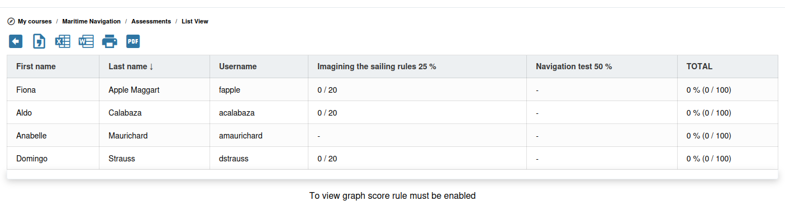

# Beoordelingen

De beoordelingen (voorheen *gradebook*) bundelen scores van oefeningen, opdrachten en andere beoordeelde activiteiten tot een overzichtelijk beeld van de prestaties van elke deelnemer. Ze sturen ook de generatie van certificaten.

## Hoe de beoordelingen werken

De beoordelingen zijn gewogen scoresystemen. U definieert:

1. **Welke activiteiten** bijdragen aan het cijfer (oefeningen, opdrachten, aanwezigheid, enz.)
2. **Het gewicht** van elke activiteit (hoeveel deze meetelt voor het eindcijfer)
3. **De minimale certificeringsscore** (de drempel om een certificaat te behalen)
4. **Een minimale score per activiteit** — Elke activiteit in het cijferboek kan een eigen **Minimale score** hebben. Deelnemers die onder dat minimum scoren op een sleutelactiviteit kunnen worden verhinderd de doelstellingen te behalen en het certificaat te verdienen, zelfs als hun gewogen totaal verder hoog genoeg is.

Activiteiten kunnen van 2 types zijn:
* **Klasactiviteit** (of fysieke activiteit), waarbij cijfers uit een andere bron moeten worden geïmporteerd
* **Online-activiteit** geselecteerd uit de cursus, waarbij cijfers worden verkregen door het voltooien van de activiteit in de cursus

Chamilo berekent het totaalcijfer van elke deelnemer op basis van deze gewichten.

## De beoordeling instellen

1. Open de tool **Beoordelingen**  vanaf de cursushomepage
2. U ziet het overzicht van de beoordelingen, aanvankelijk leeg

### Activiteiten toevoegen

1. Klik op **Online-activiteit toevoegen**
2. Kies het type:
   * **Toets** — Koppel een specifieke oefening uit de cursus
   * **Opdracht** — Koppel een map met studentpublicaties
   * **Leerpad** — Koppel de voltooiing van een leerpad
   * **Aanwezigheid** — Koppel een aanwezigheidslijst
   * **Forumonderwerp** — Koppel een forumonderwerp (dat handmatig moet worden beoordeeld)
   * **Enquête** — Koppel een enquête
3. Selecteer de specifieke activiteit binnen het gekozen type
4. Stel het **Gewicht** voor deze activiteit in (bijv. 30% voor het tussentijdse examen, 40% voor het eindproject)
5. Stel de **Minimale score** in indien van toepassing
6. Opslaan

Het totale gewicht van alle activiteiten moet optellen tot 100%.

### Subcategorieën

Voor complexe beoordelingsschema's kunt u **subcategorieën** aanmaken om gerelateerde activiteiten te groeperen:

* **Voorbeeld**: Een subcategorie "Huiswerk" (gewicht: 30%) met vijf afzonderlijke opdrachten die elk 20% van de subcategorie waard zijn
* Subcategorieën laten u de beoordeling hiërarchisch organiseren terwijl de overall berekening eenvoudig blijft

## Cijfers bekijken

De beoordeling toont een tabel met:

* De naam van elke deelnemer
* Scores voor elke activiteit
* Het gewogen totaal
* Of de deelnemer in aanmerking komt voor een certificaat

U kunt op elke kolom sorteren om snel toppresteerders of deelnemers die moeite hebben te identificeren.

### Grafieken van scoreverdeling

Onder de tabel, en op de pagina **Grafische weergave**, tekent de beoordeling één staafdiagram per activiteit plus één voor het totaal. Elk diagram is een kolomdiagram: de horizontale as vermeldt uw scorebereiken van laag naar hoog, en de hoogte van elke staaf is het aantal deelnemers in dat bereik.

Het diagram **Totaal** markeert ook het klasgemiddelde. Een rood punt staat op het bereik dat het gemiddelde bevat, en de legenda geeft het exacte percentage.

Deze grafieken verschijnen alleen wanneer de regels voor scoreweergave zijn ingesteld. Als u het bericht *To view graph score rule must be enabled* ziet, definieer dan eerst uw bereiken onder de score-instellingen van de beoordeling.

## Certificaten

Om de generatie van certificaten in te schakelen:

1. Stel in de beoordelingsinstellingen een **minimale certificeringsscore** in (bijv. 70%)
2. Wanneer het gewogen totaal van een deelnemer deze drempel haalt of overschrijdt (en hij of zij geen per-activiteit minimale score heeft gemist), kan hij of zij het certificaat downloaden
3. Het certificaat wordt gegenereerd vanuit een sjabloon dat door de platformbeheerder is geconfigureerd

Zodra **Certificaten genereren** is ingeschakeld op de hoofdcategorie, verschijnt een veld **Geldigheid van het certificaat (dagen)**. Laat het op `0` staan voor certificaten die nooit verlopen, of stel een aantal dagen in waarna het certificaat verloopt — Chamilo kan deelnemers dan herinneren wanneer die vervaldatum nadert, automatisch (cron, door de beheerder geconfigureerd) of handmatig vanuit de certificatenlijst.

Zie [Certificaten en vaardigheden](../tracking-and-reporting/certificates-and-skills.md#certificate-validity-and-expiry) voor meer details.

## Koppelen aan vaardigheden

U kunt **vaardigheden** koppelen aan de beoordeling. Wanneer een deelnemer de vastgestelde doelstellingen bereikt om de beoordeling te voltooien, kan hij of zij een certificaat, een vaardigheid of beide krijgen. Vaardigheden zijn zichtbaar op hun profiel in de sociale netwerkomgeving. Dit bouwt in de loop van de tijd een competentiedossier op.

## Cijfers exporteren

Klik op de knop **Exporteren**  om cijfers als spreadsheet te downloaden. Dit is nuttig voor:

* Het delen van cijfers met administratieve systemen
* Het uitvoeren van aanvullende analyses buiten Chamilo
* Het bijhouden van offline records

## Tips

* **Plan uw wegingen vroeg** — Definieer het beoordelingsschema aan het begin van de cursus, zodat deelnemers weten wat ze kunnen verwachten
* **Gebruik subcategorieën voor complexe cursussen** — Groepeer opdrachten, toetsen en participatie in duidelijke categorieën
* **Stel zinvolle slaagdrempels in** — De certificeringsscore moet daadwerkelijke competentie weerspiegelen, niet alleen participatie
* **Controleer regelmatig** — Bekijk het cijferboek periodiek om te controleren of alle activiteiten correct gekoppeld zijn en scores worden vastgelegd