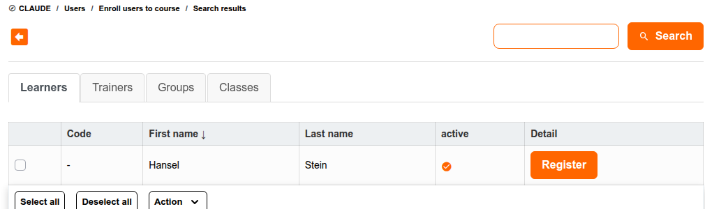
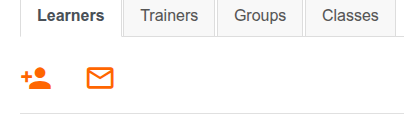
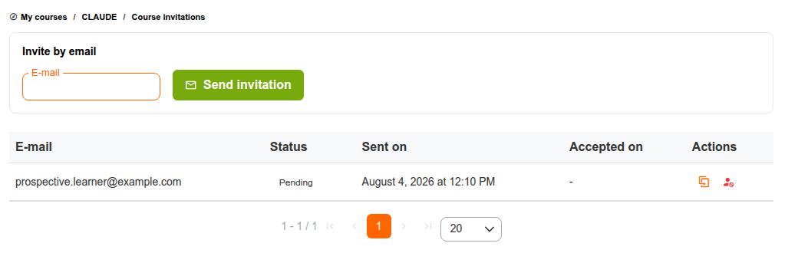

# Gebruikers inschrijven

Voordat u een cursist kunt beoordelen, moet deze zijn ingeschreven voor uw cursus. Chamilo biedt vier manieren om iemand in te schrijven, afhankelijk van wie de inschrijving uitvoert en of de persoon al een platformaccount heeft.

| Methode | Wie voert het uit | Bestaand account nodig? |
|--------|-------------|------------------------------|
| [Inschrijving door de beheerder](#administrator-enrollment) | Platformbeheerder | Ja |
| [Zelfinschrijving via de Cursuscatalogus](#self-enrollment-via-the-course-catalog) | De cursist zelf | Ja |
| [Handmatige inschrijving via de tool Gebruikers](#manual-enrollment-via-the-users-tool) | Docent (of cursusbeheerder) | Ja |
| [Gebruikers uitnodigen per e-mail](#inviting-users-by-email) | Docent (of cursusbeheerder) | **Nee** |

## Inschrijving door de beheerder

Een platformbeheerder kan elke bestaande gebruiker rechtstreeks vanuit het beheerpaneel inschrijven voor elke cursus — handig voor bulk-onboarding (bijv. het importeren van een klassenlijst) of wanneer een docent niet de rechten heeft om zelf inschrijvingen te beheren. Zie de sectie [Cursussen](../../admin-guide/courses/README.md) van de Beheerdersgids.

## Zelfinschrijving via de Cursuscatalogus

Als de [zichtbaarheid](../creating-your-course/course-settings.md#course-visibility) van uw cursus dit toestaat, kunnen cursisten met een platformaccount zichzelf inschrijven door uw cursus te vinden in **Meer cursussen verkennen** en te klikken om deel te nemen — u hoeft niets te doen. Of dit beschikbaar is, en of er een wachtwoord voor nodig is, wordt bepaald door de **Inschrijvingsinstellingen** in [Cursusinstellingen](../creating-your-course/course-settings.md#enrollment-settings).

## Handmatige inschrijving via de tool Gebruikers

Om iemand in te schrijven die al een platformaccount heeft maar zichzelf nog niet heeft aangesloten, opent u de tool **Gebruikers** van uw cursus en klikt u op het pictogram **Gebruikers toevoegen** .

1. Zoek de persoon op naam, gebruikersnaam, e-mail of officiële code
2. Klik op **Inschrijven** in hun rij, of selecteer er meerdere met de selectievakjes en gebruik het menu **Actie** om ze allemaal tegelijk in te schrijven

Alleen gebruikers die nog niet voor de cursus zijn ingeschreven, verschijnen in de resultaten.

> Dit pictogram is standaard beschikbaar voor docenten. Een platformbeheerder kan het beperken tot alleen beheerders via de instelling **Allow User Course Subscription By Course Administrator** (`allow_user_course_subscription_by_course_admin`) — als u het pictogram **Gebruikers toevoegen** niet ziet, vraag het dan aan uw beheerder.

## Gebruikers uitnodigen per e-mail

De drie bovenstaande methoden gaan ervan uit dat de persoon al een platformaccount heeft. **Cursusuitnodigingen** dekken het geval waarin dat niet zo is: u stuurt een uitnodiging naar een e-mailadres, en Chamilo mailt die persoon een eenmalige link. Door de link te openen kunnen ze een account aanmaken, en zodra ze de registratie afronden, worden ze automatisch ingeschreven voor uw cursus — er is geen aparte inschrijvingsstap nodig.

### De tool openen

Open de tool **Gebruikers** van uw cursus en klik vervolgens op het pictogram **Uitnodigen per e-mail**  in de werkbalk, naast **Gebruikers toevoegen**:

Dit opent de pagina **Cursusuitnodigingen**.

### Wie kan uitnodigingen versturen

* Platformbeheerders, altijd.
* In een gewone cursus (niet geopend in een sessie): docenten en andere gebruikers met bewerkingsrechten op de cursus.
* In een sessie: de algemene coach van de sessie, of een sessiebeheerder — niet de bredere groep cursuscoaches, omdat het versturen van een uitnodiging hier inschrijft voor de *hele sessie*, niet alleen voor deze ene cursus.

### Een uitnodiging versturen

1. Voer het e-mailadres van de ontvanger in in het formulier **Uitnodigen per e-mail**
2. Klik op **Uitnodiging versturen**

Elke uitnodiging die u voor deze cursus hebt verstuurd, verschijnt onder het formulier, met de status:

| Status | Betekenis |
|--------|---------|
| **Pending** | Verstuurd, nog niet gebruikt. Nog binnen de geldigheidsperiode. |
| **Accepted** | De ontvanger heeft zich geregistreerd en is ingeschreven. |
| **Revoked** | U hebt de uitnodiging geannuleerd voordat deze werd gebruikt. |

Voor een nog openstaande uitnodiging biedt de kolom **Actions**:

* **Copy**  — kopieert de uitnodigingslink, voor het geval u die liever zelf deelt (chat, persoonlijk) in plaats van te vertrouwen op de e-mail.
* **Revoke**  — annuleert de uitnodiging onmiddellijk; de link werkt niet meer. Een al geaccepteerde uitnodiging kan niet worden ingetrokken.

> **Het uitgenodigde e-mailadres mag nog geen account op dit platform hebben.** Als dat wel het geval is, mislukt het versturen van de uitnodiging met een bericht waarin u wordt gevraagd die bestaande gebruiker rechtstreeks in te schrijven — via [Handmatige inschrijving via de tool Gebruikers](#manual-enrollment-via-the-users-tool) hierboven.

### Uitnodigingen in een sessie

Als u de tool Gebruikers opent vanuit een cursus die binnen een sessie loopt, toont de pagina een herinnering dat de uitnodiging voor de hele sessie geldt, niet alleen voor deze cursus:

> *Deze cursus is geopend in een sessie. Een uitnodiging hier versturen schrijft de ontvanger in voor de hele sessie, niet alleen voor deze cursus.*

Dit komt overeen met hoe inschrijving elders in Chamilo werkt: u schrijft iemand in voor een sessie als geheel, of voor een zelfstandige cursus, maar nooit voor "deze ene cursus binnen deze sessie" als aparte actie.

### Wat de uitgenodigde persoon ziet

De e-mail bevat een link naar de registratiepagina. Bij het openen ervan:

* Wordt het e-mailveld vooraf ingevuld en vergrendeld op het adres dat u hebt uitgenodigd — ze kunnen zich met die link niet onder een ander adres registreren.
* Kunnen ze de registratie voltooien **zelfs als zelfregistratie platformbreed momenteel is uitgeschakeld** — mits uw beheerder de instelling **Registratie via cursusuitnodigingslinks toestaan** heeft ingeschakeld (zie hieronder). Zonder die instelling helpt een uitnodigingslink alleen als zelfregistratie anderszins openstaat.
* Worden ze onmiddellijk ingeschreven voor uw cursus (of de sessie) zodra ze het formulier indienen, en worden ze aangemeld.

De link is eenmalig te gebruiken en verloopt na 7 dagen. Als de link verloopt of de bijbehorende uitnodiging is ingetrokken, gedraagt het openen ervan zich alsof de link nooit heeft bestaan.

> De platformbrede instelling **Registratie via cursusuitnodigingslinks toestaan** (`registration.allow_invitation_registration`) bepaalt of uw uitnodigingslink registratie kan openen wanneer algemene zelfregistratie is uitgeschakeld. Vraag uw beheerder als uitnodigingen niet lijken te werken op een verder gesloten platform.

## Tips

* **Kies de methode die bij de situatie past** — beheerder of zelfinschrijving voor mensen die het platform al gebruiken, handmatige inschrijving voor een bekende bestaande gebruiker, uitnodigingen voor externe gasten, beoordelaars of iedereen die nog geen account heeft.
* **Trek uitnodigingen in die u niet meer nodig hebt** — een oude openstaande uitnodiging is nog steeds een geldige, ongebruikte link; trek die in als de beoogde ontvanger geen toegang meer nodig heeft, of als u twijfelt of de uitnodiging hen heeft bereikt.
* **Overleg met uw beheerder als een methode niet beschikbaar lijkt** — verschillende van deze stromen (handmatige inschrijving, uitnodigingen, zelfinschrijving) kunnen platformbreed beperkt of uitgeschakeld zijn.