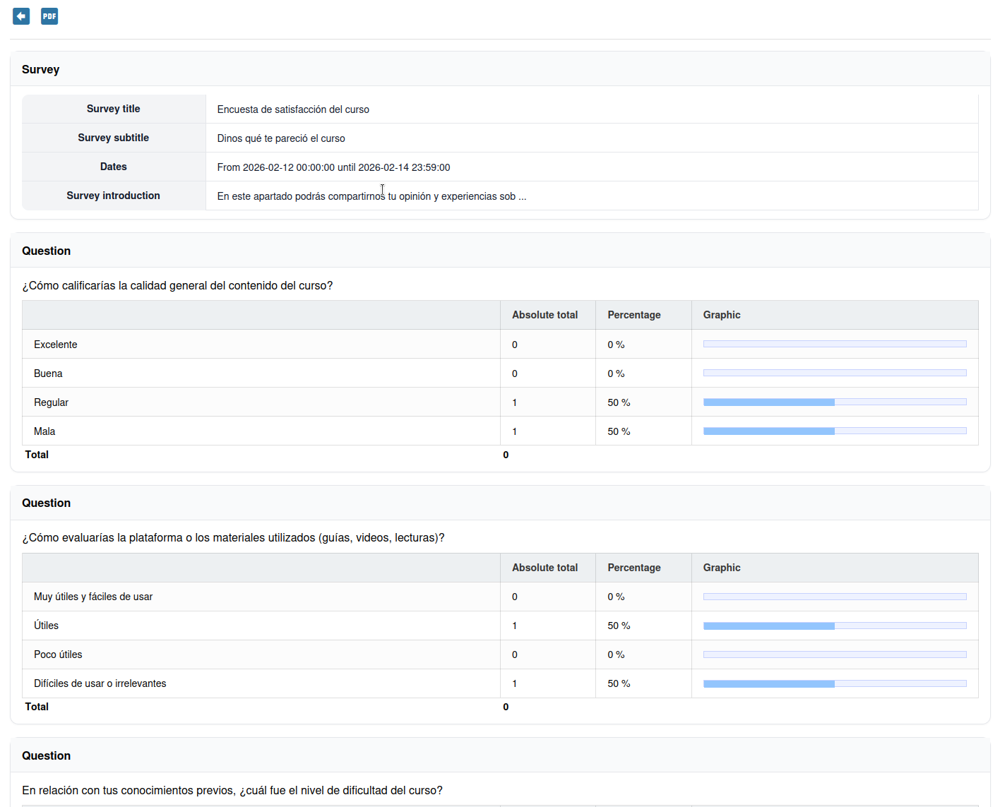

# Enquêtes

De enquête-tool laat u vragenlijsten maken om feedback van uw cursisten te verzamelen. Enquêtes zijn nuttig voor coursevaluaties, behoefteanalyses en opiniepeilingen.

## Een enquête maken

1. Open de tool **Enquêtes**  vanaf de startpagina van de cursus
2. Klik op **Enquête maken**
3. Vul de enquêtegegevens in:
   * **Code** — Dit is een unieke code voor de enquête. Deze wordt gebruikt in e-mails en links.
   * **Titel** — De naam van de enquête
   * **Ondertitel** — Een optionele secundaire kop
   * **Startdatum** — Vanaf wanneer deze enquête openstaat voor deelname
   * **Einddatum** — Tot wanneer deze enquête openstaat voor deelname
   * **Anoniem** — Of antwoorden anoniem zijn of gekoppeld aan individuele cursisten
   * **Zichtbaarheid van resultaten** — Wie de resultaten kan zien (alleen tutor, tutor en studenten, iedereen)
   * **Inleiding** — Een bericht dat aan cursisten wordt getoond voordat ze de enquête starten
   * **Dankbericht** — Een bericht dat na het indienen wordt getoond
4. Opslaan

### Geavanceerde instellingen

* **Beoordelen in de assessment-tool** — Of de antwoordstatus van deze enquête moet worden opgenomen in de assessment-tool (gradebook). Iedereen die de enquête heeft voltooid krijgt 100%, iedereen anders krijgt 0%
* **Bovenliggende enquête** — Op dit moment niet echt in gebruik (legacy-functie)
* **Eén vraag per pagina** — Presentatiestijl voor de vragen
* **Shuffle-modus inschakelen** — Of vragen moeten worden geschud
* **Vraagnummer tonen** — Of (automatisch gegenereerde) vraagnummers moeten worden getoond

## Vragen toevoegen

Zodra de enquête is gemaakt, voegt u vragen toe:

1. Kies het vraagtype:
   * **Ja/Nee** — Een eenvoudige binaire keuze
   * **Meerkeuze** — Selecteer één antwoord uit meerdere opties
   * **Meerdere antwoorden** — Selecteer één of meer antwoorden uit meerdere opties
   * **Open vraag** — Vrije-tekstantwoord
   * **Dropdown** — Selecteer uit een dropdownlijst
   * **Percentage** — Kies een percentagewaarde
   * **Score** — Beoordeel op een numerieke schaal
   * **Opmerking** — Een tekstblok (geen vraag) om instructies tussen vragen toe te voegen
   * **Meerkeuze met optie "anders"** — Selecteer één antwoord uit meerdere opties, met een alternatieve keuze
   * **Selectieve weergave** — Speciaal type waarmee u de vragenstroom kunt aanpassen op basis van eerdere antwoorden
   * **Pagina-einde** — Voeg pagina-einden toe in de vragenstroom. Alleen nuttig als "Eén vraag per pagina" in de vorige stap **niet** was geselecteerd
2. Configureer de vraagtekst en antwoordopties
3. Opslaan

Elke vraag kan als verplicht worden gemarkeerd. Als u dat niet doet, is het overslaan van een vraag acceptabel gedrag.

## Een enquête publiceren

Nadat alle vragen zijn toegevoegd:

1. Klik op **Publiceren**
2. Kies de ontvangers — Selecteer specifieke cursisten of groepen (u selecteert ze). De knop **Cursisten toevoegen** voegt alle cursisten in één keer toe en laat de docenten achterwege
3. Extra gebruikers toevoegen — Laat u gebruikers van buiten Chamilo uitnodigen om deel te nemen aan de enquête. Zij ontvangen een e-mail met een link en verschijnen met hun e-mailadres in de enquêtedetails
4. Onderwerp van de e-mail
5. Tekst van de e-mail — Leg uit waar de enquête over gaat en wanneer/hoe te antwoorden
6. Verschillende opties voor herhaalde uitnodigingen zijn beschikbaar
7. Bevestigen

Cursisten ontvangen een uitnodiging (als e-mail) om de enquête in te vullen.

Onderaan de publicatiepagina is een link beschikbaar om nog meer externe gebruikers uit te nodigen. Deelnemers die deze link gebruiken, worden niet geïdentificeerd en verschijnen als anoniem in de enquêteresultaten.

## Resultaten bekijken

Nadat cursisten hebben geantwoord:

1. Open de enquête
2. Klik op **Resultaten** of **Rapport**
3. Bekijk de antwoordoverzichten:
   * Grafieken en percentages voor gesloten vragen
   * Individuele tekstantwoorden voor open vragen
   * Voltooiingspercentage (hoeveel genodigden hebben geantwoord)

U kunt resultaten exporteren naar een spreadsheet voor verdere analyse.

## Tips

* **Houd het kort** — Cursisten vullen kortere enquêtes eerder in
* **Gebruik de anonieme modus** — Voor eerlijke feedback schakelt u anonieme antwoorden in
* **Kies het juiste moment** — Stuur enquêtes halverwege de cursus om bij te sturen, niet alleen evaluaties aan het einde van de cursus