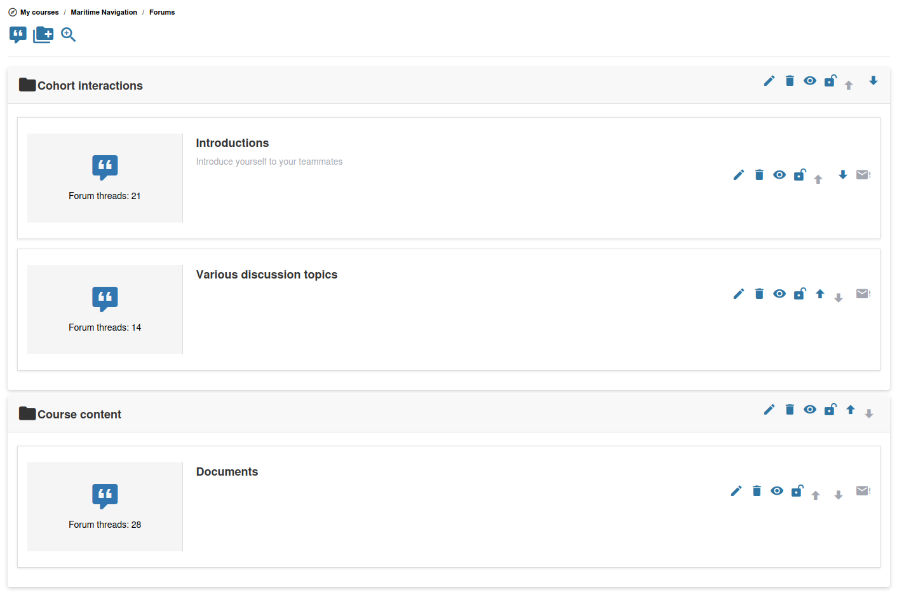

# Forums

De forumtool stelt u in staat gestructureerde discussies binnen uw cursus te hosten. Cursisten kunnen berichten plaatsen, op elkaar reageren en deelnemen aan geneste gesprekken.

## Forumstructuur

Forums in Chamilo zijn georganiseerd in drie niveaus:

1. **Forumcategorieën** — Groeperingen op het hoogste niveau (bijv. "Algemene discussies", "Vragen module 1")
2. **Forums** — Individuele discussieborden binnen een categorie
3. **Onderwerpen (threads)** — Individuele discussieonderwerpen binnen een forum, elk met een keten van antwoorden

## Een forumcategorie aanmaken

1. Open de tool **Forums**  vanaf de startpagina van uw cursus
2. Klik op **Forumcategorie toevoegen**
3. Voer een **Categorienaam** en optioneel een beschrijving in
4. Opslaan

## Een forum aanmaken

U kunt pas een forum toevoegen wanneer er minstens één categorie bestaat.

1. Klik binnen een categorie op **Forum toevoegen**
2. Vul de basisgegevens in:
   * **Titel** — De naam van dit discussiebord
   * **Beschrijving** — Een optionele beschrijving van het doel van het forum
   * **Aanmaken in categorie** — De categorie waartoe dit forum behoort
3. Open **Geavanceerde instellingen** om te configureren:
   * **Publicatiedatum** / **Sluitingsdatum** — Optioneel tijdvenster waarin het forum open is
   * **Gemodereerd forum** — Vereisen dat nieuwe berichten door een docent worden goedgekeurd voordat ze zichtbaar worden
   * **Kunnen cursisten hun eigen berichten bewerken?** — Cursisten toestaan of beletten berichten na het indienen te bewerken
   * **Gebruikers toestaan nieuwe threads te starten** — Wanneer dit op Nee staat, kunnen cursisten alleen reageren op bestaande threads
   * **Standaardweergavetype** — Kies hoe berichten worden weergegeven: **Plat**, **Threaded** of **Nested**
   * **Voor groep** — Dit forum koppelen aan een cursusgroep
   * **Openbare toegang / Privétoegang** — Voor groepsforums bepalen of elk cursuslid het kan lezen of alleen groepsleden
4. Opslaan

Als de zichtbaarheid van de cursus is ingesteld op "Open voor de wereld", toont het formulier ook de optie **Anonieme berichten toestaan?**. Deze optie is verborgen in cursussen met beperkte zichtbaarheid.

## Onderwerpen beheren

Cursisten (en u) kunnen nieuwe onderwerpen binnen een forum aanmaken. Als docent kunt u:

* **Een onderwerp vastzetten (sticky-bericht)** — Een thread als sticky markeren wanneer u deze aanmaakt of bewerkt, zodat deze altijd bovenaan verschijnt
* **Een onderwerp vergrendelen** — Verdere antwoorden voorkomen
* **Berichten bewerken of verwijderen** — De discussie modereren
* **Een onderwerp verplaatsen** — Een onderwerp naar een ander forum overzetten

## Forumscores

Wanneer u als docent een nieuwe thread aanmaakt, kunt u onder Geavanceerde instellingen **Deze thread beoordelen** inschakelen. U stelt vervolgens een maximale score in, een kolomkop voor het cijferboek en een gewicht in het rapport. U kunt ook **Thread beoordeeld door peers** inschakelen, wat vereist dat elke cursist minstens twee andere cursisten kwalificeert voordat de eigen score meetelt.

## Meldingen

Elk forum en elke thread heeft een schakelaar **Mij op de hoogte stellen** die u en uw cursisten kunnen gebruiken om zich te abonneren op e-mailmeldingen over nieuwe berichten. Meldingen zijn een abonnement per gebruiker en worden niet geconfigureerd bij het aanmaken van het forum.