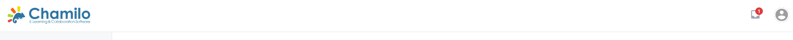
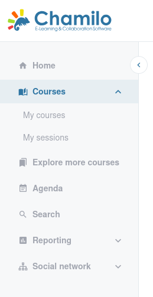

# De interface begrijpen

Chamilo 3.0 heeft een overzichtelijke, moderne interface die is ontworpen om navigatie eenvoudig te houden. Deze pagina legt elk onderdeel van de interface in detail uit.

## De bovenbalk

De bovenbalk is altijd zichtbaar bovenaan elke pagina. Deze bevat:

* **Platformlogo** — Klik erop om op elk moment terug te keren naar de startpagina.
* **Inboxpictogram**  — Toont uw berichten. Een rood badge geeft ongelezen berichten aan. Klik om uw inbox te openen.
* **Supportticketpictogram**  — Indien ingeschakeld door uw beheerder, geeft dit u toegang tot het supportticketsysteem.
* **Uw avatar** — Een cirkelvormige afbeelding in de rechterbovenhoek. Klik erop om een vervolgkeuzemenu te openen met koppelingen naar uw profiel, accountinstellingen en afmelden.

## De zijbalk

De zijbalk aan de linkerkant is uw hoofdnavigatie. Deze kan worden ingeklapt om meer ruimte te geven aan het inhoudsgebied. Klik op de pijl aan de rechterrand om deze uit of in te klappen. Chamilo onthoudt uw voorkeur.

De zijbalk bevat de volgende koppelingen (sommige kunnen verborgen zijn, afhankelijk van de configuratie van uw platform):

| Menu-item | Pictogram | Beschrijving |
|-----------|------|-------------|
| **Home** |  | Keert terug naar het hoofddashboard |
| **Mijn cursussen** |  | Toont alle cursussen waarin u bent ingeschreven |
| **Mijn sessies** |  | Toont uw trainingssessies (huidig, verleden, komend) |
| **Meer cursussen verkennen** |  | Blader door de cursuscatalogus om nieuwe cursussen te vinden |
| **Agenda** |  | Uw persoonlijke en cursuskalender |
| **Rapportage** |  | Toegang tot leerlingopvolging en cursusrapporten |
| **Sociaal netwerk** |  | Verbind met andere gebruikers, stuur berichten, word lid van groepen |
| **Videoconferentie** |  | Toegang tot live videosessies (indien geconfigureerd) |
| **Beheer** |  | Platformbeheer (alleen zichtbaar voor beheerders) |

Helemaal onderaan de zijbalk vindt u een optie **Afmelden** om snel af te melden wanneer u klaar bent. Deze optie is ook beschikbaar via het vervolgkeuzemenu van uw avatarpictogram in de rechterbovenhoek.
Als het platform wordt beheerd via externe authenticatiemethoden, zijn deze afmeldopties mogelijk niet beschikbaar.

## Het hoofdinhoudsgebied

Het centrale gebied van het scherm toont de inhoud van de huidige pagina. Bovenaan ziet u vaak een **kruimelpad** dat uw huidige locatie in het platform weergeeft (bijvoorbeeld: Home > Rockmuziek > Documenten). Gebruik het kruimelpad om terug te navigeren naar een bovenliggende pagina.

## De cursushomepage

Wanneer u een cursus binnenkomt, ziet u de **cursushomepage**. Dit wordt in detail behandeld in de sectie [Uw cursus aanmaken](../creating-your-course/), maar hier volgt een kort overzicht:

* **Cursustitel** — Prominent weergegeven bovenaan
* **Cursusintroductie** — Een optionele rich-textbeschrijving die u kunt bewerken
* **Toolraster** — Een raster van pictogrammen die de cursustools vertegenwoordigen (Documenten, Oefeningen, Forums, enz.)

Als docent ziet u extra bedieningselementen:

* **Leerlingweergave**  — Schakel dit in om de cursus te zien zoals een leerling die zou zien
* **Introductie bewerken**  — Bewerk de tekst van de cursusintroductie
* **Alles tonen / Alles verbergen** — Wijzig snel de zichtbaarheid van alle tools voor leerlingen
* **Sorteren** — Schakel slepen-en-neerzetten in om de tools op de homepage te herschikken

## Pictogramkleuren

Dit is nog experimenteel en niet volledig afgerond in Chamilo 3.0, maar we proberen de volgende regels te hanteren voor alle knoppen en actiepictogrammen in de interface:

* **Groen** voor aanmaakacties. Dit omvat het toevoegen, aanmaken, importeren, beoordelen, opslaan en kopiëren van inhoud.
* **Blauw** voor weergaveacties. Dit omvat exporteren, bekijken, voorvertonen in lijsten of in detailweergaven, zoeken en downloaden.
* **Oranje** voor bewerkingsacties. Dit omvat bewerken, verplaatsen, configureren, in-/uitschakelen, verbergen en tonen.
* **Rood** voor verwijderingsacties. Dit omvat verwijderen, wegnemen, uitschrijven.
* **Grijs** voor annuleringsacties. Gewoon alles in de bestaande toestand laten.

## Responsive Design

Chamilo 3.0 past zich aan verschillende schermformaten aan. Op een mobiel apparaat of in een smal browservenster:

* De zijbalk is standaard verborgen en kan worden geopend door op het menupictogram te tikken
* Cursuskaarten worden in één kolom weergegeven in plaats van in een raster
* Tabellen worden horizontaal scrollbaar

Dit betekent dat u en uw deelnemers het platform vanaf een telefoon, tablet of computer kunnen gebruiken, maar dat de interface er enigszins anders kan uitzien.