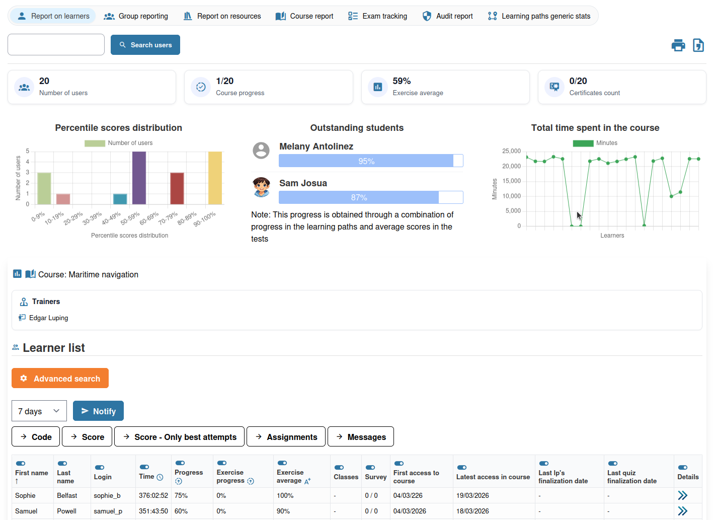

# Cursusrapporten

Cursusrapporten geven u een geaggregeerd overzicht van activiteit en prestaties van alle deelnemers in uw cursus.

## Cursusrapporten openen

Open de tool **Tracking**  vanaf de cursushomepage en selecteer de rapportweergave op cursusniveau.

## Beschikbare rapporten

### Activiteitenoverzicht

Een samenvatting van de algehele betrokkenheid bij de cursus, inclusief ingeschreven deelnemers, tijd besteed in de cursus, cursusvoortgang, oefeningvoortgang en gemiddelde score, en opdrachtactiviteit.

Afzonderlijke detailweergaven zijn beschikbaar vanuit de trackingsectie voor **resources** (toegangsaantallen per resource), **tools** (gebruik per tool) en **events** (ruw gebeurtenissenlogboek).

### Oefeningrapporten

Voor elke oefening in de cursus:

* Aantal deelnemers dat de oefening heeft geprobeerd
* Gemiddelde score
* Scoreverdeling
* Aantal deelnemers dat is geslaagd (op basis van de door u ingestelde slaagdrempel)

### Leerpadrapporten

Voor elk leerpad:

* Voltooiingspercentages over alle deelnemers
* Gemiddeld voortgangspercentage
* Tijd besteed per item
* Deelnemers die het pad hebben voltooid versus degenen die nog bezig zijn

### Opdrachtrapporten

Voor elke opdracht:

* Aantal ontvangen inzendingen
* Aantal openstaande beoordelingen

## Gegevens exporteren

U kunt tracking- en rapportdata exporteren voor verdere analyse. Zoek naar de optie **Export**  om gegevens te downloaden in een spreadsheetcompatibel formaat.

## Sessie-rapporten

Als u lesgeeft binnen een sessie, zijn rapporten beperkt tot de deelnemers van die sessie. Sessietutors hebben toegang tot rapporten van alle cursussen in hun sessie. Een globale configuratie-instelling kan docenten ook toestaan opdrachten te zien via alle sessies die hun cursus gebruiken (vraag dit na bij uw beheerder).