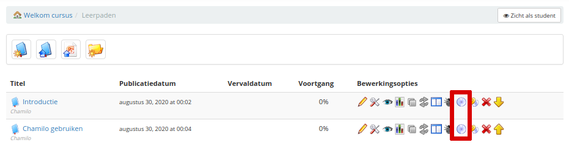

# Leerpad exporteren

Om een leertraject te exporteren, gaat u eerst naar het tabblad _Mijn cursussen_ \(doorgaans het 2e tabblad van links\).

Afbeelding 16: Interface - Lijst met cursussen

Hier kun je de cursussen zien waarvan je de leraar bent \(via het potloodpictogram\). Om door te gaan, klikt u op een ervan en voert u de tool _Learning path_ in.

Eenmaal in de leerpadenlijst, klikt u op het cd-pictogram om een back-upbestand te genereren.

Afbeelding 17: Interface - Leerpaden exporteren

In dit stadium hoeft u alleen te selecteren waar u het bestand op uw schijf wilt opslaan. De export is beschikbaar als een .zip-bestand.

Merk op dat deze export wordt gegenereerd in het SCORM 1.2-standaardformaat \(dat ook definieert dat het moet worden gecomprimeerd als een .zip\), dat u dan misschien wilt hergebruiken op een ander LMS, of het nu Chamilo is of een ander, voor zover het is SCORM 1.2-compatibel \(wat min of meer elk ander e-learning portaal betekent\), maar dit formaat maakt de editie complex, om niet te zeggen onmogelijk. Als zodanig is het in de meeste gevallen een niet-wijzigbare back-up.

U kunt ook elk leertraject naar PDF exporteren, hoewel dynamische elementen zoals audio-, video- en flash-animaties niet worden geëxporteerd.
