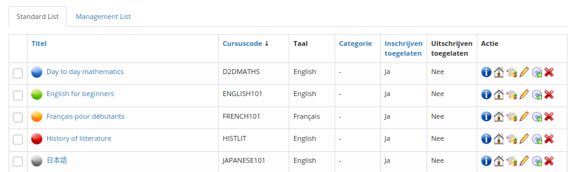
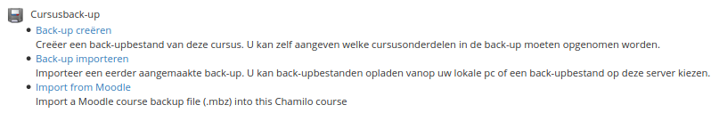
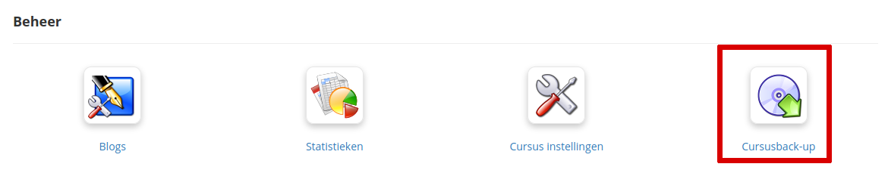
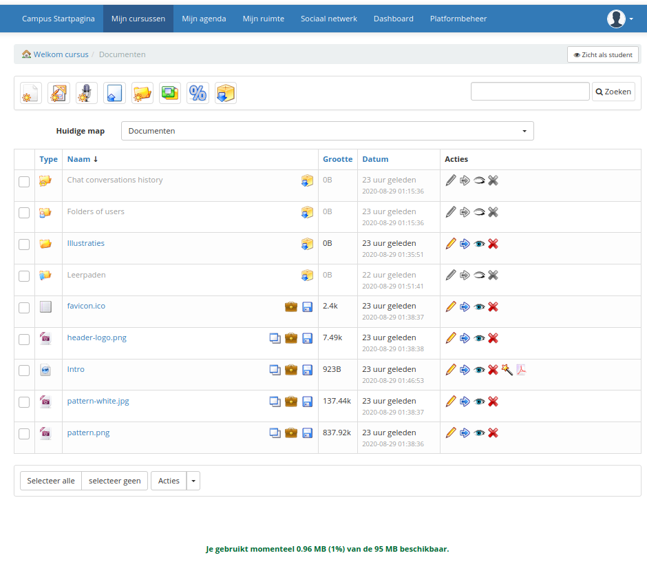

# Een cursus opslaan

De platformbeheerder kan elke cursus opslaan vanuit \(onder andere\) de administratieve interface.

1. Ga naar: «Administratie» → «Lijst met cursussen»:

Afbeelding 18: Administratie - Cursussenblok

1. Klik op het cd-pictogram om de cursus te exporteren.

Afbeelding 19: Administratie - Lijst met cursussen - Back-up

1. Chamilo stelt vervolgens voor om "een back-up te genereren" of "back-upinformatie te importeren" van de back-up. Klik op _Back-up genereren_.

Afbeelding 20: Beheer - Back-up

1. U kunt kiezen tussen een volledige back-up en een specifieke selectie \(afhankelijk van uw behoeften\). Laten we _Complete_ backup kiezen voor het voorbeeld.

Afbeelding 21: Beheer - Back-upinstellingen

1. De back-up wordt gegenereerd en u hoeft alleen maar op de zip-bestandknop te klikken om deze te downloaden.

Afbeelding 22: Beheer - Back-up, resultaten van het genereren van back-ups

1. Door op de knop _Generate backup_ te klikken, maakt Chamilo een back-upbestand aan dat standaard in de map _chamilo/app/cache_ terechtkomt. U kunt het dus door directe toegang herstellen, maar dat betekent dat andere mensen er ook toegang toe hebben. Dit betekent dat je als admin allebei een normaal proces zou moeten hebben om deze directory op te schonen \(we bieden er een aan in de _main/cron_ directory maar je moet het uitvoeren\) **en** dat je je configuratie moet instellen \(via .htaccess of VirtualHost config\) om directe navigatie binnen de _main/archive_ directory te vermijden.

Er is ook een andere manier om back-ups te maken...

Klik als admin of docent op het tabblad _Mijn cursussen_ en vervolgens op een van de beschikbare cursussen. Dan is het mogelijk om een back-up te maken op vrijwel dezelfde manier door op de tool _Onderhoud_ te klikken.

Afbeelding 23: Interface - Tools voor cursusbeheer

De interface is iets anders ...

Afbeelding 24: Interface - Opties voor back-up van de cursus

Met de opties voor cursusback-up kunt u nog drie andere functies uitvoeren:

* **Cursuskopie** stelt u in staat om een cursus geheel of gedeeltelijk te dupliceren naar een andere \(bij voorkeur lege\) cursus. De enige vereiste toestand hiervoor is om een eerste cursus te hebben met iets om te kopiëren, en een andere cursus die de elementen van de eerste niet bevat.
* **Lege cursus** stelt u in staat om de hele inhoud van een cursus te legen. Stel dat u een nieuwe cursus wilt starten in dezelfde "shell" als de vorige ... klik gewoon op deze link en alle eerder gemaakte bronnen zijn verdwenen, zonder de kans om ze te herstellen. Het is duidelijk dat u, voordat u dat doet, het cursuselement wilt herstellen via een _Course backup_ bewerking.
* **Verwijderen** stelt je in staat om de hele cursus te verwijderen, dit betekent ook dat je de lege shell verwijdert. Een bevestiging is vereist, maar als het eenmaal is verwijderd, verwacht dan niet dat het ergens als veilige kopie beschikbaar is ...

**Opmerking**: wanneer u het .zip-bestand van de back-up opent, zult u een grote overeenkomst zien met de documenthiërarchie van de _Documents_-tool.

Ter informatie: het standaard .zip-bestand voor een cursus die oorspronkelijk met voorbeeldinhoud is gemaakt, weegt ongeveer 8,9MB.

Het bevat :

* een intern structuurbestand met de naam course\_info.dat
* een map genaamd _Document_
* een reeks bestanden en mappen met de cursusdocumenten, alles wat niet aan de gebruikers is gekoppeld \(opdrachten en andere gebruikersgerelateerde zaken worden niet opgeslagen\)

De map _Document_ heeft een structuur die lijkt op die in afbeelding 25, die de structuur van de documenttool weergeeft zoals weergegeven in afbeelding 26.

Afbeelding 25: Back-up - Structuur van back-upbestanden

Afbeelding 26: Interface - Documentenlijst

Deze documenten zijn de standaardinhoud van de cursus.

Bovendien herstelt de back-up alleen documenten \(afbeeldingen, video's, enz.\) Die betrekking hebben op de cursus.

