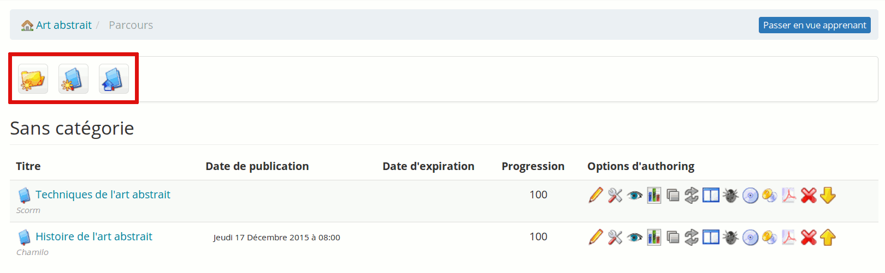

# Leerpaden

Na het exporteren van de leertrajecten, wil je misschien weten hoe je ze weer kunt importeren in een ander (of hetzelfde) Chamilo-portaal.

Maak in het tabblad *Mijn cursussen* een lege cursus aan die overeenkomt met de cursus die moet worden geïmporteerd (of hergebruik een bestaande cursus). Eenmaal in de cursus klikt u op *Leerpaden*.

In de leerpaden-tool heb je drie mogelijkheden:

- « Nieuwe cursus aanmaken» (1e icoon),
- « Importeren [SCORM](http://fr.wikipedia.org/wiki/Sharable_Content_Object_Reference_Model) cursussen » (2de icoon),
- « Chamilo Rapid » (3de icoon)

Afbeelding: Interface - Leerpaden importeren

Om het eerder geëxporteerde leertraject te importeren, klikt u op _Import SCORM course (2e icoon).

Om het eerder geëxporteerde leertraject te importeren, klikt u op *Import SCORM course* \ (2e icoon ).

De back-up moet uiteraard compatibel zijn met SCORM en, iets minder voor de hand liggend, SCORM 1.2, een specifieke versie van SCORM. Chamilo ondersteunt SCORM 2004 niet volledig, dus u zult waarschijnlijk een geldige leerpadimport hebben, maar het zal meestal niet volledig functioneel blijven. Je leertrajectpakket kan ook AICC-compatibel zijn, maar dat is een ander verhaal.

Merk op dat het veld *Authoring tool* slechts een informatief veld is en geen gedragsverandering genereert.
