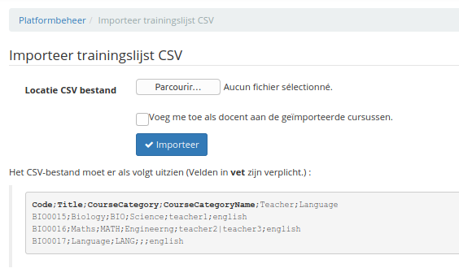

# Lijst met cursussen importeren

Met deze functie kun je een CSV-bestand importeren om cursussen te maken. Als je categorieën gebruikt en je importeert de cursussen op een ander platform dan het platform waaruit je ze hebt geëxporteerd, dan moet je ervoor zorgen dat je op beide portals dezelfde categoriecodes hebt.

Afbeelding 60: Administratie - Cursussen aanmaken in batches

Eenmaal geïmporteerd hoeft u alleen leertrajecten in te vullen.
