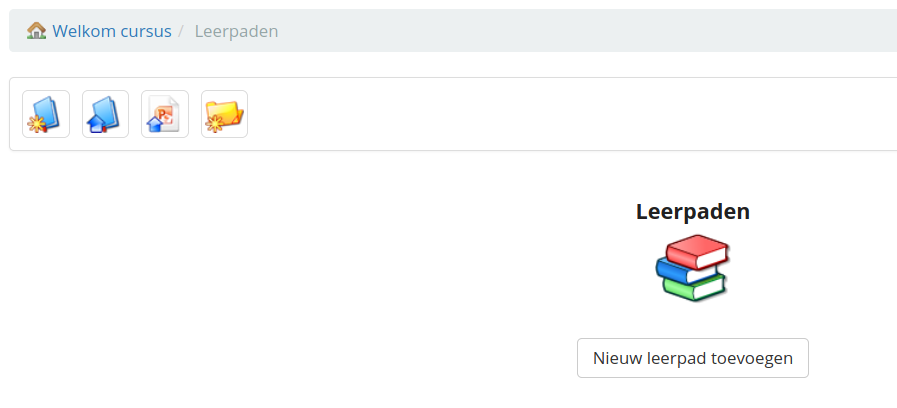
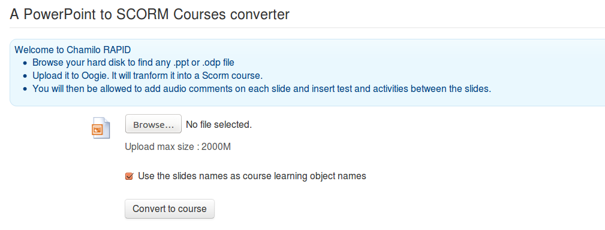

# Chamilo Rapid

De conversie van PowerPoint®- of Impress®-presentaties naar leertrajecten is relatief complex om op de juiste manier te installeren. Er is maar één bekende sneltoets: installeer een OpenOffice.org of LibreOffice versie 3 en het *screen* commando.

$sudo apt-get install libreoffice screen

Start vervolgens de volgende opdrachten

$ screen

*$* *sudo soffice -accept=**”**socket,host=**127.0.0.1**,port=2002,tcpNoDelay=1;urp;”* *-headless -nodefault* *-nofirststartwizard* *-nolockcheck -nologo* *-norestore* *&*

ctrl-a + ctrl-d

Elke fijnere uitleg zou grotendeels buiten de context van deze gids vallen, maar dit recept werkt goed op de Ubuntu-server.

**Opmerking**: de installatie van de videoconferentieserver omvat al de installatie van de *OpenOffice.org* server op poort 8100, dus als je deze hebt geïnstalleerd, heb je de bovenstaande opdracht niet nodig. Configureer Chamilo om de presentatieserver van poort 8100 te gebruiken.

Eenmaal geconfigureerd en actief, kunt u PPT converteren vanuit de leerpadtools van uw cursussen.

Afbeelding 87: Pictogram voor snelle conversie in tool Leerpaden

Afbeelding 88: Leerpad importeren PPT-scherm

Eenmaal op deze manier geïmporteerd, wordt een PowerPoint- of Impress-presentatie omgevormd tot een volledig leertraject, klaar om verder te worden bewerkt en gestructureerd, en vervolgens voor leerlingen gepubliceerd.

Als u vastloopt met de installatie van deze service, aarzel dan niet om een van onze officiële providers te vragen om u een handje te helpen of om u een van hun vooraf geconfigureerde servers te huren.
