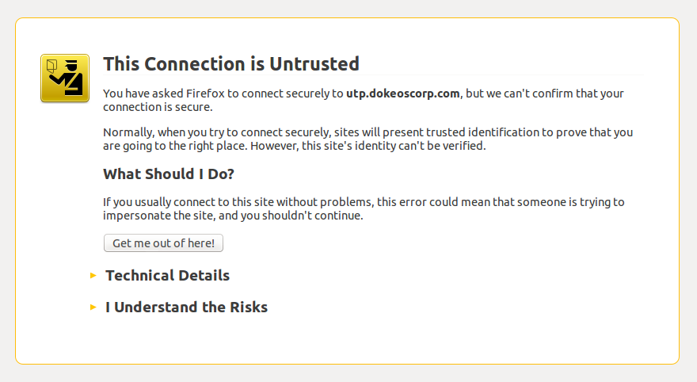

# Je site beveiligen met SSL / HTTPS

Naarmate Chamilo LMS populairder is geworden, hebben we verschillende aanwijzingen ontvangen van wachtwoorddiefstal en dat de veiligheid van Chamilo in het geding kan zijn. Bekijk onze sectie Beveiliging in Chamilo LMS (10.2) in de bijlage voor meer informatie over beveiliging in Chamilo.

De zwakste schakel tot dusver met onze Chamilo-portals is de infrastructuur, in die zin dat studenten (relatief gemakkelijk) toegang kunnen stelen van een leraar die verbinding maakt met het platform vanuit dezelfde computerruimte (vanwege enkele kenmerken van netwerkapparatuur). Er zijn veel manieren om de communicatie van een andere gebruiker met de server te “bespioneren”, en een van de veiligste manieren om dit soort diefstal te voorkomen, is door de hele communicatie tussen de gebruiker en de Chamilo-server te versleutelen.

Dit kan worden gedaan via SSL (of beter bekend als HTTPS voor de weergave van een "s" in de URL van die portalen), een veilige en standaardmanier om HTTP-communicatie op het web te versleutelen.

Helaas, vanwege de inherente beveiliging van het systeem, moet een SSL-certificaat (vereist om de veilige communicatie te laten plaatsvinden) voor een beperkte tijd (virtueel) "ondertekend" worden door een erkende autoriteit. Dit impliceert (in de meeste gevallen tot nu) betaling aan genoemde autoriteit van een vergoeding voor het ondertekenen van het certificaat. Met andere woorden, een certificaat is niet gratis en het is niet permanent. Een eenvoudig (laagste beveiligingsniveau) certificaat, alleen voor een enkele domeinnaam, kan bijvoorbeeld tussen de $ 25 en $ 100 per jaar kosten.

U kunt uw certificaten “zelf ondertekenen”, maar dit zal een eng scherm tonen voor alle gebruikers de eerste keer dat ze de portal openen, en het zal hen vragen om een beslissing te nemen. De gebruikers zullen minimaal 3 keer op zeer specifieke opties moeten klikken om naar de site te gaan, zoals geïllustreerd door de volgende schermafbeeldingen.

 
 
Afbeelding: klik op de knop "Uitzondering toevoegen"

Deze nogal enge drie stappen zijn voltooid, uw gebruiker heeft toegang tot uw site met een gecodeerde verbinding, maar het proces werkt niet voor iedereen.

Om deze berichten te vermijden, moet u een SSL-certificaat kopen (we hebben tot nu toe redelijk succes gehad met *RapidSSL*, maar het is geheel aan u om de juiste SSL-certificaatprovider voor u te kiezen).

Als u liever kiest voor een zelfondertekend certificaat omdat uw team een eindig aantal mensen zal gebruiken en u weet dat ze de 3 stappen van certificaatacceptatie kunnen beheren, dan kunt u dit artikel volgen om het in te stellen: [https://beeznest.wordpress.com/2008/04/25/how-to-configure-https-on-apache-2/](https://beeznest.wordpress.com/2008/04/25/how-to-configure-https-on-apache-2/)

Er is geen veiligere en praktische manier om uw verbindingen te beveiligen dan SSL, dus probeer niet uw eigen beveiligingsmechanisme te implementeren. Als u opmerkingen heeft over SSL, dient u rechtstreeks contact op te nemen met de community die de standaard beheert.
