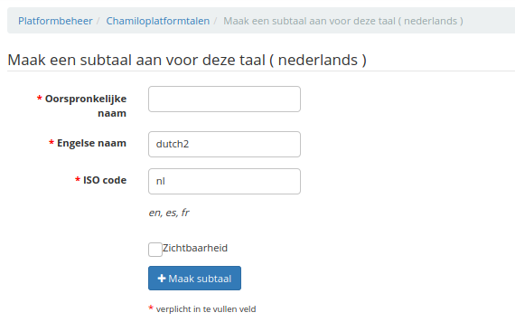

# Een subtaal maken

Klik op het pictogram voor het maken van een subtaal uiterst rechts op de regel Engels. Vul het formulier in door een algemene naam op te geven voor de taal (bijv. "Medisch Engels") en een Engelse naam zonder spaties of accenten (bijv. "Medisch_english"), en een ISO-code die hetzelfde is als de vadertaal (in dit geval "en").

 
 
Afbeelding: Administratie - Creëren van subtalen

Afbeelding: Administratie - Creëren van subtalen

Afbeelding: Administratie - Lijst met talen, met subtalen

De resultatenpagina laat een iets andere regel zien. Klik op het dubbele pijlpictogram om uw eigen termen te definiëren.
