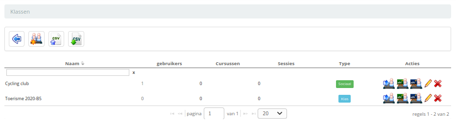
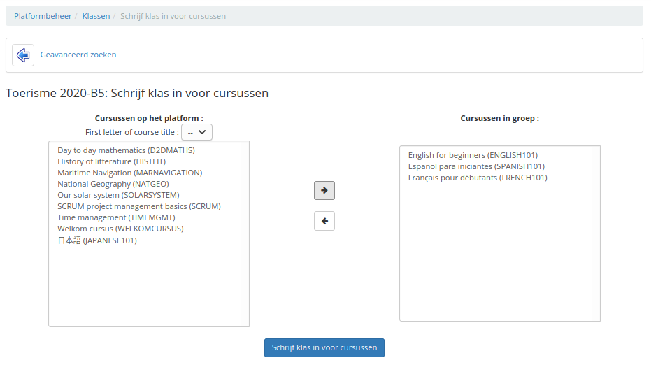
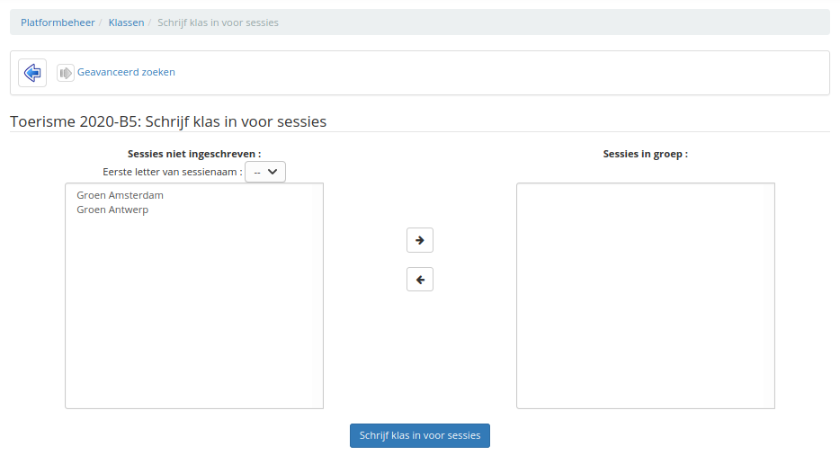

# Klassen

Klassen zijn een groep gebruikers (in het algemeen studenten). Aan deze groepen kunnen cursussen of sessies worden toegewezen, zodat alle groepsgebruikers persoonlijk op deze cursussen of sessies worden ingeschreven.

Evenzo, wanneer u de klas uitschrijft voor een cursus of sessie, wordt elk van de klasgebruikers afzonderlijk afgemeld voor de cursus of sessie.

**Opmerking**: vóór 1.8.8 was er al een concept van klasse (iets anders), dat wederzijds exclusief was met de sessietool. Sinds versie 1.8.8 is het mogelijk om lessen te gebruiken in combinatie met sessies.

De klasseninterface is vrij eenvoudig. De lijst met klassen is de eerste keer leeg. Om een klas toe te voegen, klikt u op het sterpictogram.

Afbeelding 77: Administratie - Klassen - Lege lijst

Voor het maken van een klasse is alleen een naam en een optionele beschrijving nodig.

U keert dan terug naar de lijst met klassen om er gebruikers aan toe te voegen (via het gebruikerspictogram).

Afbeelding 78: Administratie - Klassen - Gebruikers toevoegen

Het gebruikersabonnementscherm is vergelijkbaar met het abonnementsscherm van andere gebruikers dat u eerder hebt gezien.

Nadat de gebruikers zijn toegevoegd, kunt u de klas inschrijven voor een of meer cursussen en voor een of meer sessies.

Afbeelding 79: Administratie - Klassen - Cursussen toevoegen

Afbeelding 80: Administratie - Klassen - Sessies toevoegen

Merk op dat, zoals de sessielogica voorschrijft, een klas nooit mag worden ingeschreven op een cursus **en** op een sessie (die deze cursus bevat), anders zou je de student (en waarschijnlijk de leraar) met dubbele toegangen in en uit een sessie.
