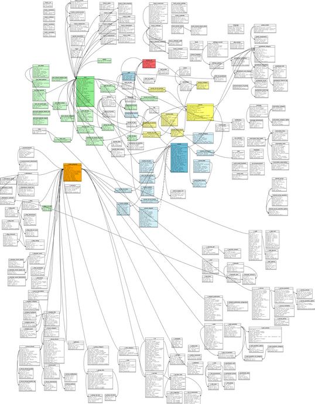

## Database structuur {# database-structuur}

Als je geïnteresseerd bent in de databasestructuur voor Chamilo 1.9, kijk dan op onze wiki voor de volledige schema's: [http://support.chamilo.org/projects/chamilo-18/wiki/Database_schema](http://support.chamilo.org/projects/chamilo-18/wiki/Database_schema) . Weet gewoon dat er ongeveer 180 tafels zijn, met veel onderlinge verbindingen, zorg dat u weet wat u doet voordat u aanpassingen maakt. Er zijn verschillende mechanismen om plug-ins te ontwikkelen op basis van de huidige structuur, zonder deze te wijzigen. Neem contact op met de ontwikkelaars via IRC (zie de voettekst van onze website) of via [http://support.chamilo.org/projects/chamilo-18](http://support.chamilo.org/projects/chamilo-18) als je je verloren voelt.

 Afbeelding 93: Chamilo LMS 1.9 database-structuur

De databasestructuur is drastisch veranderd tussen Dokeos of Chamilo LMS 1.8 en Chamilo LMS 1.9. We hebben alles naar één database verplaatst zonder tabelreplicatie, wat ons nu een reeks nieuwe kansen biedt voor mash-ups tussen cursussen.

Het is belangrijk op te merken dat **de databasestructuur niet verandert tussen Chamilo LMS minor-versies** , Niks. Dit komt door een moeilijk te beheren maar zeer nuttige beslissing die op ontwikkelaarsniveau is genomen om ervoor te zorgen dat gebruikers gemakkelijk van de ene versie naar de andere kunnen upgraden zonder het risico te lopen gegevensverlies of verslechtering te veroorzaken.

Dus als u een Chamilo LMS 1.9.0-installatie heeft, kunt u eenvoudig upgraden naar 1.9.2, 1.9.4 of 1.9.6, en uw databasestructuur zal helemaal niet veranderen.
